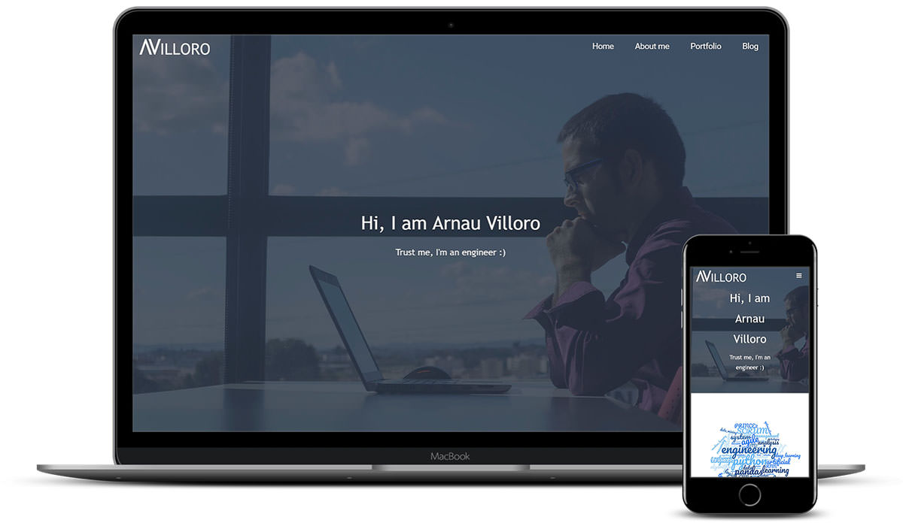
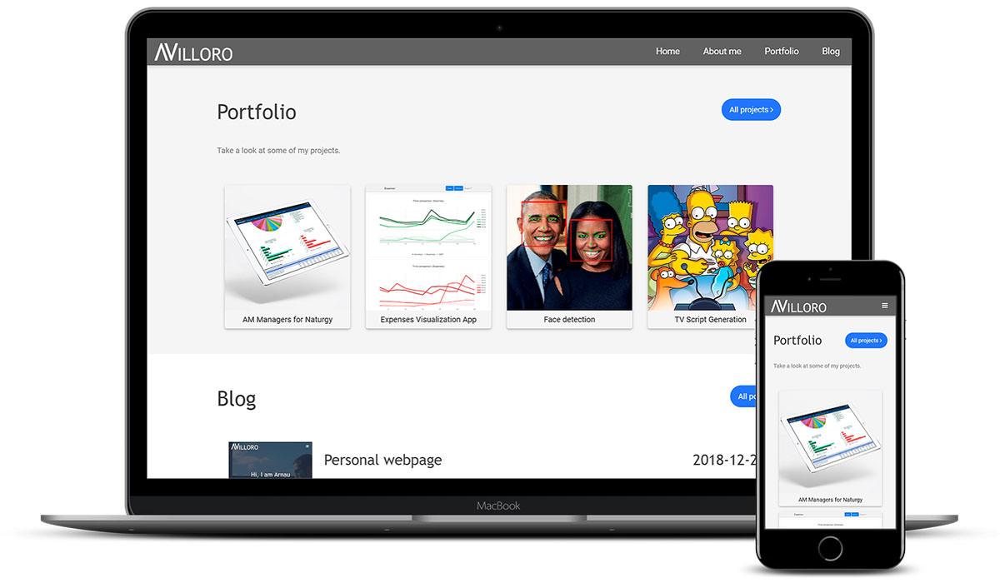

I used to have a personal webpage made with wordpress. Since I have been working as a developer for some years I decided that I could create something that better suited my needs.

I knew I wanted to create something that was:

* really fast
* easy to mantain (by a developer)
* made from scratch (since it would help me learn)

And I ended up creating a webpage with <FancyLink linkText="Flask" url="http://flask.pocoo.org/" company="flask"/> and making it a static webpage with <FancyLink linkText="Frozen flask" url="https://frozen-flask.readthedocs.io/" company="readthedocs"/>. I also used the power of <FancyLink linkText="Jinja2" url="http://jinja.pocoo.org/" company="jinja" dark="true"/> templates.

For the html part I decided to go with <FancyLink linkText="w3css" url="https://www.w3schools.com/"/> since it was an easy way to create a responsive webpage.

Some screenshoots:

