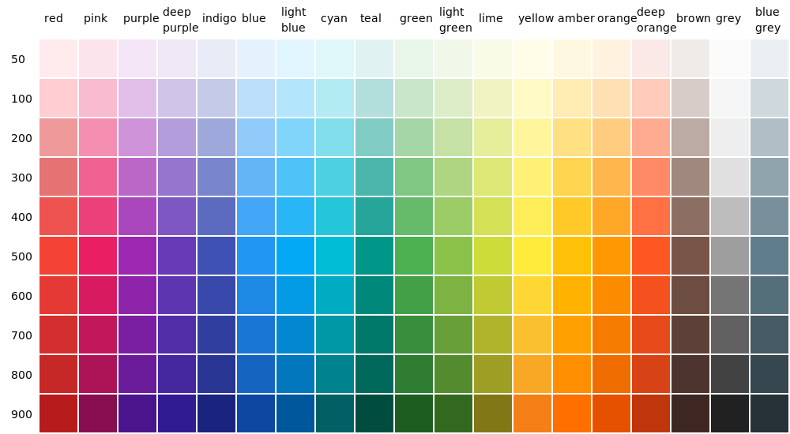
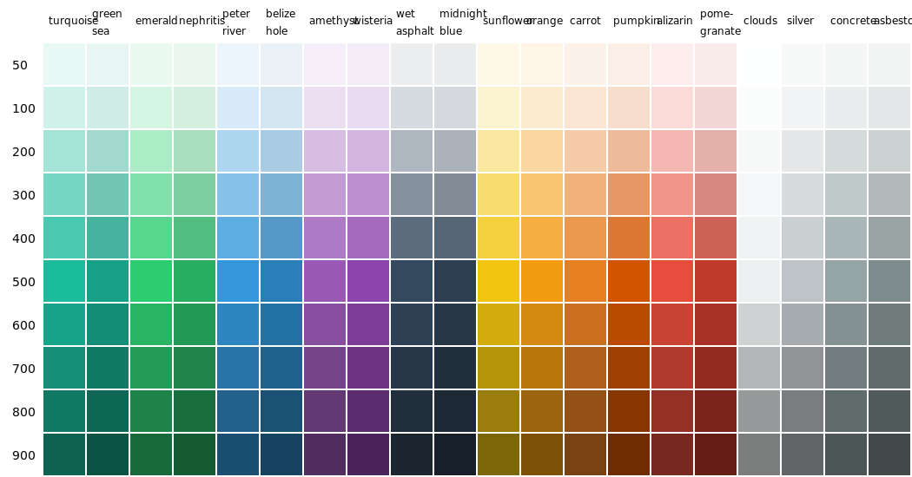

<script type="module" src="/js/posts/0004-plots-colors.js"></script>

Choosing between colors is always a difficult task, especially for people like me who are not very good a design tasks.

I used to have a hard time every time I had to deal with colors. I allways felt that having a lot of names for the colors was not a practical solution. For example in html you can use colors like `darksalmon`, `mediumvioletred` or `darkslateblue` which I find almost impossible to remeber and work with.

But in 2014 google presented [Material Design](https://material.io/) and a very good [color palette](https://material.io/design/color/the-color-system.html#color-usage-palettes).

## Table of Contents

[TOC]

## 1. Material design palette

There are 19 colors with 10 different intensities for each one plus the white and black colors. This gives us 192 different colors ordered in a matrix.



This allows us to use gradients of the same colors like in the following plot:

<canvas id="plot-colors"></canvas>

More info about colors and palettes can be found at [htmlcolorcodes.com](https://htmlcolorcodes.com/color-chart/).

## 2. Using material colors in python (v-palette)

I use [plotly](https://plotly.com/) in a lot of projects and I like using the material colors as well.

To do so I create a simple module ([v-palette](https://github.com/villoro/v-palette)) that allows me to call the colors I want to use with an array of color names and indexs. For example:

```python
from v_palette import get_colors

# Retrive one color
get_colors(("red", 100))
```
<TerminalOutput className="mb-6">
  \> '#FFCDD2'
</TerminalOutput>

```python
# Retrive some colors
get_colors([("red", 100), ("blue", 100)])
```
<TerminalOutput>
  \> ['#FFCDD2', '#BBDEFB']
</TerminalOutput>

Remeber to install it using pip with:

```sh
pip install v-palette
```

### 2.1. Flat colors

If you use v-palette you can also use the [flat colors](https://htmlcolorcodes.com/color-chart/flat-design-color-chart/).



You can use them by passing the param `palette="flat"`

```python
# Retrive some colors
get_colors([("emerald", 100), ("silver", 100)], palette="flat")
```
<TerminalOutput>
  \> ['#D5F5E3', '#F2F3F4']
</TerminalOutput>
