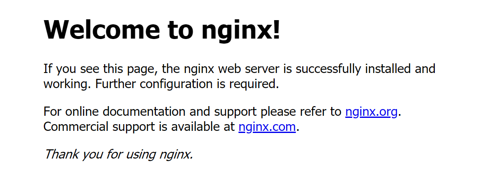

In order to serve a python web app hosted on a server there are some tools that you need to install and set up.

## Table of Contents

[TOC]

## 1. Basic schema
First of all you will need a Linux machine. I'd suggest you use an **AWS EC2** instance. You can see [here](https://villoro.com/post/aws_ec2.html) how to create one.

There are three main components needed for serving a python app:

1. Web server
2. WSGI
3. Python app
4. Supervisor


### 1.1 Web server
This component will handle the requests and among other things it will deal with static files (images, css, js...). In this post we are going to use [Nginx](https://www.nginx.com/) since it is more commonly used for python. Another popular option is [apache](https://httpd.apache.org/).

### 1.2. WSGI
Web servers cannot communicate directly with python apps so you need a Web Server Gateway Interface ([WSGI](https://wsgi.readthedocs.io/en/latest/what.html)).
In this case we will use [Gunicorn](https://gunicorn.org/) because it is a simple solution. Another common choice would be [uwsgi](https://uwsgi-docs.readthedocs.io/en/latest/).

### 1.3. Python App
The idea of this post is to set up `nginx` and `gunicorn`. To test them you can create a very simple app using [flask](http://flask.pocoo.org/). You can do the same with [django](https://www.djangoproject.com/) or [dash](https://plot.ly/products/dash/) apps.

### 1.4. Supervisor
[Supervisor](http://supervisord.org/) is a system that allows users to monitor and control processes. This will make sure to restart the gunicorn process if it anything goes wrong. Without it you should do it yourself.

<Notice type="info">
  You can read more about why a web server and wsgi [here](https://serverfault.com/questions/331256/why-do-i-need-nginx-and-something-like-gunicorn).
</Notice>


## 2. Installation
First you should create the flask app and test it. After you will install and configure both wsgi and supervisor in order to have a service to serve the app. Finally you will configure nginx to serve the content to the web. 

### 2.1. Python app
 First let's create the `index.py` with the app:

```sh
# Create html folder if neeeded
mkdir /var/www/html
cd /var/www/html

# Install requirements
pip3 install flask

# Create index.py with the app
nano /var/www/html/index.py
```

And paste the following code:

<TerminalOutput color="stone">
  `/var/www/html/index.py`
</TerminalOutput>
```python
from flask import Flask

app = Flask(__name__)

@app.route('/')
def index():
    return "Hello World"

if __name__ == '__main__':
    app.run(debug=True)
```

You can try it by running:
```sh
python3 index.py
```

You can now view it by going at `XX.XXX.XXX.XXX:PORT` (Use your EC2 IP and the port).

<Notice type="info">
  Default flask port is **5000**. To try it you need to open the port.
</Notice>

#### 2.1.1. Open EC2 ports (optional)
If you are using and **AWS EC2** it is possible that you don't have the port 80 opened. You can do it with:

1. Go to AWS console and then to the EC2 page. Use the sidebar to go to `NETWORK & SECURITY/Security Groups`.
2. Find the security group of your EC2 instance and edit the **Inbound** rules.
3. Add `Custom TCP Rule` with port `5000` (or the one you used).
4. If you are opening a port for testing, remeber to close it back when you are done.

### 2.2. WSGI

Install gunicorn with:

```sh
pip3 install gunicorn
```

### 2.3 Install supervisor

```sh
sudo apt install supervisor -y
```

You will create an config file for your project, for example `/etc/supervisor/conf.d/flask_test.conf`:

```sh
sudo nano /etc/supervisor/conf.d/flask_test.conf
```

And write the following configuration:

<TerminalOutput color="stone">
  `/etc/supervisor/conf.d/flask_test.conf`
</TerminalOutput>
```toml
[program:flask_test]
command = gunicorn index:app -b localhost:8000
directory = /var/www/html/
autostart = true
autorestart = true
```

<Notice type="info">
  `index` refers to the python file. `app` is the name of the flask app that is inside this file.
</Notice>

Then start supervisor:

```sh
sudo supervisorctl reread
sudo service supervisor restart

# Check the result
sudo supervisorctl status
```

### 2.4. Web server

#### 2.4.1. Install and test nginx

To install nginx run:
```sh
sudo apt-get update
sudo apt install nginx -y
```

You can now view if nginx is serving content by going at XX.XXX.XXX.XXX (Use your EC2 IP). You will see the `nginx` default landing page:



<Notice type="warning">
  You will need the port **80** opened
</Notice>

#### 2.4.2 Configure nginx

You should add a config file for your app (`flask_test` for example) inside the nginx `sites-available` folder. You should delete the `default` config file.

```sh
sudo rm /etc/nginx/sites-available/default
sudo nano /etc/nginx/sites-available/flask_test
```

And write the following configuration:

<TerminalOutput color="stone">
  `/etc/nginx/sites-available/flask_test`
</TerminalOutput>
```text
server {
    listen 80 flask_server;

    location / {
        proxy_pass http://127.0.0.1:8000;
    }
}
```

<Notice type="warning">
  `8000` should match the port defined at supervisor and `80` the port that you opened to test nginx.
</Notice>

Now you need a symlink in `sites-enabled` that points to the file you created before:

```sh
sudo rm /etc/nginx/sites-enabled/default
sudo ln -s /etc/nginx/sites-available/flask_test /etc/nginx/sites-enabled
```

And now you can start nginx:

```sh
sudo nginx -t
sudo service nginx restart
```

You can now go to `XX.XXX.XXX.XXX` and you should see the flask app `Hello World` message.

<Notice type="warning">
  If everything is working remeber to close the ports that you opened only for testing.
</Notice>

## 3. Next steps

### 3.1. Configure nginx

The nginx configuration you used is really simple. For example you can set nginx to serve static files directly instead of passing through the flask app by:

<TerminalOutput color="stone">
  `/etc/nginx/sites-available/flask_test`
</TerminalOutput>
```text
server {
    listen 80 flask_server;

    location /static/ {
        root /var/www/html/;
    }

    location / {
        proxy_pass http://127.0.0.1:8000;
    }
}
```

For more info about how to configure nginx [here](https://www.linode.com/docs/web-servers/nginx/how-to-configure-nginx/).

### 3.2. SSL certificate

I strongly suggest you set up a SSL certificate for apps that are in production. You can learn how with this [tutorial](https://www.digitalocean.com/community/tutorials/how-to-secure-nginx-with-let-s-encrypt-on-ubuntu-18-04).

While working on this post I set this app for my first time. It is normal to encounter difficultes but I was able to sort it out, you can do it too!
