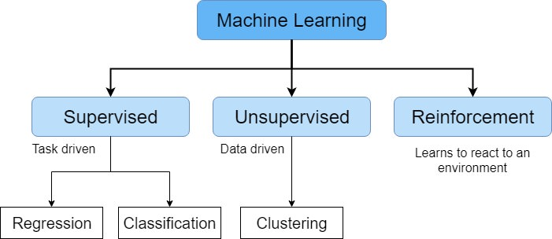
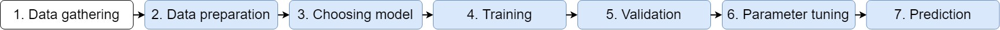
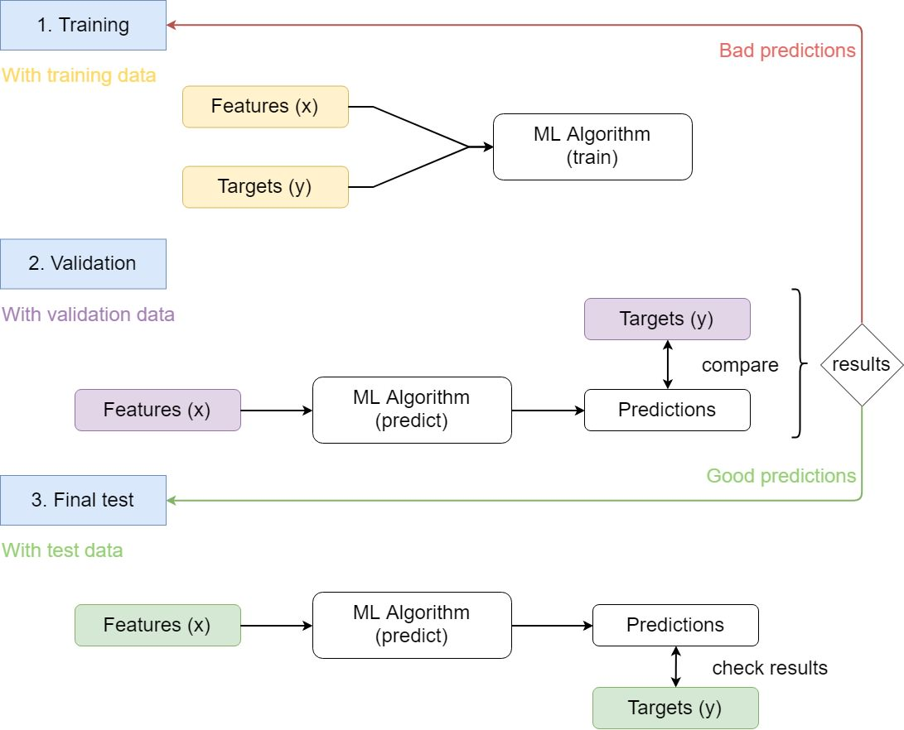
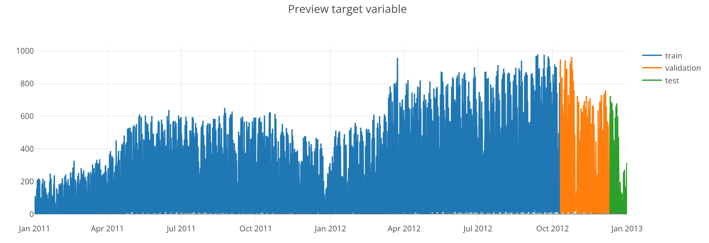
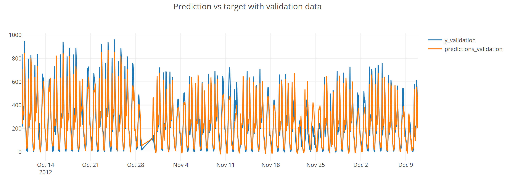
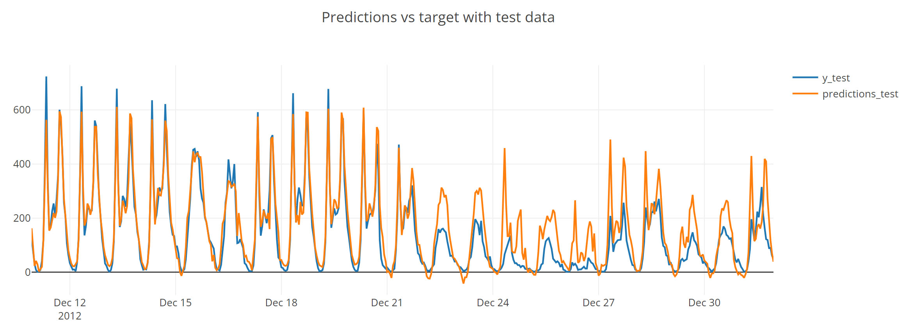

## Table of Contents

[TOC]

## 1. What is Machine Learning?

Machine Learning is an application of Artificial Intelligence (AI) that allows computers to automatically learn from data without being explicitly programmed. Insted of using explicit instructions it relies on patterns and inference instead.

### 1.1. Types of Machine Learning

There are different tasks that ML can perform and they can be categorized in three categories:

* Supervised Learning 
* Unsupervised Learning 
* Reinforcement Learning

#### 1.1.1. Supervised Learning
Supervised Learning algorithms build a mathematical model from both the inputs and the desired outputs. Each training example has one or more inputs (features, usually represented as `x`) and at least one desired output (target, represented as `y`). It will have and objective function that will be optimized through iterations (training). After the training is completed the algorithm would be able to predict the target given the features of new examples.

Supervised learning algorithms include classification and regression.

#### 1.1.2. Unsupervised Learning

Unsupervised learning algorithms take a set of data that contains only the inputs and find a structure. The algorithm learn from unlabeled data and is able to create groups (clusters) of similar points.

#### 1.1.3. Reinforcement Learning

Reinforcement learning (RL) is an area of machine learning concerned with how software agents ought to take actions in an environment so as to maximize some notion of cumulative reward. The focus of the agent is in finding a balance between exploration (of uncharted territory) and exploitation (of current knowledge).

### 1.2. Machine Learning steps

There are seven steps:

In this post we will do everything except the data gathering.

## 2. Full Machine Learning example

As a way to help you understand what is ML we will use an example of supervised learning.
We will use the <FancyLink linkText="Bike sharing data" url="https://www.kaggle.com/contactprad/bike-share-daily-data"/> from <FancyLink linkText="Kaggle" url="https://www.kaggle.com"/>.

Bike-sharing rental process is highly correlated to the environmental and seasonal settings. For instance, weather conditions, precipitation, day of week, season, hour of the day, etc. can affect the rental behaviors. So in this example of regression we will use that information to try to predict the bike rental.

### 2.1. How the data is used in a supervised learning problem

The data will be splitted in 3 groups:

* Training
* Validation
* Test

The idea is to learn with **training** data. Then check the model with the **validation** data and if the results are not good tune the parameters train another time. When the results are good stop and do one final test with the **test** data.

### 2.2. Preparing the data

The first thing we need to do is to handle the categorical features since machine learning algorithms don't work with text as inputs. In this dataset we have 5 categorical features:

* season
* weather situation
* month
* hour
* weekday

We will create new dummy columns for all categorical features. For example there are four seasons so we will create **season_1**, **season_2**, **season_3** and **season_4** columns with `1` if the point is in that season and `0` otherwise.

<Notice type="warning">
  We cannot use only one column and `1`, `2`, `3` or `4` as the options since the seasons are not **linearly related**. That is to say that `sumer + spring = winter` does not make sense. To avoid this relations we create the four new columns.
</Notice>

Another important thing to do is to **normalize** the data. This step is mandatory for some algorithms and it never has a bad efect. To normalize the data we will calculate the mean and the standard deviation (std) of each column and then we will substract the mean to all values of the column and divide by the std. This will ensure that all columns have `mean = 0` and `std = 1`.

Let's also check the target we want to predict. In the dataset there are the rentals for `casual` and `registred` users as well as the sum of those two. This last one (`cnt`) will be our target.

### 2.3. Selecting the algorithm

In this example we will use Support Vector Regression (SVR). It is an algorithm that is similar to a liniar regression but using a treshold. It is out of the scope of this post to explain how it works but you can read it <FancyLink linkText="Support Vector Regression Or SVR" url="https://medium.com/coinmonks/support-vector-regression-or-svr-8eb3acf6d0ff"/>.

### 2.4. Training and parameter tuning

First we fit the algorithm using the **training** data and we check the result using the **validation** data.

<Notice type="success">
  Since the results are good there is no need to tune the parameters, the default ones work well.
</Notice>

### 2.5. Check that the algorithm is working

Now we will use the **test** data to ensure that everything is working well.

And it is indeed. It only has some problems around christmas since they are special days. One way to solve this would be to include more years so that the classifier can learn what happens on christmas 
