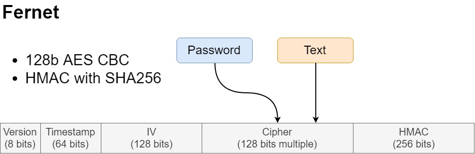

## 0. Intro

While working at `AM Managers` project we encountered some difficulties. We were a team of around 8 people and it was common to have internship every some months. So we regularly needed to help new people to set up all the tools needed at that project.

It was also common that we wanted to include new passwords when we started using new tools like new APIs or new DB. At the begining we were creating env vars for each password but every time someone added a new password all the time were forced to include it as a new env var.

## 1. Dictionary of passwords
Then we decided to create a dictionary of encrypted passwords that we could track with git along with one master password as an env var.

After starting to have some EC2 instances we discoverd that it was easier for us to have a file with the master password than an env var.

## 2. The v-crypt package
After having the same problem with more projects I decided that it was better to create a new python package that could help me dealing with that instead of copying the code from the `AM Managers` repository all the time.

The idea behind this module is to be able to **create a `json` or `yaml` with encrypted secrets**. The keys will be public but the values won't. This way you can **store the dictionary of secrets in git** and easily share them with other people working in the same project. You will only need to **share the `master.password` once**. And all the other passwords/secrets will be tracked with git.

It uses **Fernet** from the <FancyLink linkText="Cryptography" url="https://cryptography.io/en/latest/" company="readthedocs"/> module. This is a secure and tested way of encrypting information.



### 2.1 How it works
It is really easy to use:

```python
from v_crypt import Cipher

# Create a cipher instance
cipher = Cipher()

# Create a new master password
cipher.create_password()

# Store a secret
cipher.save_secret("secret", "I like python")

# Retrieve a secret
cipher.get_secret("secret")
```

### 2.2. Customization

There are three parameters to customize the cipher:

1. **secrets_file:** path of the file with secrets. Can be a `json` or `yaml`.
2. **filename_master_password:** path of the file with the master password
3. **environ_var_name:** if passed it allows to read the master password from an environ var.

<Notice type="info">
  For `yaml` you need to install `pyyaml`
</Notice>

For example you could do:

```python
cipher = Cipher(secrets_file="data/secrets.yaml", filename_master_password="data/master.secret")
```

This will allow you to store both the `master.password` and `secrets.yaml` in the folder `data`.

There is not much more customization since the idea is to keep it simple.

### 2.3. How we use it

We usually have one or more python files with utilities, for example `utilities.py`.

To use v_crypt we initiallize the `cipher` there and then create a `get_secret` dummy function that will call the cipher.

<TerminalOutput color="stone">
  utilities.py
</TerminalOutput>
```python
from v_crypt import Cipher

cipher = Cipher(secrets_file="data/secrets.yaml", filename_master_password="data/master.secret")

def get_secret(key):
    return cipher.get_secret(key)
```

Then you can use it elsewhere with:

```python
import utilities as u

u.get_secret("secret")
```

<Notice type="warning" className="mt-6">
  Remember to add `master.password` to the gitignore. Or you can use the rule `*.password` to ignore all files with `password` extension.
</Notice>
