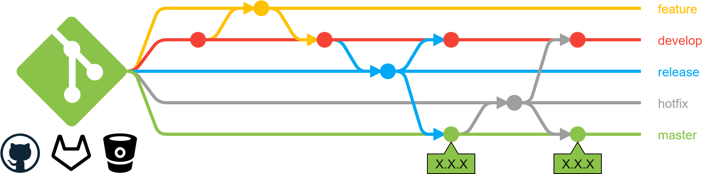
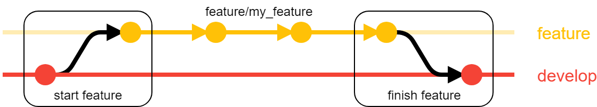
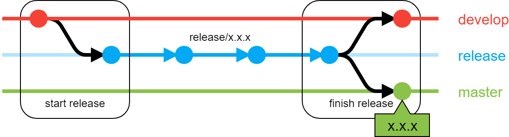
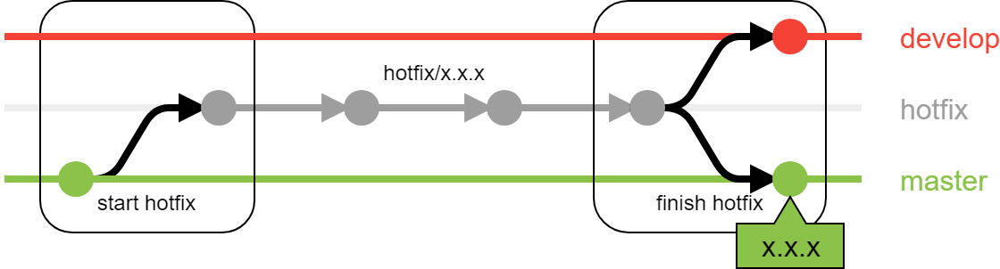

When you work with a team to develop some program/package/solution is it a **must** to have some kind of **version control system**.
It is even a really good idea if you are working alone. One of the most common solutions is `git`.
It is not limited to control code you can also use it to control documentation or any kind of files that can have different versions.

<Notice type="warning">
  Please use **git** you will be much more happy in the long term!
</Notice>

If you are using git from the command line you should check <FancyLink linkText="Git guide" url="http://rogerdudler.github.io/git-guide/" company="default"/> out.

## Table of Contents

[TOC]

## 1. Using 'git flows'

There are some famous 'git flows' in the industry such as:

* <FancyLink linkText="Gitflow" url="https://danielkummer.github.io/git-flow-cheatsheet/" company="default"/>
* <FancyLink linkText="Gitlab flow" url="https://about.gitlab.com/2014/09/29/gitlab-flow/"/>
* <FancyLink linkText="Github flow" url="https://guides.github.com/introduction/flow/"/>
* <FancyLink linkText="Oneflow" url="https://www.endoflineblog.com/oneflow-a-git-branching-model-and-workflow" company="default"/>

I strongly recommed using `gitflow` since is the more complete solution and will give you more flexibility.
In this post I am going to explain how it works.

<Notice type="error">
  **Disclaimer:** After some years, I'd suggest you go with <FancyLink linkText="Github flow" url="https://guides.github.com/introduction/flow/"/> whenever possible since it greatly simplifies the workflow.
  And only switch to <FancyLink linkText="Gitflow" url="https://danielkummer.github.io/git-flow-cheatsheet/" company="default"/> if you actually needed to have **2 long lived branches** (`develop` + `main`)
</Notice>

## 2. Gitflow

With `gitflow` there are two main branches which are the `master` and `develop`.
The `master` branch is a snapshot of the code that is in production.
If you add code to this branch it must be deployed to production.
The `develop` branch is where you test your code before adding it to `production`.
This is the branch that will have a snapshot of the development server if you have one.

### 2.1. Features

To add new functionalities you can create a `feature` branch.
Those start from the `develop` branch since it has the latest stable code.
Once they are finished they get merged to the `develop` branch.

<Notice type="info">
  **Feature** branches can have any name preceded by `feature/`
</Notice>

### 2.2. Releases

Once you want to add new things to production you can do a `release`.
By defition they start from the `develop` branch.
When they are closed they must merge the new changes to the `master` branch and the `develop` to ensure that `master` and `develop` are aligned.

After closing the release it will add a tag to the `master` branch with the version like X.X.X.

<Notice type="info">
  To add the correct tag **release** branches should have the name of the new version you are creating preceded by `release/` like `release/x.x.x`
</Notice>

### 2.2. Hotfixs

`Hotfixs` are created if and only if there is a thing in production that needs to be fixed before doing a release.
This usually means that there is some blocking problem to fix. This is way they are created form the `master` branch.
When closing a `hotfix` it will be merged to both `master` and `develop` like a `release`.

## 3. Using code revision

Since you are probably working with a team it is a good idea to have code revision at some point.
This way everybody can check other's people code and it will be easier to see if there are errors/problems.
This is usually created by **pull requests**. Those are a way to 'ask' the team to merge a branch to another branch.

I suggest that all **pull requests** are made instead of **finishing a feature**.
That means that when you finish a `feature` you should create a pull request to merge that `feature` into the `develop` branch.
After everybody (or a portion of the team) has checked the code it can be merged.

<Notice type="warning">
  It is important to merge **features** into the **develop** branch, not the **master** one.
</Notice>

If you want you can also create pull requests to close a `release` or a `hotfix` but you need to make sure to do some things:

* create the pull request to merge it into the `master` branch.
* tag manually the `master` branch with the version.
* after closing the pull request remember to also merge the `release`/`hotfix` into the `develop` branch.

## 4. Using gitflow with some git programs

If you use **git** from a terminal check this <FancyLink linkText="Gitflow guide" url="https://danielkummer.github.io/git-flow-cheatsheet/" company="default"/> for using gitflow.

If you are using <FancyLink linkText="Sourcetree" url="https://www.sourcetreeapp.com/"/> you can use the **gitflow** button on the top right corner or simply press `CTRL` + `SHIFT` + `F`.
This will suggest you the next **gitflow** action.

If you are using <FancyLink linkText="Sublime Merge" url="https://www.sublimemerge.com/"/> you can press `CTRL` + `P` to open the command box and type `gitflow` to performe the action you want.

## 5. Conventions

When you are working with **gitflow** you are creating branches with some preffixes which can be customized.
If you change them remember to specify it in the `README`. For example I usually use those preffixes since are shorter:

* feature: `f/`
* release: `r/`
* hotfix: `h/`

### 5.1. Version numbers

As said before `releases` and `hotfixs` should be named with the new version you are deploying like for example 1.2.0.
Version numbers are usually three numbers separeted by `.` where they represent:

1. Major version. This should be changed when there is a change in the code that will break backwards compatibility
2. Minor version. To track new features
3. Fix version. This will be increased when the changes are only to fix bugs and not to add features.
