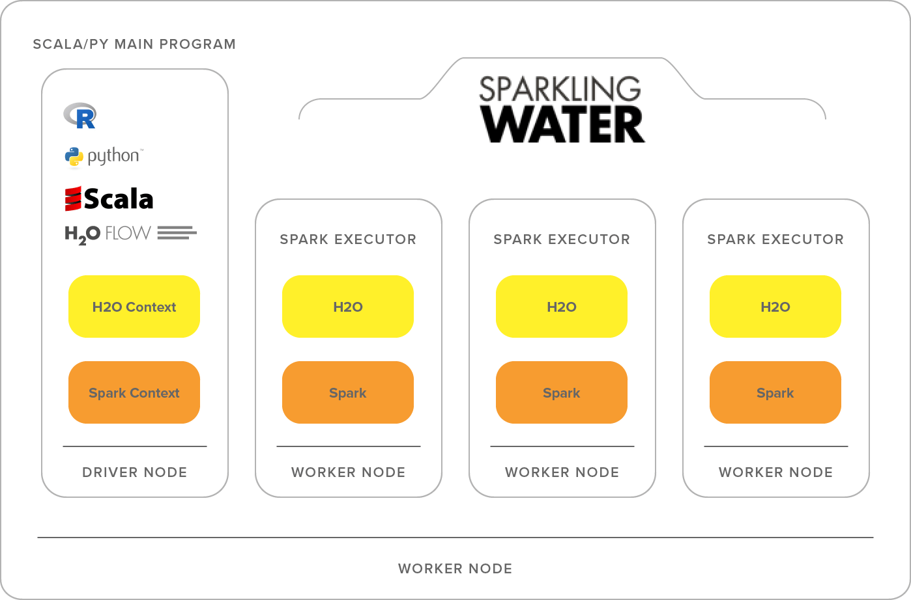

<script type="module" src="/js/posts/0026-plots-h2o.js"></script>

## Table of Contents

[TOC]

## 1. What is H2O

According to their website, H2O is a fully open source, distributed in-memory machine learning platform with linear scalability.
H2O supports the most widely used statistical & machine learning algorithms including gradient boosted machines, generalized linear models, deep learning and more.

It uses MapReduce to break down tasks so that it can send tasts to workers on a cluster.

H2O also has an AutoML functionality that automatically runs through all the algorithms and their hyperparameters to produce a leaderboard of the best models.

## 2. H2O AutoML

The best way to understand **AutoML** is by showing a practical case.
As an example we will use the <FancyLink linkText="Higgs Challenge" url="https://www.kaggle.com/c/higgs-boson/data"/> data.
Since the preprocessing is out of the scope of this post we can directly use a copy of the preprocessed data:

<div class="flex justify-center">
  <Button label="Train data" link="https://s3.amazonaws.com/erin-data/higgs/higgs_train_10k.csv" style="solid" />
  <Button label="Test data" link="https://s3.amazonaws.com/erin-data/higgs/higgs_test_5k.csv" style="solid" />
</div>

### 2.1. Start H2O session

This is really straightforward:

```python
import h2o
from h2o.automl import H2OAutoML, get_leaderboard

h2o.init()
```

This code will init an H2O session.

### 2.2. Get data

The first step is to load the data.
Then we will create a list with the names of all feature columns an another for the target.
The last step is to mark the target as a `factor`. This means setting it as a target.
All this can be done with:

```python
# Import a sample binary outcome train/test set into H2O
train = h2o.import_file("https://s3.amazonaws.com/erin-data/higgs/higgs_train_10k.csv")
test = h2o.import_file("https://s3.amazonaws.com/erin-data/higgs/higgs_test_5k.csv")

# Identify predictors and response
x = train.columns
y = "response"
x.remove(y)

# For binary classification, response should be a factor
train[y] = train[y].asfactor()
test[y] = test[y].asfactor()
```

<Notice type="info">
  This creates an `H2O` dataframe. You can always transform it to **Pandas** with `x.as_data_frame()`
</Notice>

### 2.3. Train

The first step is to create the `H2OAutoML` object.
Since we aim to get reproducibility of the example we will set a seed.
When you do so you also need to specify the maximum number of models to be trained.

```python
aml = H2OAutoML(max_models=20, seed=1, max_runtime_secs=training_minutes*60)
```

I also find it useful to limit the total amount of time that **AutoML** can spend on training.

Once the **AutoML** object is declared to train you only need to pass the `training_frame` and the names of both **features** and **targets**.

```python
aml.train(x=x, y=y, training_frame=train)
```

### 2.3. Check results

You can see the results with `lb = aml.leaderboard`.
However it is more useful to see all possible information with:

```python
# Optionally add extra model information to the leaderboard
lb = get_leaderboard(aml, extra_columns='ALL')

# Print all rows (instead of default 10 rows)
lb.head(rows=lb.nrows)
```

The total training time (for all models) of the example was **limited to 2 minutes**. The results are:

| model_id                            | auc    | logloss | aucpr  | mean_per_class_error |
|-------------------------------------|--------|---------|--------|----------------------|
| StackedEnsemble_AllModels_AutoML    | 0.7864 | 0.5553  | 0.8036 | 0.3196               |
| StackedEnsemble_BestOfFamily_AutoML | 0.7838 | 0.5579  | 0.8008 | 0.3306               |
| GBM_5_AutoML                        | 0.7809 | 0.5597  | 0.7978 | 0.3254               |
| GBM_1_AutoML                        | 0.779  | 0.5616  | 0.7965 | 0.3267               |
| GBM_grid__1_AutoML_model_2          | 0.7786 | 0.5913  | 0.7952 | 0.3452               |
| GBM_2_AutoML                        | 0.7783 | 0.5615  | 0.7963 | 0.3298               |
| GBM_3_AutoML                        | 0.7764 | 0.5639  | 0.7933 | 0.3281               |
| GBM_4_AutoML                        | 0.7708 | 0.5709  | 0.7904 | 0.3537               |
| DRF_1_AutoML                        | 0.7652 | 0.5802  | 0.7833 | 0.3405               |
| XRT_1_AutoML                        | 0.7651 | 0.5822  | 0.7831 | 0.3492               |

## 3. H2O vs Manual ML

In order to compare the results of **H2O AutoML** I trained a Support Vector Classifier (SVC) and a Random Forest Classifier (RFC).
Then I also did a GridSearchCV with the RandomForest to get some numbers.

The parameters for the GridSearchCV are:
```yaml
{'n_estimators': [50, 100, 150, 200], 'max_features': ['auto', 'sqrt', 'log2']}
```

And the 3 metrics analized are:

* Training time
* Prediction time
* <FancyLink linkText="AUC" url="https://developers.google.com/machine-learning/crash-course/classification/roc-and-auc"/>

In order to see if results could be improved I did another train with **AutoML** but limited to 2 hours instead of 2 minutes.

Here you can see how all models perform:
<canvas id="auc_predict_time" style="width:100%;height:500px;"></canvas>

**AutoML** models are usally faster for predict and some of them perform better than the manual ones.

<canvas id="auc_train_time" style="width:100%;height:500px;"></canvas>

The training time with **AutoML** was lower than sklearn while having equal or better results.

## 4. Sparkling water

Even though **H2O** uses MapReduce it might be useful to integrate it with spark.
To do so you only need to use **Sparkling water**.
This will help distribute tasks to workers using **Spark**.



To install it read the official documentation.

Once it is installed you only need to replace the **H2O** initalization (`h2o.init()`) for:

```python
from pyspark.sql import SparkSession
from pysparkling import H2OContext

spark = SparkSession.builder.appName("h2o_auto_ml").getOrCreate()
hc = H2OContext.getOrCreate(spark)
```
