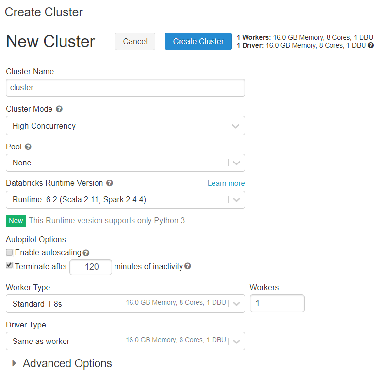
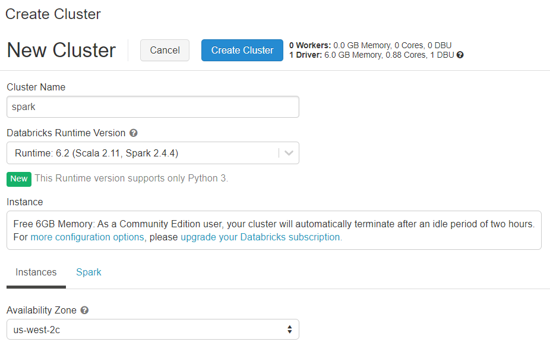
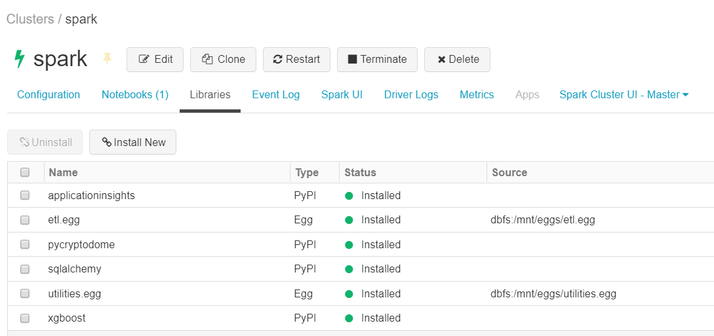
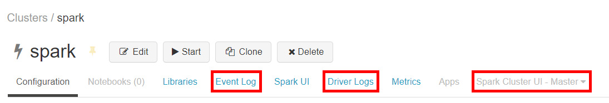
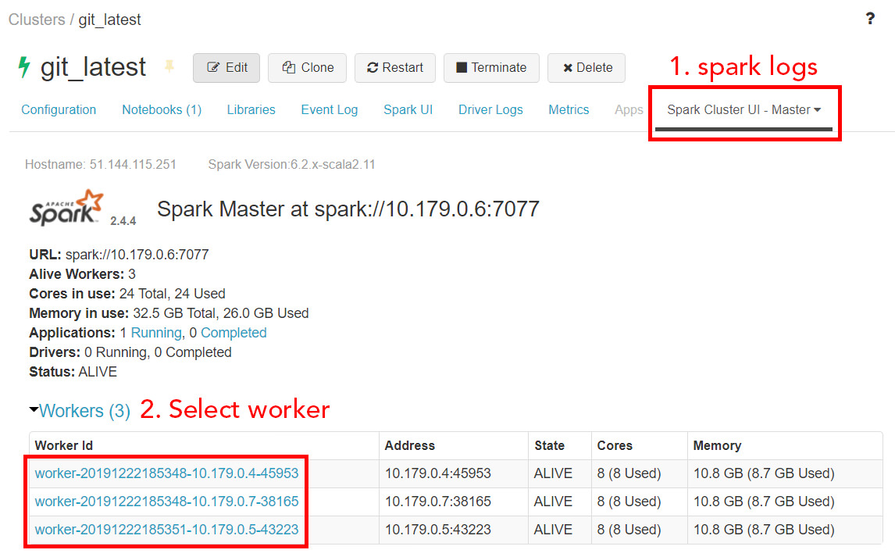
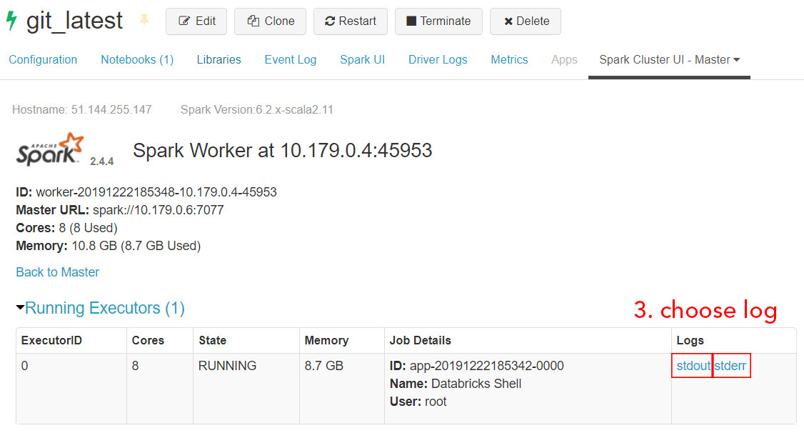

## Overview

**Databricks** provides a Unified Analytics Platform that accelerates innovation by unifying data science, engineering and business.

You can try it if you register <FancyLink linkText="Databricks" url="https://databricks.com/try-databricks"/>.
There are two options:

* **Community Edition:** this is free but you only can use a single small cluster.
* **Databricks Plaform:** use this option if you plan to create your own clusters. It has 14 days of free trial and you will need to pay for the machines you use for the clusters

> [!tip]
> I suggest you start trying it with the **Community Edition**

## Clusters

### Cluster creation

In order to use databricks you will first need to create a cluster.
The available options will change based on the **Databricks** version you are using.

#### Community Edition Version

With this version you can configure more things.

##### Cluster mode

The default mode is `standard` and will work well for 1 user.
For multiuser use `high concurrency`.

> [!warning]
> If you want to use scala you must use `standard` cluster mode

##### Databricks runtime version

Databricks runtimes are the set of core components that run on Databricks clusters.
This will decide the `python`, `R` and `spark` version as well as some pre-installed libraries.

You can read more about the versions of each databricks runtime in <FancyLink linkText="Databricks releases notes" url="https://docs.databricks.com/release-notes/runtime/supported.html#release-notes"/>.

##### Python version

**Use python 3**. Python 2 is deprecated so please do not use it.

##### Autopilot

The first parameter is `Enable Autoscaling`.
This will allow to create more workers for the cluster if needed and of course it will mean that the cost might increase as you need more machines.

There is the `terminate after` param that sets the minutes of inactivity before shutting down the cluster.

##### Environ vars

By clicking `Advanced Options` and then `Spark` you can set the **Environment Variables**.
This is really useful to do some configuration at the cluster level.

#### Community Edition Version

If you are using the **Community Edition** version of databricks is really easy to create a new version.

You only need to write a cluster name and decide the databricks runtime version.

### Permissions

In `Advanced Options` / `Permissions` is where permissions are set.
The available options are:

* **Can Attach to:** this means that they can use the cluster
* **Can Restart:** allows to start, restart and close the cluster
* **Can Manage :** admin privilege

### Libraries

There are multiple ways of installing python libraries:

1. Using **databricks runtime**
2. With an **init script**
3. `Libraries` section in Cluster configuration
4. Using `dbutils`

With **databricks runtime** some basic libraries will be installed.
The good part is that you have those libraries available but at the cost that it is not easy to change the default version of that library.

For some libraries that will need some different configuration on the `driver` and the `workers` machines it is useful to install them using an **init script**.
`dask` is a good example of them since it is needed to start both the worker and the driver.

The default way for new libraries should be using the `Libraries` section.
From there you can install `eggs` from a **blob storage** or directly using **PyPI**.
You can see an example of the libraries installed on a cluster:

> [!warning]
> It is not possible to install python `wheels`, use `eggs` instead.

And lastly you should avoid installing libraries using `dbutils`.
This also won't work if you are using a `conda` databricks runtime.

### Logs

There are some kind of logs:

* event logs
* driver logs
    * standard output
    * standard error
    * log4j output
* spark logs
    * worker standard output
    * worker standard error

#### Event logs

In this section is possible to view the actions performed to the cluster.
For example a start of the cluster will be registered here.

#### Driver logs

Those are the logs that the **driver** machine writes.

The `standard output` and `standard error` are self explanatory.
The `log4j output` is the output that **spark** uses.

#### Spark logs

This allows to access the `stdout` and `stderr` logs of each spark worker.

## Notebooks

The way to work with databricks is by using notebooks.
They are really similiar to the <FancyLink linkText="Jupyter" url="https://jupyter.org/"/> notebooks so it should be easy if you already know them.

Once you create a new notebook you will need to set:

* name
* language
* cluster

You can later rename the notebook or attach it to another cluster if needed.

### Multilanguage

You can work with multiple languages in the same notebook even though there is a default one.
To do so you only need to use some magic commands like `%python` to work with python.

> [!note]
> No need to use anything to work with the default language

The languages you can use are:

| language       | prefix |
|----------------|---------|
| python         | %python |
| markdown       | %md     |
| Linux commands | %sh     |
| SQL            | %sql    |
| R              | %r      |
| scala          | %scala  |

### Spark

One of the great things about **databricks** is that it comes with spark install, configured and already imported.
To use spark you can simply call `spark`.
For example you could run in python `spark.sql("SELECT * FROM my_table")`.

### dbutils

**Databricks** comes with a class that has some utilities.
This have 3 main functionalities:

* Secrets (`dbutils.secrets`)
* File system (`dbutils.fs`)
* Widgets (`dbutils.widgets`)
* Package installer (`dbutils.library`)

#### dbutils.secrets

This allows to interact with secrets.
In Azure you will connect it to a Key Vault so that you can retrieve secrets from there.

#### dbutils.fs

This allows to write and read files.
It is also used to mount external storage units such as a datalake or a blob.

#### dbutils.widgets

You can create custom widgets that allow you to interact with the notebook.
For example you can create and dropdown that sets the value of one python variable.

#### dbutils.library

This allow you to install packages.
I would advise to manage libraries with the `Libraries` section of the cluster configuration.

> [!warning]
> If you are using a **conda** environment `dbutils.library` won't work.

### display and displayHTML

The `display` object is mainly used to show tables.
You can pass a **spark** or **pandas** dataframe and it will be nicely displayed.
It also allows to create plots based on the dataframe.

`displayHTML` as the name suggest allows to display HTML content.
It is the equivalent of an `iframe` in HTML.

## Storing and reading data

Databricks come with a folder where you can store data.
It is under the path `/dbfs/FileStore`.
However I suggest that you mount your own external unit and store the data there.

One important aspect for reading and writing data is the paths.
Imagine that you have a table stored in `/dbfs/mnt/blob/data.delta`.
To read that in different languages you should:

| language | sentence                                     |
|----------|----------------------------------------------|
| python   | /dbfs/mnt/blob/data.delta                    |
| sh       | /dbfs/mnt/blob/data.delta                    |
| spark    | dbfs:/mnt/blob/data.delta                    |
| SQL      | SELECT * FROM delta.\`/mnt/blob/data.delta\` |

## Scheduling jobs

You can schedule jobs with the section `Jobs`.
It works like the Linux **cron**.

> [!warning]
> It should **only** be used for small tasks since **it is not an orchestrator** like **Airflow** or **Azure Data Factory (ADF)**.
