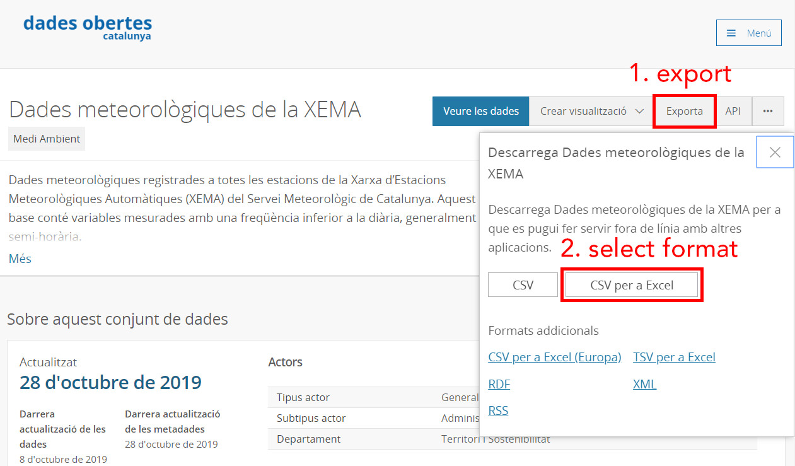
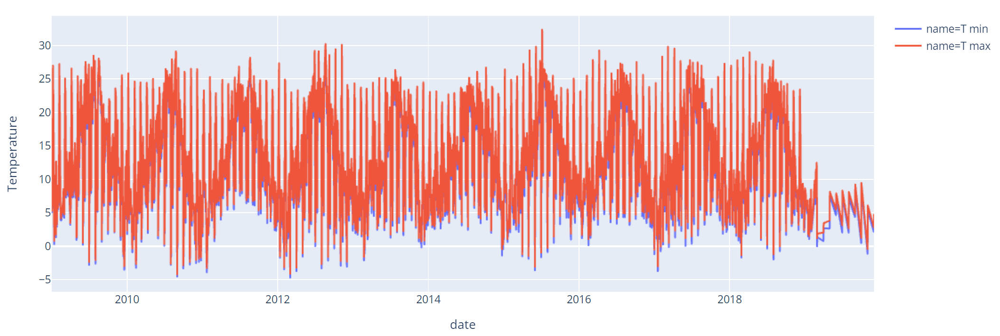
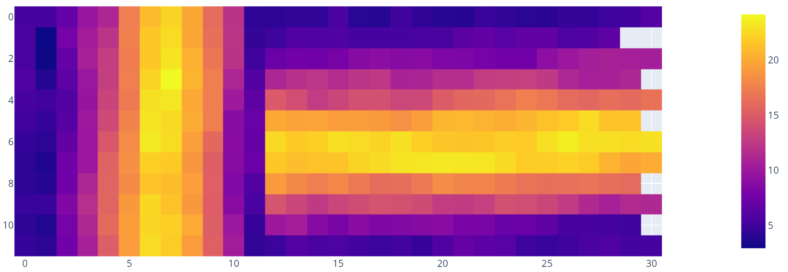
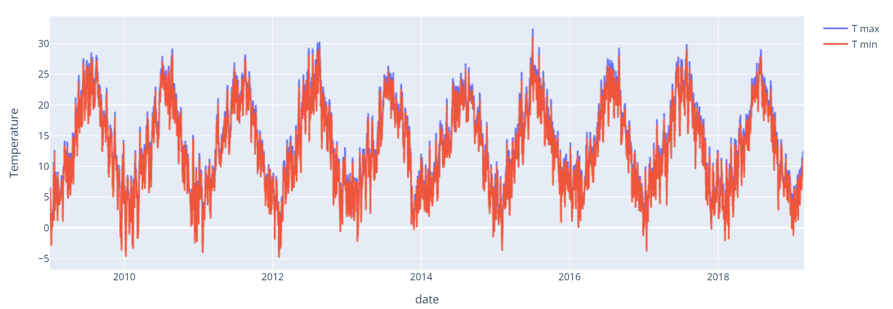

<script type="module" src="/js/posts/0028-plots-pyspark-example.js"></script>

## Table of Contents

[TOC]

## 0. Overview

This post about pyspark will work with one example that should be too big to work with pandas.

Be sure to read <FancyLink linkText="Pyspark Intro" url="https://villoro.com/blog/pyspark-intro/"/> before proceding with this post.

## 1. Get data

For this example we need to download a table that is really big.
We would use open data from [Catalunya](https://en.wikipedia.org/wiki/Catalonia).

<Notice type="warning">
  This dataset is quite big, it might take some hours to download.
</Notice>

It consits of 3 csvs:

<div class="flex justify-center">
  <Button label="Data (~22GB)" link="https://analisi.transparenciacatalunya.cat/Medi-Ambient/Dades-meteorol-giques-de-la-XEMA/nzvn-apee" style="solid" />
  <Button label="Variables (2 KB)" link="https://analisi.transparenciacatalunya.cat/d/4fb2-n3yi" style="solid" />
  <Button label="Stations (43 KB)" link="https://analisi.transparenciacatalunya.cat/d/yqwd-vj5e" style="solid" />
</div>

To download first click the `Exporta` button then `CSV per a Excel`.



## 2. Work with pandas

Usually the first things is to read a chunk of data with:

```python
pd.read_csv(c.URI_CSV, index_col=0, nrows=1_000_000)
```

And in one second you can have data 1 million rows into memory.
But if you try to read the whole file you will probably run out of memory.

<Notice type="error">
  Pandas developers suggest that you have between **5 to 10 times as RAM as the file size**.
Since the file is 22GB you should have more than **110 GB of RAM**.
</Notice>

But fear not, you can work with pyspark which way less memory.
I was able to everything in my computer with only 16 GB of RAM.

## 3. Check data

You can read the whole table with spark and it will be really fast (only some seconds):

```python
sdf = spark.read.csv("Dades_meteorol_giques_de_la_XEMA.csv", header=True)
```

Remember that **spark is lazy**.
It won't do anything until you call an operation that requires to do calculations.
Some of those could be `sdf.show`, `sdf.toPandas` or writting a file.

Let's try to count the number of stations:

```python
sdf.select("CODI_ESTACIO").distinct().count()
```

This took around **6 minutes**. As you are probably thinking this is slow.
The problem is that we are reading from a `csv` which is a really ineficient file format.

Let's transform it to `parquet` which is way better.

```python
# This took me 17 min with a Solid State Disk (SSD).
sdf.write.format("parquet").mode("overwrite").save("weather_data.parquet")
```

<Notice type="warning" className="mt-6">
  Remember to load the dataframe from the `parquet` file to see the performance improvement.
</Notice>

## 4. Read data

Now is possible to do things like counting the rows or the number of unique stations without spending too much time.

<canvas id="count_time_by_format" style="width:100%;height:250px;"></canvas>

### 4.1. Explore possible partitions

It is a good idea to store dataframe in parquet by partitions.
Usually they are partitioned by `date`.
But what is important is that you partition by a column that you will usually filter or aggregate.

<Notice type="warning">
  You should never choose a partition column that has a lot of unique values since it will mean a lot of files.
</Notice>

#### 4.1.1. Using station column

By counting the number of rows by station we can see that:

* there are 212 stations
* they are more or less equally distributed

So this is a good column to use for partitions

<canvas id="partition_station" style="width:100%;height:300px;"></canvas>

#### 4.1.2. Using variable column

This is another valid column for partition.
But since we are going to do analysis filtering by station it is better to partition by `station`.

#### 4.1.3 Using both station and variable column

In this case the results are worst.
The problem is that using to partitions is only useful if there are really a lot of rows.

In our case it ends up using **2 times the space disk** as the file partitioned by `station`.

<table class="v-table" align="center">
  <tr>
    <th class="v-table-header">partition</th>
    <th class="v-table-header">unique partitions</th>
    <th class="v-table-header">disk usage [GB]</th>
    <th class="v-table-header">writting time [min]</th>
  </tr>
  <tr>
    <td>station</td>
    <td>212</td>
    <td>2.56</td>
    <td>30.28</td>
  </tr>
  <tr>
    <td>variables</td>
    <td>26</td>
    <td>-</td>
    <td>-</td>
  </tr>
  <tr>
    <td>station + variables</td>
    <td>2893</td>
    <td>4.44</td>
    <td>60.6</td>
  </tr>
</table>

## 5. Explore data

Now that we have the data properly stored let's do some exploration.
First remeber to load the data from the partitioned file.

If we take a look at basic operations we can see that the performance is similar as the one before setting the partition.

<canvas id="count_time_by_partition" style="width:100%;height:250px;"></canvas>

However if we work with data from one partition the performance will be way better.

### 5.1. Explore one station

First let's explore the table with the definitions of the stations.
Since I have a home at a small town called `Ulldemolins` let's try to find it.

```python
sdf_stations = timeit(spark.read.csv)(c.URI_STATIONS, header=True)
sdf_stations[sdf_stations["NOM_ESTACIO"].startswith("Ull")].toPandas()
```

This gives 5 results.
Two of them are from [Ulldemolins](https://en.wikipedia.org/wiki/Ulldemolins), one station that was closed on 2008 and the new one with the code `XD`.

So let's join the tables with the data and the one with the variable definitions.

```python
sdf.createOrReplaceTempView("data")

sdf_vars = timeit(spark.read.csv)(c.URI_VARS, header=True)
sdf_vars.createOrReplaceTempView("vars")

ulldemolins = spark.sql("""
    SELECT d.DATA_LECTURA as datetime, d.VALOR_LECTURA as value, ACRONIM as acr, NOM_VARIABLE as name
    FROM data d
    LEFT JOIN vars v
    ON d.CODI_VARIABLE = v.CODI_VARIABLE
    WHERE CODI_ESTACIO = "XD"
""")
ulldemolins.createOrReplaceTempView("ulldemolins")
```

Now if we do a count of this new table with `ulldemolins.count()` we can see that is really fast (0.59 s).

The thing is that spark is only accessing one partition so it does not need to load a lot of data.
It is only working with 2.8 million rows which is only 0.78% of the original data (360 million rows).

### 5.2. Explore temperatures of one station

Let's keep only max temperatures (encoded as `Tx`) and min temperatures (as `Tn`).
To filter it you can:

```python
sdf = ulldemolins[ulldemolins["acr"].isin(["Tx", "Tn"])]
```

The result has only 356255 rows.
So it is safe to transform to **pandas** to continue the exploration.
However let's work with **spark** to practice a little bit more.

First let's extract the date from the datetime.
To do so we need to craete a `udf` and then apply it:

```python
@udf(StringType())
def get_day(x):
    """ Parse date and extract day """
    return pd.to_datetime(x).strftime("%Y-%m-%d")

sdf = sdf.withColumn("date", get_day(sdf["datetime"]))
```

Finally we can extract average min and max temperatures for each day.
This will make the table even smaller.

```python
df = sdf.groupBy(["date", "acr", "name"]).agg({"value": "mean"}).toPandas()
df = df.sort_values("date")
```

Now we can create a plot with the min and max temperatures.



Some thoughts about the plot:

* It seems that 2019 data is not good (missing values).
* If you zoom in you will see that there is some kind of pattern for the days.

Let's check it out.

#### 5.2.1 Explore problem with temperatures

Let's create a column with the `month` and one with the `day` in order to pivot the table.

```python
df["day"] = df["date"].str[-2:]
df["month"] = df["date"].str[5:-3]

df_avg = df[df["acr"] == "Tn"].pivot_table(
    values="avg(value)",
    index="month",
    columns="day"
)
```

Let's plot this pivot table:



And now the problem looks obvious. 
The data from the first 12 days is odd it is like it has been turned 90 degrees.
And it is indeed because we **parsed incorrectly** by confusing `months` and `days`.

#### 5.2.2. Explore data parsing it correctly

The only thing needed to fix the problem is to pass `day=True` to the function `pd.to_datetime`.
So the `udf` should look like:

```python
@udf(StringType())
def get_day(x):
    """ Parse date and extract day """
    return pd.to_datetime(x, dayfirst=True).strftime("%Y-%m-%d")
```

By doing the same the plot now looks this way:



And it looks way better.
There are no missing points in 2019 and the plot is more smooth.
