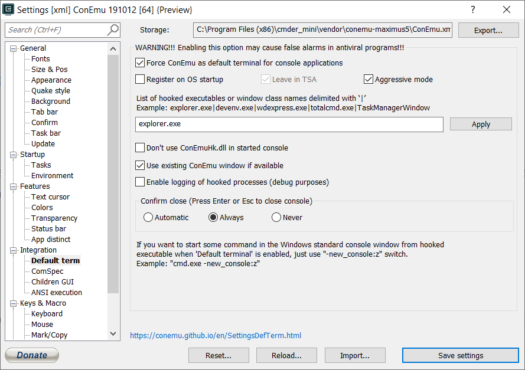
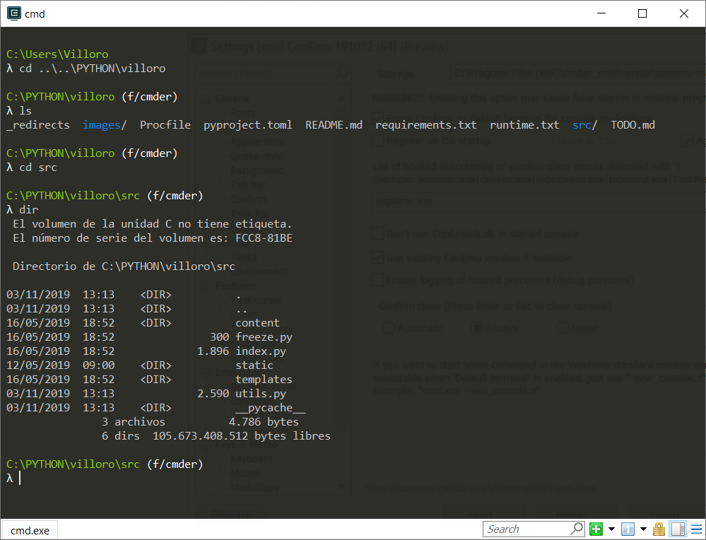

## 0. Overview

**Cmder** is a software package created out of pure frustration over the absence of nice console emulators on Windows.
It is based on amazing software, and spiced up with the Monokai color scheme and a custom prompt layout, looking sexy from the start.

## 1. Instalation

You can download from the <FancyLink linkText="Cmder" url="https://cmder.app/"/>.
I advise you install the version with git.

After downloading it extract the data and copy it to `C:\cmder_mini`.
I suggest you put it directly on `c:\` to avoid permission problems.

Then open the `.exe` file (`C:\cmder_mini\Cmder.exe`) to start using it.

<Notice type="info">
  You can right click the `.exe` file and pin it to the task bar.
</Notice>

## 2. Setting it as the default terminal

Open the **cmder** settings with `WIN` + `ALT` + `P`.
Then go to `Integration` / `Default term` and mark `Force conEmu as default terminal for console applications`.

After that any operation that opens the terminal or the powershell will open `cmder`.

## 3. Features

One of the best features is that most linx commands (like `ls`) work here as well as the windows ones (like `dir`).
So for example, no more problems with `cls` vs `clear` both work here!

Another really great feature is that you can open multiple consoles as tabs (like with chrome) with `CTRL` + `T` and close it with `CTRL` + `W`.

It is also way better visually than the default windows terminal.
And it has git integrations so that you will see by default the branch you are working on.

One other cool feature are alias.
For example you can write `alias jn=jupyter notebook` and the write `jn` to start jupyter notebooks.

As an example some useful alias would be:

| command                                                          | description                                      |
|------------------------------------------------------------------|--------------------------------------------------|
| alias ll=ls -lah                                                 | list files with details and human readable sizes |
| alias cdp=cd c:/PYTHON                                           | go to the python path                            |
| alias jn=cd c:/PYTHON && jupyter notebook                        | go to the python path and open jupyter notebook  |
| alias jl=cd c:/PYTHON && jupyter lab                             | go to the python path and open jupyter lab       |
| alias rf=python src/index.py                                     | open a flask app                                 |
| alias vtasks=cd c:/GIT/vtasks && poetry run python src/master.py | go to vtasks folder and run it with poetry       |

It has a lot of other nice features, you can read about it in their webpage.
You can read about them in the <FancyLink linkText="Cmder documentation" url="https://github.com/cmderdev/cmder" dark="true"/>.
