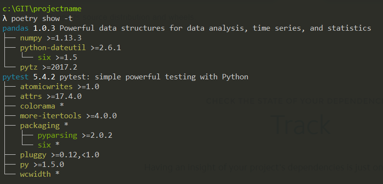

## 0. Overview


Poetry is a python packaging and dependency manager.
It makes it really easy to manage packages while using environments under the hood.
It also allows build and publishing packages to PyPI (or other sites).

## 1. Alternatives. Why Poetry?

Before viewing why is **Poetry** a good solution let's check the more common alternatives.

### 1.1. Raw

The easiest and least elegant why of handling dependencies is by simply installing all packages in the main environment.
In other words this means installing packages only using:

```sh
pip install example_package
```

This is usually the way new python developers install programs.
In order to track the installed libraries users could add them manually in the `requirements.txt` file or export it using:

```sh
pip freeze > requirements.txt
```

This method will have some major problems:

1. It will be difficult to install different versions for different projects (for example `pandas 0.25` for one project and `1.0` for another.)
2. If requirements are added manually it is possible to forget some (when adding new ones or deleting unused)
3. If requirements are added with `pip freeze` it will be difficult to differenciate between real dependencies and dependencies of the installed packages
4. There will be no differenciation between **development dependencies** and **production dependencies**

<Notice type="info">
  It is true that you can create a `requirements_dev.txt` file to handle development dependencies but you will need to manually mantain it.
</Notice>

### 1.2. Virtualenv / Conda

With both `Virtualenv` or `Conda` it is possible to create **environment**. This will allow to have different versions for different projects.

But except from that point there will still be the other problems.

## 2. How Poetry works?

With **Poetry** you create a project (or import one) and it automatically creates/uses a virtual environment under the hood.

**Poetry** will only use two files the `pyproject.toml` and `poetry.lock`.

The `pyproject.toml` is a standard python file for configuring a project. It aims to have all information about the project.

As an example:

```toml
[tool.poetry]
name = "test_project"
version = "0.1.0"
description = ""
authors = ["villoro7 <villoro7@gmail.com>"]

[tool.poetry.dependencies]
python = "^3.8"

[tool.poetry.dev-dependencies]
pytest = "^5.2"

[build-system]
requires = ["poetry>=0.12"]
build-backend = "poetry.masonry.api"
```

<Notice type="info" className="mt-6">
  By using the `pyproject.toml` file you will not need the `setup.py` file.
</Notice>

Finally the `poetry.lock` is a snapshot with the exact versions install. It can be updated from the `pyproject.toml`.

## 3. Creating a project

### 3.1. Init a new project

The first thing to do with python is to create a new project. You can do it with:

```sh
poetry new projectname
# Replace projectname for the name you want
```

### 3.2. Project structure

Creating a new project will create the following files:

```yaml
- /projectname
    ├── /projectname
    │   └── __init__.py
    ├── /tests
    │   ├── __init__.py
    │   └── test_projectname.py
    ├── pyproject.toml
    └── README.rst
```

There will be a dummy test inside the `tests` folder using the `pytest` package.

## 4. Managing dependencies

The idea is to use poetry to add or remove packages and let it handle the `pyproject.toml` file.

### 4.1. Add/remove packages

To add or remove packages you can use:

```sh
poetry add pandas
poetry remove pandas
```

You can also specify a development dependency with:

```sh
# Both are equivalent
poetry add -D black
poetry add --dev black

# And for remove
poetry remove -D black
poetry remove --dev black
```

Poetry is more has more ways of specifing the versions of the dependencies.
The default one is:

```sh
pandas = "^0.25"
```

Wich translates to `>=0.25.0 <1.0.0`

You can check all the possible ways in the <FancyLink linkText="Poetry docs" url="https://python-poetry.org/docs/dependency-specification/#version-constraints" company="poetry"/>.

### 4.2. Install update dependencies

Once there is a `pyproject.toml` file you can install/update all the specified dependencies.

<Notice type="info">
  Those are also the commands you should run if the project was created and you are **fetching it from git**.
</Notice>

```sh
poetry install
poetry update

# for production
poetry install --no-dev
```

<Notice type="info" className="mt-6">
  Both commands will create a the `poetry.lock` file with a snapshot of the installed packages (or update it if already present).
</Notice>

### 4.3. See dependencies

With poetry you easily see the dependencies of your project as well as the dependencies of those dependencies.

```sh
# Show all dependencies
poetry show -t

# Show production dependencies (no development)
poetry show -t --no-dev
```

As an example:



### 4.4. Check

With `poetry check` you can check if the `pyproject.toml` file has any errors.

## 5. Runing code with Poetry

Since poetry uses a virtual environment and you are not activating/sourcing it has commands to actually work with the environment.

With `poetry shell` you can have a shell using the environment created with poetry.

And `poetry run xxxx` will allow you to run the command you want using the environment.
As an example instead of running:

```python
luigid

python src/master.py
```

You should do:

```sh
poetry run luigid

poetry run python src/master.py
```

## 6. Create and publish packages

You can use poetry to build python packages with:

```sh
poetry build
```

This will create both a `whl` and `.tar.gz` files.

And then you can also upload it to `PyPI` with:

```sh
poetry publish
```

## 7. Poetry compatibility

Finally you can use poetry and allow other people to use the old `requirements.txt` file.

You will only need to export it with:

```sh
poetry export -f requirements.txt > requirements.txt
```

## 8. More info

If you want to read more about poetry check out the following links:

1. <FancyLink linkText="Poetry documentation" url="https://python-poetry.org/docs/" company="poetry"/>
2. <FancyLink linkText="Solving dependency management in Python with Poetry" url="https://towardsdatascience.com/solving-dependency-management-in-python-with-poetry-165b92069e9d" company="medium" dark="true"/>
