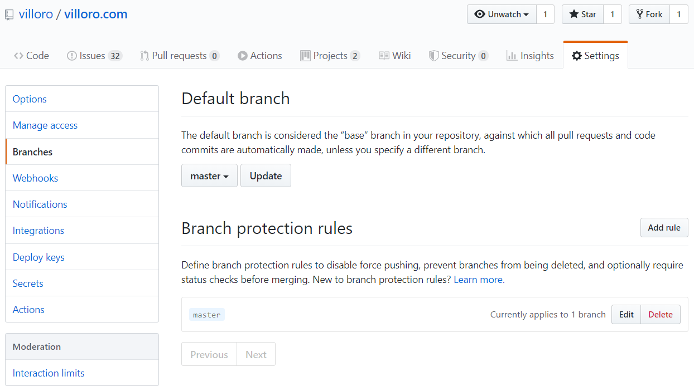

## 1. Using a git provider

The first thing to do is select a **GIT** hosting service. The most popular are:

* <FancyLink linkText="Github" url="https://github.com/" dark="true"/>
* <FancyLink linkText="Bitbucket" url="https://bitbucket.org/"/>
* <FancyLink linkText="Gitlab" url="https://about.gitlab.com/"/>
* <FancyLink linkText="Azure DevOps" url="https://azure.microsoft.com/services/devops/" company="azure-devops"/>

Those services host your **GIT** repository and allow you to interact with your team.
There are some methodologies that you can follow when working with **GIT**, my suggestion is that you use **gitflow**: <FancyLink linkText="Using gitflow for code control" url="https://villoro.com/blog/using-gitflow" dark="true"/>

### 1.1. Protecting branches

As I suggested it is a good practice to use pull request to integrate changes to the `develop` and/or `master` branches.
Since people can do mistakes you should set some branch protection.

As an example this is how you prevent the `master` branch to be deleted or to have direct changes (all changes should come from a pull request).



## 2. Install a custom terminal

If you are developing you almost certainly will also be using a terminal.
If you are a **Windows** the default terminal lacks a lot of nice features so I you can install a custom terminal.

My personal favorite is **cmder**: <FancyLink linkText="Cmder terminal for windows" url="https://villoro.com/blog/cmder-terminal-windows" dark="true"/>

With **cmder** you can define your own **alias**.
Here you have an example of the ones I am using:

<TerminalOutput color="stone">
  C:\cmder\config\user_aliases.cmd
</TerminalOutput>
```sh
ll=ls -lah  
cdp=cd c:/GIT  # This is my default folder for GIT projects
jn=cd C:/GIT $t jupyter notebook  
jl=cd c:/GIT $t jupyter lab  
rf=python src/index.py 
```

<Notice type="warning">
  You should append that to the end of the `user_aliases.cmd` file. **Do not remove the existing content**.
</Notice>

## 3. Connect to your GIT hosting service

There are different ways to connect to the GIT hosting service.
The more secure one is by setting up a **SSH** key: <FancyLink linkText="Using git with SSH" url="https://villoro.com/blog/git-with-ssh" dark="true"/>

### 3.1. GIT Client

You can work with **GIT** with your terminal or by using a program.
In my case I like using <FancyLink linkText="Sublime Merge" url="https://www.sublimemerge.com/"/>.

It works in `Windows`, `Mac` and `Linux` and uses only **GIT** commands under the hood.

## 4. Installing an IDE

In order to develop you need to write text files.
You can do it with any text editor but there IDEs that have a lot of nice features.

The one I like the most is <FancyLink linkText="Sublime Text 3" url="https://www.sublimetext.com/"/>.

It is also important to install extensions for your IDE that can help you.
As an example you can use `black` with `sublack` for **Sublime Text**: <FancyLink linkText="Black for code formatting" url="https://villoro.com/blog/black-code-formatting" dark="true"/>

## 5. Create package with poetry

Then you need to create your project. The important part is that you use some kind of virtual environment / package control like:

* <FancyLink linkText="Anaconda" url="https://www.anaconda.com/"/>
* <FancyLink linkText="Virtualenv" url="https://virtualenv.pypa.io/en/latest/" company="default" dark="true"/>
* <FancyLink linkText="Poetry" url="https://python-poetry.org/" company="poetry"/>

I find that **Poetry** is the easiest and the one that has more useful features.
You can read more about it here: <FancyLink linkText="Poetry package manager" url="https://villoro.com/blog/poetry-python-package-manager" dark="true"/>

## 6. Pre-commit

<FancyLink linkText="Git Hooks" url="https://git-scm.com/book/en/v2/Customizing-Git-Git-Hooks"/> are a good way to automate some tasks.
There are multiple way of using them. What I suggest is that you use `pre-commit`: <FancyLink linkText="Using Pre-commit to automate tasks" url="https://villoro.com/blog/pre-commit" dark="true"/>

<Notice type="success">
  `Pre-commit` can be used for any language even though is developed with python.
</Notice>

My bare minimum for `pre-commit` with python is to add:

* black
* flake8

## 7. CI Integration

**Continuous Integration (CI)** allows to automate tasks such as testing and deploying.
If you don't know what it is you can read it <FancyLink linkText="Continuous integration" url="https://www.atlassian.com/continuous-delivery/continuous-integration"/>.

There are a lot of **CI** providers, the more famous are:

* <FancyLink linkText="Travis CI" url="https://travis-ci.org/"/>
* <FancyLink linkText="Jenkins" url="https://www.jenkins.io/"/>
* <FancyLink linkText="Circle CI" url="https://circleci.com/" dark="true"/>
* <FancyLink linkText="Gitlab" url="https://gitlab.com/"/>

## 8. Deploying

Finally you might want to deploy your code.

For an `app` my favorite is <FancyLink linkText="Heroku" url="https://www.heroku.com/"/>.
It has free options and is really easy to set up.

For static webpages you should use <FancyLink linkText="Netlify" url="https://www.netlify.com/"/>.
They are the ones hosting this webpage.

Finally for other stuff I usually use <FancyLink linkText="AWS" url="https://aws.amazon.com/" company="aws"/>.
