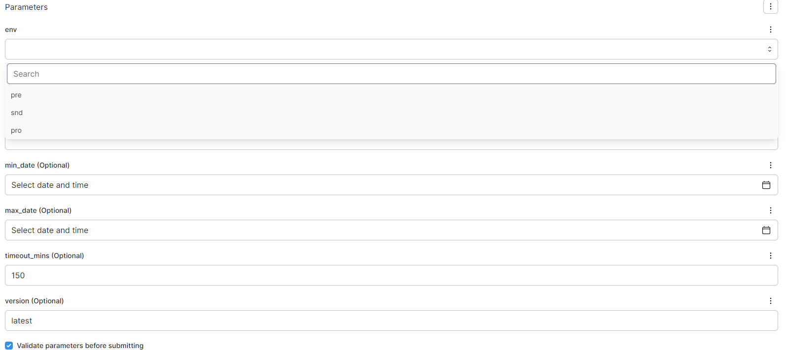

<script type="module" src="/js/posts/0040-plots-prefect.js"></script>

## 0. Why Prefect?

Five years ago (in 2019), I created a pipeline to automate tasks (more info in <FancyLink linkText="Vtasks" url="https://github.com/villoro/vtasks" dark="true"/>).
Initially, I used <FancyLink linkText="Airflow" url="https://airflow.apache.org/" company="airflow"/> (see how in <FancyLink linkText="Setting up Airflow" url="https://villoro.com/blog/setting-up-airflow/" dark="true"/>) since it was the industry standard at the time.
However, I found Airflow to be overly complex for my needs. This led me to switch to <FancyLink linkText="Luigi" url="https://github.com/spotify/luigi" dark="true"/> (see how in <FancyLink linkText="Luigi orchestrator" url="https://villoro.com/blog/luigi-orchestrator/" dark="true"/>).

While Luigi worked better for me, I still lacked features such as dynamic DAG creation based on input parameters.
Fortunately, I discovered <FancyLink linkText="Prefect" url="https://www.prefect.io/" dark="true"/>, which offered the simplicity and flexibility I desired:

* Super simple to start with
* Very flexible

I quickly adopted Prefect for my pipeline and found it to be highly effective.

You might be hesitant to use a new tool without substantial support. However, Prefect is gaining popularity and is positioned as the top Airflow alternative, as evident from the GitHub stars of various orchestrators:

<canvas id="plot-github-stars" style="width:100%;height:300px;"></canvas>

<Notice type="warning" className="mt-6">
  GitHub Stars extracted using <FancyLink linkText="Daily Stars explorer" url="https://github.com/emanuelef/daily-stars-explorer"/>.
  To quickly see the star history of a repo, you can use <FancyLink linkText="Stars History" url="https://star-history.com/"/>.
</Notice>

## 1. Prefect Basics

<Notice type="info">
  If you want a more in-depth introduction to **Prefect** basics, you can read <FancyLink linkText="Prefect Quickstart" url="https://docs.prefect.io/latest/getting-started/quickstart/" dark="true"/> instead.
</Notice>
The first step is to install prefect with:

```sh
pip install prefect
```

### 1.1. First `flow` (aka `DAG`)

Now, you're ready to create your first `flow` (this is how `Prefect` refers to a `DAG`) using a simple decorator:

<TerminalOutput color="stone">
  /main.py
</TerminalOutput>
```python
from prefect import flow

@flow
def greet(name):
    print(f"Hello {name}")

if __name__ == '__main__':
    greet("John")
```

To run the `flow`, execute the following command:

```sh
python main.py
```

### 1.1. Adding `tasks` and `subflows`

In Prefect, you can add `tasks` to be run inside a `flow`.
`Tasks` work similarly to `flows` since they are also defined with a decorator:

<TerminalOutput color="stone">
  /main.py
</TerminalOutput>
```python
from prefect import flow
from prefect import task

@task
def greet(name):
    print(f"Hello {name}")

@flow
def good_morning():
    greet("John")
    greet("Sam")

if __name__ == '__main__':
    good_morning()
```

<Notice type="info" className="mt-6">
  A `flow` can call another `flow`, and you can have as many layers as you want of `flows` calling `flows` inside them.
</Notice>

So you could change the code above to:

```python
from prefect import flow

@flow # Now this is a flow
def greet(name):
    print(f"Hello {name}")

@flow
def good_morning():
    greet("John")
    greet("Sam")

if __name__ == '__main__':
    good_morning()
```

<Notice type="warning" className="mt-6">
  A `task` **cannot** call another `task` inside itself.
</Notice>

### 1.2. Using `tags`

Adding `tags` in Prefect is quite straightforward:

```python
from prefect import tags

with tags("env:pro", "type:greet"):
    good_morning() # Call any 'flow' you want
```
<Notice type="info">
  The `tags` are simply `strings`.
</Notice>

In order to categorize, I like to use tags with `{key}:{value}` format, like `env:pro`.
This helps me to later filter `flows`.

### 1.3. Adding `logs`

To add `logs` linked to `Prefect` you need to:

```python
from prefect import flow
from prefect import get_run_logger

@flow(name="greet")
def greet(name):
    logger = get_run_logger()
    logger.info(f"Hello {name}")

if __name__ == '__main__':
    greet("John")
```
<Notice type="error">
  `get_run_logger()` **must** be called inside a `task` or a `flow`, else it will fail.
</Notice>

Also, notice that in this example, I defined a `name` for the `flow`.

## 2. Connection to Prefect Cloud

With the example we did Prefect run locally with a local database it created.
This is useful for testing but you shouldn't be running jobs in production without a server.

To connect to Prefect cloud you can do it with:

```sh
prefect cloud login
```

This will open an internet window where you will be asked to log in.
Since this won't work well on automated processes, the alternative is to create a Prefect token:

```sh
prefect cloud login -k your_token
```
<Notice type="warning">
  Make sure to replace `your_token`. Prefect tokens usually start with `pnu_`.
</Notice>

<Notice type="info" className="mt-6">
  In some cases, you might run into problems because Prefect is still using the default settings. To clean them out, go to `~/.prefect` and delete the files that are there.
  **Important:** this will delete the local database with the information of the flows you just ran.
</Notice>

## 3. Using Prefect Blocks

You can use <FancyLink linkText="Prefect Blocks" url="https://docs.prefect.io/latest/concepts/blocks/" dark="true"/> to set up connections to external tools.
For example, you can use the Slack Block to store a Slack webhook.
Once done, you can send Slack messages by simply running:

```python
from prefect.blocks.notifications import SlackWebhook

slack_webhook_block = SlackWebhook.load("slack") # The name of the block you just created
slack_webhook_block.notify("Hello from Prefect!")
```

## 4. Naming conventions

When calling flows or tasks, I like to follow a naming convention where each unit inherits a prefix from its parent.
In the example we used before, it would be:

```python
from prefect import flow

@flow(name="good_morning.greet")
def greet(name):
    print(f"Hello {name}")

@flow(name="good_morning")
def good_morning():
    greet("John")
    greet("Sam")

if __name__ == '__main__':
    good_morning()
```

This helps keep things organized and makes it easier to understand the relation between different flows and tasks.

For a more complex example, let's take a look at my personal pipeline <FancyLink linkText="Vtasks" url="https://github.com/villoro/vtasks" dark="true"/>.
There we can see how the main flow `vtasks` calls different flows like `vtasks.backup` or `vtasks.expensor`.
They in turn have different tasks inside:

```plaintext
- vtasks
  ├── vtasks.backup
  │   ├── vtasks.backup.backup_files
  │   ├── vtasks.backup.clean_backups
  │   └── vtasks.backup.copy
  ├── vtasks.expensor
  │   ├── vtasks.expensor.read
  │   └── vtasks.expensor.report
  └── ...
```

## 5. Migrating to `prefect`

I think that migrating from another orchestrator to Prefect can be easily done in incremental steps:

1. Track executions
2. Set up a Prefect Server (this is optional, you can use Prefect cloud instead)
3. Create deployments so that you can trigger executions from Prefect
4. Schedule flows with Prefect

The idea behind those steps is to be able to test Prefect and see if it indeed suits your needs better compared to other solutions.

### 5.1. Track executions with `prefect`

This first step towards implementing Prefect is to add some flows in any Python code you have.
The idea is to use Prefect only for observability purposes so that you have a centralized place from where you can:

* See logs
* Track flows/tasks outcomes
* Have notifications for failures

<Notice type="success">
  This won't interfere with any existing orchestrator.
</Notice>

So for example let's imagine that you use Airflow for triggering EMR jobs.
Here what you would do is to add Prefect decorators to the code that runs in EMR.

For example you could have the following flows:

```plaintext
- my_emr_job
  ├── my_emr_job.read
  ├── my_emr_job.transform
  │   ├── my_emr_job.transform.rename
  │   └── my_emr_job.transform.cast
  └── my_emr_job.write
```

This is just a dummy example but it helps to illustrate how you could add better observability.

### 5.2. Set up a `Prefect server`

At this point, you will need to decide if you want to set up your Prefect server.
If you want to do so you can read how in <FancyLink linkText="Prefect Server Setup: Configuration and Deployment" url="https://villoro.com/blog/prefect-server-setup/" dark="true"/>.

You can always start creating your Prefect server and then migrate to Prefect cloud or the other way around.

### 5.3. Create `deployments` for running `flows`

In this step, you will create `Deployments` for the `flows` you want to be able to trigger from Prefect.

This will allow you to perform `backfills` or any other manual run using Prefect UI.

<Notice type="success">
  Again, this won't interfere with any existing orchestrator.
  It will only provide another way of manually triggering `flows`.
</Notice>

As an example, see how you can use `dropdowns`, `date pickers`, default values and other nice features that simplify triggering manual runs:



This is automatically created as long as you properly define the parameters in your flow.
This is the code for the example above:

```python
from datetime import datetime
from typing import Literal

@flow(name="prefect.emr.salesforce.sf_export")
def sf_export(
    env: Literal["pre", "snd", "pro"],
    select: str = None,
    exclude: str = None,
    min_date: datetime = None,
    max_date: datetime = None,
    timeout_mins: int = 150,
    version: str = "latest",
):
```

In order to see how to create the `Deployments` themselves, read <FancyLink linkText="Prefect Server Setup: Configuration and Deployment | Deployments" url="https://villoro.com/blog/prefect-server-setup#2-deployments" dark="true"/>

### 5.4. Schedule `flows` with `prefect`

The last step is to finally use Prefect for scheduling the  `flows`.

<Notice type="warning">
  Now is the time to finally switch to `Prefect` and to deprecate any other orchestrator you might have.
</Notice>

To see how to schedule `flows`, go to <FancyLink linkText="Prefect Server Setup: Configuration and Deployment | Deployments" url="https://villoro.com/blog/prefect-server-setup#2-deployments" dark="true"/>

## 6. Using `prefect.client`

We can use `prefect.client` to interact with the Prefect API.
This allows us to do very powerful things like:

* Updating tags at runtime based on input parameters
* Querying past flows and taking certain actions based on the outcome

All interactions with `prefect.client` are **async**.
That means you will need to do one of the following:

1. Defining `async` functions whenever interact with it
2. Calling `asyncio.run()` (or `await` if you are in a Jupyter Notebook)

### 6.1. Updating `tags` at runtime

In general `tags` are defined prior to a `flow_run`.
However, it is possible to modify those tags at runtime.
This is very useful to add `tags` based on the input parameters of a `flow`.
Imagine that we have a `flow` that can run in `pre`/`pro`, it is really useful to tag the `flow_run` with the environment where it ran.

We can update the `tags` with the following code:

```python
import asyncio

from prefect import get_run_logger
from prefect.client import get_client
from prefect.context import get_run_context


def update_tags(tags):
    logger = get_run_logger()
    if not tags:
        logger.warning("No tags passed to 'update_tags', nothing to do")
        return True

    logger.info(f"Adding {tags=} to current flow_run")

    # Read current flow
    flow_run = get_run_context().flow_run
    tags += flow_run.tags

    client = get_client()
    asyncio.run(client.update_flow_run(flow_run.id, tags=set(tags)))
    return True

```
<Notice type="warning">
  This is meant to be called from a `flow`. It won't work if called from a `task`.
</Notice>

And then we would use it with:
```python
from prefect import flow

@flow(name="good_morning.greet")
def greet(name):
    print(f"Hello {name}")

@flow(name="good_morning")
def good_morning(env):
    update_tags([f"env:{env}"])
    greet("John")
    greet("Sam")

if __name__ == '__main__':
    good_morning("pro")
```

### 6.2. Querying `prefect` for conditional `flows`

You can query any `prefect` entity with the `prefect.client` like:

* `flows`
* `flow_runs`
* `tasks`

For example for querying `flow_runs` we would use something like:

```python
from prefect.client import get_client
from prefect.orion.schemas import filters
from prefect.orion.schemas import sorting

async def read_flow_runs(flow_run_filter=None, sort=sorting.FlowRunSort.START_TIME_DESC):
    """
    Asynchronously retrieves flow runs with query limits.

    Args:
        offset (int): Offset for paginating the results.
        flow_run_filter (prefect.orion.schemas.filters.FlowRunFilter, optional): Filter for flow runs. Defaults to None.
        sort (prefect.orion.schemas.sorting.FlowRunSort, optional): Sorting options. Defaults to sorting.FlowRunSort.START_TIME_DESC.

    Returns:
        list: List of flow runs.
    """
    client = get_client()
    return await client.read_flow_runs(flow_run_filter=flow_run_filter, sort=sort)
```

We can use the `flow_run_filter` to filter the `flow_runs` we want to get.
It is a little bit complex since you need to use the `filter` from `prefect.orion.schemas`.

For example:

```python
async def query_flow_runs(name_like, env, state_names, start_time_min)
    filter_params = {
        "name": filters.FlowRunFilterName(like_=name_like),
        "tags": filters.FlowRunFilterTags(all_=[f"env:{env}"]),
        "state": filters.FlowRunFilterState(
            name=filters.FlowRunFilterStateName(any_=state_names)
        ),
        "start_time": filters.FlowRunFilterStartTime(after_=start_time_min),
    }

    flow_run_filter = filters.FlowRunFilter(**filter_params)
    return await read_flow_runs(flow_run_filter)
```

Finally with that we can use that to see if we have already run a `flow` with:

```python
from datetime import datetime, timedelta

flow_runs = asyncio.run(
    query_flow_runs(
       name_like="vtasks.gcal.summary",
       env="pro",
       start_time_min=datetime.now() - timedelta(days=1)
    )
)

if flow_runs:
    do_something()
```

<Notice type="success" className="mt-6">
  This is very useful when you have a pipeline that executes multiple times a day and you don't want to run a `flow`/`task` each time but only once if it hasn't been done in less than a day.
</Notice>
