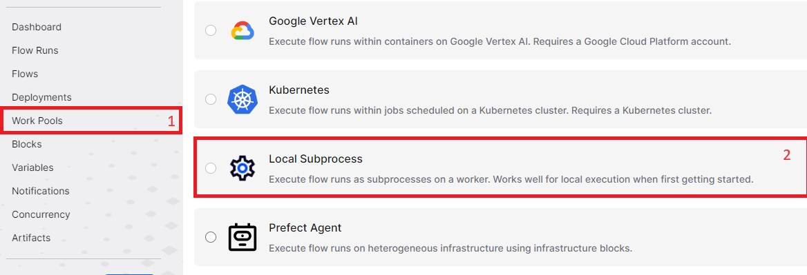

## Table of Contents

[TOC]

## 3. Using Prefect Blocks

You can use <FancyLink linkText="Prefect Blocks" url="https://docs.prefect.io/latest/concepts/blocks/" dark="true"/> to set up connections to external tools.
For example you can use the `Slack Block` to store a `Slack webhook`.
Once done you can send `slack` messages by simply running:

```python
from prefect.blocks.notifications import SlackWebhook

slack_webhook_block = SlackWebhook.load("slack") # The name of the block you just created
slack_webhook_block.notify("Hello from Prefect!")
```

This is how I recommend storing `Github` and `AWS` credentials needed for this tutorial.

## 4. Setting up a Prefect Server

<Notice type="info">
  This section is based on <FancyLink linkText="Hosting a Prefect server instance" url="https://docs.prefect.io/latest/guides/host/" dark="true"/> guide.
</Notice>

The simplest configuration that can work in `production` needs 3 pieces:

1. A **database** for the server
2. The `prefect server`
3. At least one `prefect worker`

For the `database` I simply used a `postgres` hosted on `AWS`.

Prefect is design to be able to scale way beyond that configuration (more info in <FancyLink linkText="Deploying Flows to Work Pools and Workers" url="https://docs.prefect.io/latest/guides/prefect-deploy/" dark="true"/>)
However in this post I'll only explain the basic setup.

This basic configuration works for me because I only want the `prefect workers` to trigger different `AWS` jobs and tasks using `boto3`, such as:
* `lambdas`
* `ecs` tasks with `fargate`
* `emr serverless` tasks

So one simple worker is enough for that set up.

### 4.1. Creating the Prefect Server

Here we only need a simple `docker` that has `prefect` installed.
There is no offical images for a `docker server` but we can use the official one for `workers`.

Then the only set up needed is to provide the correct configuration for the database:

<TerminalOutput color="stone">
  /Dockerfile.server
</TerminalOutput>
```docker
# Prefect version must match Dockerfile.worker and pyproject.toml
FROM prefecthq/prefect:2.16-python3.10 as base

# Set connection (format: `postgresql+asyncpg://{user}:{password}@{url}:{port}/prefect`)
ARG DB_URL
RUN prefect config set PREFECT_API_DATABASE_CONNECTION_URL="${DB_URL}"
RUN prefect config set PREFECT_SERVER_API_HOST=0.0.0.0

CMD ["prefect", "server", "start"]
```

<Notice type="warning">
  If you try to run this with the `database` in a `docker` you will probably run into networking problems.
  I strongly suggest you use <FancyLink linkText="Prefect example with Docker compose" url="https://github.com/rpeden/prefect-docker-compose/blob/main/docker-compose.yml" dark="true"/> to see how to do it with `docker compose`.
</Notice>

And then to create the `docker image` run:

```sh
docker build --build-arg DB_URL=XXX -f Dockerfile.server -t northius/prefect/server .
```
<Notice type="warning">
  Replace `XXX` with the database `URL`.
  If it's a `postgres` one it should be like `postgresql+asyncpg://{user}:{password}@{url}:{port}/prefect`
</Notice>

With the `prefect server` you will be able to access the web UI.
If you are running it locally you can find it in `localhost:4200`.
However the `server` won't be able to run any flow without a `worker`.

### 4.2. Creating a Prefect Worker

The first thing we need is to create a `Work Pool` so that the `Worker` we will create can join it.



<TerminalOutput color="stone">
  /Dockerfile.worker
</TerminalOutput>
```docker
# Prefect version must match Dockerfile.server and pyproject.toml
FROM prefecthq/prefect:2.16-python3.10 as base

# Connect to prefect
ARG PREFECT_API_URL
ENV PREFECT_API_URL=${PREFECT_API_URL}

# Allow to config pool_name
ARG POOL_NAME=subprocess-pool
ENV POOL_NAME=${POOL_NAME}

ENTRYPOINT prefect worker start --pool ${POOL_NAME}
```

```sh
docker build --build-arg PREFECT_API_URL=XXX -f Dockerfile.worker -t northius/prefect/worker .
```

<Notice type="warning">
  Make sure that the `prefect` versions match in both `Dockerfile`.
</Notice>

### 4.3. Running Both Containers

## 5. Deployments

### 5.1. Creating Deployments

<TerminalOutput color="stone">
  /prefect.yaml
</TerminalOutput>
```yaml
pull:
- prefect.deployments.steps.git_clone:
    id: clone-step
    repository: https://github.com/github_user/repo.git
    branch: main
    credentials: "{{ prefect.blocks.github.github }}"
- prefect.deployments.steps.pip_install_requirements:
    requirements_file: requirements.txt
    directory: "{{ clone-step.directory }}"
    stream_output: False
```

### 5.2. Advanced Usage of Deployments

```yaml
definitions:
  work_pools:
    subprocess-pool: &subprocess-pool
      name: subprocess-pool

    version: &version
      version: 0.4.3

    # Define defaults (that can be overwritten)
    defaults: &defaults
      <<: *version
      work_pool: *subprocess-pool
      tags: ["type:prefect"]
      schedule: {}
```

<FancyLink linkText="YAML alias nodes" url="https://yaml.org/spec/1.2.2/#71-alias-nodes" dark="true"/>


<TerminalOutput color="stone">
  /prefect.yaml
</TerminalOutput>
```yaml
- name: lambdas.athena_history
  <<: *defaults
  description: Export Athena history with a lambda
  entrypoint: src/lambdas/lambdas.py:athena_history
  tags: ["type:prefect", "group:lambda", "job:athena_history"]

- name: lambdas.emr_history
  <<: *defaults
  description: Export EMR history with a lambda
  entrypoint: src/lambdas/lambdas.py:emr_history
  tags: ["type:prefect", "group:lambda", "job:emr_history"]
  schedule:
    cron: "0 3 * * *"
```

## 6. Prefect flows examples

<TerminalOutput color="stone">
  /src/common/prefect_utils.py
</TerminalOutput>
```python
import asyncio

from prefect import get_run_logger
from prefect.client import get_client
from prefect.context import get_run_context


def update_tags(tags):
    logger = get_run_logger()
    if not tags:
        logger.warning("No tags passed to 'update_tags', nothing to do")
        return True

    logger.info(f"Adding {tags=} to current flow_run")

    # Read current flow
    flow_run = get_run_context().flow_run
    tags += flow_run.tags

    client = get_client()
    asyncio.run(client.update_flow_run(flow_run.id, tags=set(tags)))
    return True

```

<TerminalOutput color="stone">
  /src/lambdas/base.py
</TerminalOutput>
```python
from prefect import get_run_logger
from prefect import task

from src.common.session import get_session


@task(name="prefect.lambdas.run")
def _run_lambda(client, name):
    logger = get_run_logger()

    response = client.invoke(
        FunctionName=name,
        InvocationType="RequestResponse",
        LogType="None",
    )

    if (status_code := response["StatusCode"]) == 200:
        logger.info(f"Lambda {name=} completed successfully")
        return True

    logger.error(f"Lambda {name=} failed with {status_code=}")


def run_lambda(env, name):
    logger = get_run_logger()
    logger.info(f"Running lambda {name=} in {env=}")

    client = get_session(env).client("lambda")
    _run_lambda(client, name)
```

<TerminalOutput color="stone">
  /src/lambdas/lambdas.py
</TerminalOutput>
```python
from typing import Literal

from prefect import flow

from prefect_northius.lambdas.base import run_lambda


@flow(name="prefect.lambdas.athena_history")
def athena_history(env: Literal["snd", "pro"]):
    run_lambda(env, "nt-lambda-function-athena-history")


@flow(name="prefect.lambdas.emr_history")
def emr_history(env: Literal["snd", "pro"]):
    run_lambda(env, "nt-lambda-function-emr-history")
```

## 7. Prefect API with `prefect.client`
