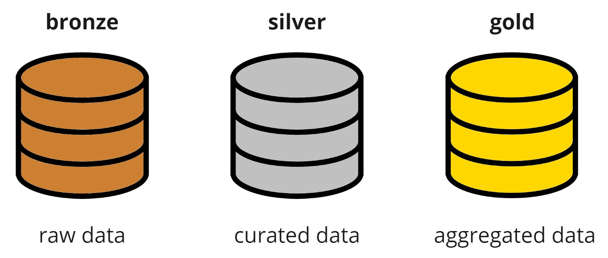

## Table of Contents

[TOC]

## 0. Motivation

In traditional pipelines, data processing typically focuses on the last batch, such as yesterday's data for daily executions.
While effective under normal circumstances, multiple failures can lead to tedious backfilling processes.
This post delves into the concept of self-healing pipelines, which streamline operations by automatically backfilling failed executions, reducing the need for manual interventions.

## 1. Regular batch processing

Let's imagine we have a daily pipeline that was running well until Friday (`2024-05-03`) when someone pushed a bug to `production`.
You discover that mistake on Monday (`2024-05-06`) morning.
Now you need to recover all missing data and that means you need to backfill 3 days. 


So you go to your orchestrator and schedule 3 jobs to extract the data for each day that failed.
This works well but it has some drawbacks:

1. You need to manually lunch the backfills
2. Running 3 jobs instead of 1 can be less cost effective in some systems (like with spark)

## 2. Processing new data

The basic idea behind `Self-healing pipelines` is to always process any data that is **newer to the last extraction done**.
In pseudo code that would be:

```sql
source.last_modified_at > max(destination.last_modified_at)
```

Going back to the example, since the last correct extraction was done on the `2024-05-03`, in the next run we will process from there up until `2024-05-06`.

<Notice type="warning">
  **Important:** if you need to process a lot of days you might need to increase the resources and it might not work automatically unless you have some way of increasing them automatically.
</Notice>

### 2.1. Partitioning

I like to structue the data lake in 3 layers as `databricks` suggest in <FancyLink linkText="Medallion Architecture" url="https://www.databricks.com/glossary/medallion-architecture"/>.

Those layers are:

1. `bronze`, aka `raw` or `landing`
2. `silver`
3. `gold`



#### 2.1.1. Partitions in `bronze`

For the `bronze` layer I strongly suggest that you always partition by the extraction datetime.
Since I like to add the `p_` preffix to the partition columns, that would be `p_exctracted_at`.

The advantages are:

* **No need to write old partitions** (update or rewrite) when extracting new data
* Easy to know when was the last extraction done and what data needs to be processed

#### 2.1.2. Partitions on `silver`/`gold`

Then on `silver` and/or `gold` layers you can switch to partition by `creation_date` (based on the data) or to not partition at all.
As a reference see <FancyLink linkText="When to partition tables on Databricks" url="https://docs.databricks.com/en/tables/partitions.html"/>.
They suggest that you only partition big tables (> 1TB) when using `delta` tables (also applicable to `iceberg` or `hudi` tables).

So on those layers you will need to read all new partitions from `bronze` and update that table on `silver`/`gold`.
The easiest way is to use the `MERGE INTO` option that both <FancyLink linkText="Delta Lake" url="https://delta.io/"/> and <FancyLink linkText="Iceberg" url="https://iceberg.apache.org/" company="iceberg"/> support.

### 2.2. Deduplication

In the `bronze` layer we are extracting any row that had a change and we store it partition it by `p_extracted_at`.
That means that if we try to process multiple `bronze` partitions we will likely have duplicates.
To handle them we simply need to keep the latest entry.

As an example, let's imagine the following data:


The idea is to define a `row_number (rn)` for each `id` in the table in a descending order based on `last_modified_at` field (if not present you can use `p_extracted_at`).
With that you only need to keep all records that have `rn = 1` since the rest are duplicates.

#### 2.2.1. Deduplication when there is no `id` column

If there is no `id` column you will need to create one.
This is done by creating a `composite key` as described in <FancyLink linkText="DBT | Composite key" url="https://docs.getdbt.com/reference/resource-configs/unique_key#use-a-combination-of-two-columns-as-a-unique-key"/>.

<Notice type="warning">
  The easiest way to do so in `DBT` is by using the `dbt_utils.generate_surrogate_key` macro.
  More info at <FancyLink linkText="DBT | SQL surrogate keys" url="https://docs.getdbt.com/blog/sql-surrogate-keys"/>.
</Notice>

That can easily be replicated in `python` or other programming languages.

## 3. Code snippets

Now that we have all the concepts clear let's see how to implement it in `python` and `SQL`.

### 3.1. Python

I use `spark` with `python` for extracting data for new sources.
The imporant part here is to:

1. Get the `max_datetime`
2. Extract new data based on `max_datetime`
3. Export it partitioned by `p_extracted_at`

#### 3.1.1. Get `max_datetime`

```python
from datetime import datetime
from datetime import timedelta
from dateutil import parser

from loguru import logger # or any other logger

PARTITION_COL = "p_extracted_at"


def table_exists(spark, tablename: str, db=None):
    """Checks if a table exists"""
    # Check and extract proper 'db' and 'tablename'
    if db is None:
        msg = "'tablename' must be like 'db.table' or 'iceberg.db.table' when db=None"
        if tablename.startswith("iceberg."):
            assert len(tablename.split(".")) == 3, msg
            db, table = tablename.split(".")[-2:]
        else:
            assert len(tablename.split(".")) == 2, msg
            db, table = tablename.split(".")
    else:
        msg = "When passing 'db' then 'tablename' cannot have a '.'"
        assert "." not in tablename, msg
        table = tablename

    return spark.sql(f"SHOW TABLES IN {db} LIKE '{table}'").count() > 0

def infer_max_datetime(
    spark,
    tablename,
    filter_col,
    lookup_days=7,
    partition_col=PARTITION_COL,
    as_datetime=True,
):
    """
    Infers the 'max_date' of a table by checking the greater value inside the table.
    """
    logger.info(f"Infering 'max_date' for '{tablename}' ({filter_col=})")

    if not table_exists(spark, tablename):
        logger.warning(
            f"Table '{tablename}' does not exist which should only happen at the first run."
        )
        return None

    min_partition = (datetime.now() - timedelta(days=lookup_days)).isoformat()

    logger.info(f"Querying with {min_partition=}")
    sdf = spark.table(tablename).filter(f"'{partition_col}' >= '{min_partition}'")

    min_dt_str = sdf.agg({filter_col: "max"}).collect()[0][0]
    logger.info(f"Infered {min_dt_str=}")

    if not min_dt_str:
        logger.warning(f"max('{filter_col}') returned no values")
        return None

    if as_datetime:
        min_dt = parser.parse(min_dt_str)
        logger.info(f"Infered {min_dt=} for '{tablename}'")
        return min_dt

    return min_dt_str
```
<Notice type="info">
  Notice that here we are querying a column `filter_col` (which usually will be `last_updated_at`).
  Given that we the pipeline can fail and/or that we can do backfills that max value might not be in the latest partition.
  This is way I recommend querying `N` days of data (7 by default) and getting the max from there.
</Notice>

#### 3.1.2. Extract new data and store it

```python
from datetime import datetime

from pyspark.sql import SparkSession
from pyspark.sql import functions as F

PARTITION_COL = "p_extracted_at"
TABLENAME = "db.table"

def main():

    spark = SparkSession.builder.appName("test").getOrCreate()
    
    # Get the max `last_updated_at`
    max_dt = infer_max_datetime()

    # Extract new data
    sdf = get_data(where=f"WHERE last_updated_at >= {max_dt}")

    # Add partition column
    sdf = sdf.withColumn(PARTITION_COL, F.lit(datetime.now().isoformat()))

    # Write the data
    sdf.write.mode("append").format("parquet").saveAsTable(TABLENAME)

    spark.stop()

if __name__ == '__main__':
    main()
```
<Notice type="info">
  `get_data` is not defined since it's out of scope.
  It's just a function that queries some external system.
</Notice>

### 3.2. DBT (SQL)

I use `DBT` for transforming for creating the `silver` and `gold` layers.
Those examples should explain how to:

* Process only new data
* Deduplicate

#### 3.2.1. DBT macros

With `DBT` I like to define 2 macros:

* `row_number`. This is useful because in most tables I sort the windows with the same ways and I use the same key
* `last_update`. This one is useful for getting the latest updated of the 'self' table (`this` in DBT)

They can be defined with:

```sql

    ROW_NUMBER() OVER(PARTITION BY {{ keys }} ORDER BY {{ sorting }})



    (
        SELECT max({{ column }})
        FROM {{ table }}
    
        WHERE {{ filter_expression }}
    
    )

```

And the documentation:

```yaml
version: 2

macros:
  - name: row_number
    description: Gets the row_number which will be used for removing duplicates
    arguments:
      - name: keys
        type: string
        description: Column(s) used to define table unicity. Default `id`
      - name: sorting
        type: string
        description: Column and direction used to sort the window. Default `p_extracted_at DESC`

  - name: last_update
    description: |
      Returns the **last_update** from the `self` table.
      This is useful for building smart incremental models where we only process the deltas that are not processed.

      It would be used like:

          SELECT *
          FROM source
          
              WHERE p_extracted_at > {{ last_update('_extracted_at') }}
          

    arguments:
      - name: column
        type: string
        description: Name of the column that contains the `last_update`
```

#### 3.2.2. DBT model

Once you have the macros, the basic code for the model would look like:

```sql
WITH source AS (
    SELECT *
    FROM {{ ref('your_source_table') }}
),

latest_data_from_source AS (
    SELECT
        *,
        {{ row_number() }} AS rn
    FROM source
     -- This helps reading only the new data
        WHERE p_extracted_at > {{ last_update('_extracted_at') }}
    
),

deduplicated AS (
    SELECT
        ----------  ids
        id,

        ----------  add any other column here
        other_column

        ----------  metadata
        p_extracted_at AS _extracted_at
    FROM latest_data_from_source
    WHERE rn = 1 -- This is for deduplication
)

SELECT *
FROM deduplicated
```

<Notice type="warning" className="mt-6">
  It's important that you set the proper `materialization`.
  In general it should be `materialization=incremental` (see: <FancyLink linkText="DBT | Incremental models" url="https://docs.getdbt.com/docs/build/incremental-models"/>).
  And you might also need to set up the incremental strategy. For example with <FancyLink linkText="DBT Athena" url="https://github.com/dbt-athena/dbt-athena"/> I set the `incremental_strategy: merge` and the `table_type: iceberg`.
</Notice>

## 4. Handling schema changes

One last thing you might want to automatically handle are schema changes.
You cannot handle all of them but you can easily adapt to:

* Missing columns
* New columns
* Types changed

<Notice type="info">
  I only suggest you do that on `bronze` where you want to have as less errors as possible.
</Notice>

<Notice type="warning" className="mt-6">
  Notice that if you implement some automatic handling of schema changes you might have inconsistent data that you will need to handle.
  Do it at your own risk.
</Notice>

### 4.1. New or missing columns

If you want to automatically handle missing columns you simply need to add them as `NULL` in the input dataframe.

When working with `Delta` or `Iceberg` you can easily add columns without problems.
But sometimes on the `bronze` you might be working with raw `parquet`.
In that case, you will need to manually add the column to the catalog.

You can do both things with the following code:
 
```python
def fix_missmatching_columns(spark, sdf, tablename):

    if not table_exists(spark, tablename):
        logger.warning(
            f"'{tablename}' doesn't exist which should only happen at the first run"
        )
        return sdf

    sdf_hist = spark.table(tablename)

    # Get columns from the parquet table and current dataframe
    columns_history = sdf_hist.columns
    columns_current = sdf.columns

    # See which ones are missing and the new ones
    columns_new = set(columns_current) - set(columns_history)
    columns_missing = set(columns_history) - set(columns_current)

    if columns_new:
        cols_to_add = [f"{x} {get_col_dtype(sdf, x)}" for x in columns_new]
        cols_text = ", ".join(cols_to_add)

        logger.info(
            f"Adding to '{tablename}' [source] {len(columns_new)} "
            f"new columns: {cols_to_add=}"
        )

        spark.sql(f"ALTER TABLE {tablename} ADD columns ({cols_text})")

    if columns_missing:
        cols = {x: get_col_dtype(sdf_hist, x) for x in columns_missing}

        logger.warning(
            f"There are {len(columns_missing)} missing columns in "
            f"'{tablename}' [sdf]: {cols=}. Adding them as `NULL`."
        )
        sdf = sdf.select(
            "*",
            *[F.lit(None).cast(dtype).alias(name) for name, dtype in cols.items()],
        )

    if not columns_new and not columns_missing:
        logger.debug(f"Columns match for '{tablename}'")

    return sdf
```

### 4.2. Handling type changes

If you experience multiple type changes in your tables and you want to automatically handle them I think that the best thing you can do is to convert all columns to `string`.
Then on the `silver` layer you can apply the proper `type` you want by casting.
This should ensure that you always extract data to `bronze` no matter what.
