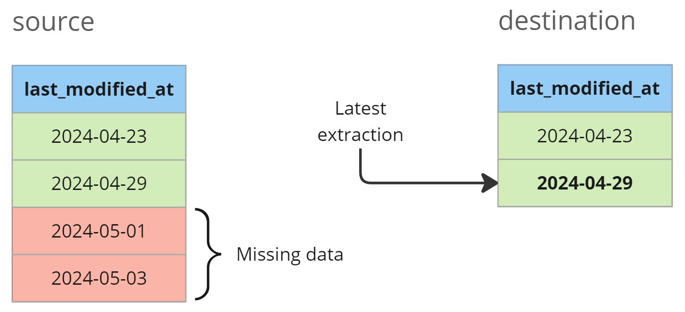
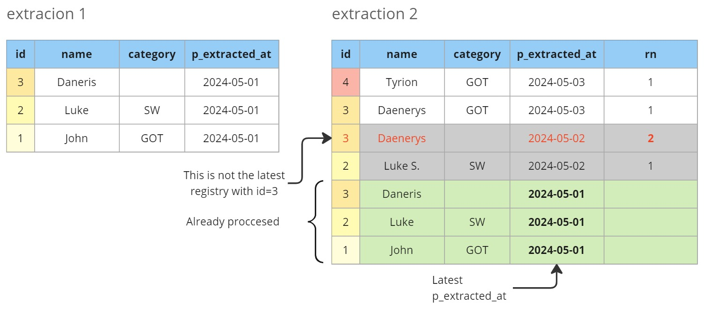

## Table of Contents

[TOC]

## 0. Motivation

In traditional pipelines, data processing typically focuses on the last batch, such as yesterday's data for daily executions.
While effective under normal circumstances, multiple failures can lead to tedious backfilling processes.
This post delves into the concept of self-healing pipelines, which streamline operations by automatically backfilling failed executions, reducing the need for manual interventions.

## 1. Daily processing

## 2. Processing new data

### 2.1. Deduplication

## 3. Code snippets

### 3.1. SQL / DBT

### 3.1. Python
