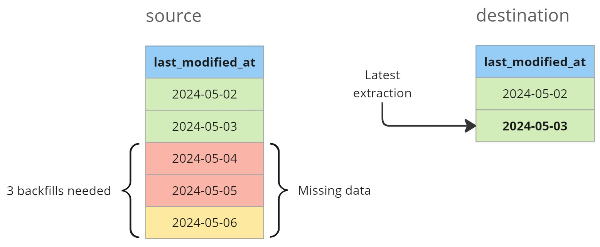

## Table of Contents

[TOC]

## 0. Motivation

In traditional pipelines, data processing typically focuses on the last batch, such as yesterday's data for daily executions.
While effective under normal circumstances, multiple failures can lead to tedious backfilling processes.
This post delves into the concept of self-healing pipelines, which streamline operations by automatically backfilling failed executions, reducing the need for manual interventions.

## 1. Regular batch processing

Let's imagine we have a daily pipeline that was running well until Friday (`2024-05-03`) when someone pushed a bug to `production`.
You discover that mistake on Monday (`2024-05-06`) morning.
Now you need to recover all missing data and that means you need to backfill 3 days. 



So you go to your orchestrator and schedule 3 jobs to extract the data for each day that failed.
This works well but it has some drawbacks:

1. You need to manually lunch the backfills
2. Running 3 jobs instead of 1 can be less cost effective in some systems (like with spark)

## 2. Processing new data

The basic idea behind `Self-healing pipelines` is to always process any data that is **newer to the last extraction done**.
In pseudo code that would be:

```sql
source.last_modified_at > max(destination.last_modified_at)
```

Going back to the example, since the last correct extraction was done on the `2024-05-03`, in the next run we will process from there up until `2024-05-06`.

<Notice type="warning">
  **Important:** if you need to process a lot of days you might need to increase the resources and it might not work automatically unless you have some way of increasing them automatically.
</Notice>

### 2.1. Partitioning

I like to structue the data lake in 3 layers as `databricks` suggest in <FancyLink linkText="Medallion Architecture" url="https://www.databricks.com/glossary/medallion-architecture"/>.

Those layers are:

1. `bronze`, aka `raw` or `landing`
2. `silver`
3. `gold`


#### 2.1.1. Partitions in `bronze`

For the `bronze` layer I strongly suggest that you always partition by the extraction datetime.
Since I like to add the `p_` preffix to the partition columns, that would be `p_exctracted_at`.

The advantages are:

* **No need to write old partitions** (update or rewrite) when extracting new data
* Easy to know when was the last extraction done and what data needs to be processed

#### 2.1.2. Partitions on `silver`/`gold`

Then on `silver` and/or `gold` layers you can switch to partition by `creation_date` (based on the data) or to not partition at all.
As a reference see <FancyLink linkText="When to partition tables on Databricks" url="https://docs.databricks.com/en/tables/partitions.html"/>.
They suggest that you only partition big tables (> 1TB) when using `delta` tables (also applicable to `iceberg` or `hudi` tables).

So on those layers you will need to read all new partitions from `bronze` and update that table on `silver`/`gold`.
The easiest way is to use the `MERGE INTO` option that both <FancyLink linkText="Delta Lake" url="https://delta.io/"/> and <FancyLink linkText="Iceberg" url="https://iceberg.apache.org/" company="iceberg"/> support.

### 2.2. Deduplication

In the `bronze` layer we are extracting any row that had a change and we store it partition it by `p_extracted_at`.
That means that if we try to process multiple `bronze` partitions we will likely have duplicates.
To handle them we simply need to keep the latest entry.

As an example, let's imagine the following data:


The idea is to define a `row_number (rn)` for each `id` in the table in a descending order based on `last_modified_at` field (if not present you can use `p_extracted_at`).
With that you only need to keep all records that have `rn = 1` since the rest are duplicates.

#### 2.2.1. Deduplication when there is no `id` column

If there is no `id` column you will need to create one.
This is done by creating a `composite key` as described in <FancyLink linkText="DBT | Composite key" url="https://docs.getdbt.com/reference/resource-configs/unique_key#use-a-combination-of-two-columns-as-a-unique-key"/>.

<Notice type="warning">
  The easiest way to do so in `DBT` is by using the `dbt_utils.generate_surrogate_key` macro.
  More info at <FancyLink linkText="DBT | SQL surrogate keys" url="https://docs.getdbt.com/blog/sql-surrogate-keys"/>.
</Notice>

That can easily be replicated in `python` or other programming languages.

## 3. Code snippets

### 3.1. SQL / DBT

### 3.1. Python

## 4. Handling schema changes

### 4.1. Handling type changes
