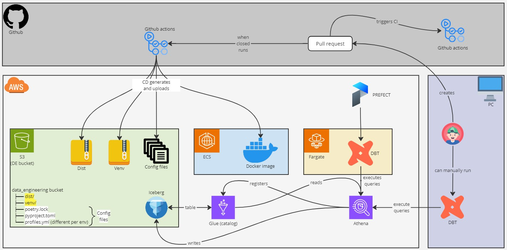

## Table of Contents

[TOC]

## 0. Motivation

<FancyLink linkText="DBT" url="https://www.getdbt.com/"/> serves as a gateway for SQL practitioners to engage more deeply in data engineering tasks.
While DBT Cloud offers a managed solution, budget constraints may lead to exploring self-hosting options.
Leveraging <FancyLink linkText="AWS ECS" url="https://aws.amazon.com/en/ecs/" company="aws"/> (Fargate) aligns with our existing AWS infrastructure and offers cost-effective scalability.
By self-hosting DBT on AWS ECS (Fargate), we gain better control and observability over our data transformation processes.

When setting this up, I got a lot of information and direction from these posts:

* <FancyLink linkText="Running dbt-core in production on AWS using ECS Fargate and Airflow" url="https://data-dive.com/deploy-dbt-on-aws-using-ecs-fargate-with-airflow-scheduling/" company="default" dark="true"/>
* <FancyLink linkText="Deploying and Running dbt on AWS Fargate" url="https://medium.com/hashmapinc/deploying-and-running-dbt-on-aws-fargate-872db84065e4" dark="true"/>

However, I still think I have multiple improvements to share, such as handling it with `poetry`, integrating with `prefect`, exporting DBT run results, among other things. This is why I'm documenting everything.

## 1. The components

In our setup, we combine `DBT`, `Docker`, and `AWS ECS (Fargate)` to streamline the execution of data transformation pipelines:

* **DBT** enables SQL practitioners to efficiently transform and model data.
* **Docker** containerizes the necessary Python code for DBT, ensuring consistency and reproducibility.
* **AWS ECS (Fargate)** executes Docker containers, providing a lightweight and serverless solution for running DBT.

<Notice type="success">
  Teams using AWS EKS can replicate this setup with minimal effort, leveraging existing Kubernetes clusters.
</Notice>

There are also some components that can be easily swapped by similar tools. They are:

* **Prefect** as the orchestrator that runs scheduled jobs and provides observability
* **Athena** as the query engine
* **Github actions** for both Continuous Integration (CI) and Continuous Delivery (CD)
* **Glue** as the data catalog

Here you can see a diagram of the overall architecture:



## 2. Handling packages in docker

From the beginning, I wanted to have a simple Docker image that is independent of the DBT code.
This way, changes to DBT itself won't require creating a new image and uploading it to ECR.

The solution is to create two `.tar.gz` files:

* `package.tar.gz`: contains all DBT code
* `venv.tar.gz`: contains the virtual environment, so packages don't need to be installed at runtime

Both files are downloaded at runtime and are versioned, allowing us to use older versions if needed.
To decide which version to download and use, I export the `pyproject.toml`, which contains the `version` number.

You can read more about it in <FancyLink linkText="Deploying and Running dbt on AWS Fargate" url="https://medium.com/hashmapinc/deploying-and-running-dbt-on-aws-fargate-872db84065e4" dark="true"/> (section `Docker Image`).

## 3. Docker images

With this approach, we have three Docker images:

* **Venv**: Used for creating the virtual environment and for packaging the code
* **ECS**: Runs in `ECS (Fargate)`
* **Base**: Contains shared code and packages for the other two images.

How to upload these images to ECR is out of scope.
For guidance, refer to <FancyLink linkText="How to Build and Push Docker Images to AWS ECR" url="https://www.freecodecamp.org/news/build-and-push-docker-images-to-aws-ecr/"/>

### 3.1. Docker.base

This base Docker image installs Python and some basic Python packages.

<TerminalOutput color="stone">
  .github/docker/Dockerfile.base
</TerminalOutput>
```docker
# Top level build args
ARG BUILD_FOR=linux/amd64

FROM --platform=${BUILD_FOR} python:3.10.7-slim-bullseye as base

# Env vars + Args
ARG POETRY_VERSION=1.6.1 # Should match CI config 
ENV PYTHONIOENCODING=utf-8
ENV LANG=C.UTF-8

WORKDIR /usr/app/dbt/

# System setup
RUN apt-get update \
  && apt-get dist-upgrade -y \
  && apt-get install -y --no-install-recommends \
    git \
    ssh-client \
    software-properties-common \
    make \
    build-essential \
    ca-certificates \
    libpq-dev \
  && apt-get clean \
  && rm -rf \
    /var/lib/apt/lists/* \
    /tmp/* \
    /var/tmp/*

# Update and install python packages
RUN python -m pip install --upgrade \
  pip \
  setuptools \
  wheel \
  poetry==${POETRY_VERSION} \
  boto3 \
  loguru \
  toml \
  --no-cache-dir
```

### 3.2. Docker.venv

This image creates a virtual environment with all dependencies.
It also packages all DBT code. Finally, it exports both as a `.tar.gz` file.

<TerminalOutput color="stone">
  .github/docker/Dockerfile.venv
</TerminalOutput>
```docker
FROM dbt/base as base

ARG PACKAGE_VERSION

# Copy the scripts needed for setting up the environment (and yes, all of them are needed...)
COPY pyproject.toml .
COPY poetry.lock .
COPY README.md .
COPY dbt_src dbt_src

# Set up poetry and install dependencies
RUN poetry config virtualenvs.in-project true && \
    poetry install

# Install 'dbt_src' as a package
RUN poetry build && \
    poetry run pip install dist/*.whl

# Create a '.tar.gz' with the virtual environment
RUN poetry run venv-pack -o dist/venv_${PACKAGE_VERSION}.tar.gz

# Export the '.tar.gz'
FROM scratch AS export
COPY --from=base /usr/app/dbt/dist/*.tar.gz /dist/
```
<Notice type="warning">
  We **do need** to copy `pyproject.toml`, `poetry.lock`, and `README.md` for it to work.
</Notice>

<Notice type="info" className="mt-6">
  The `dbt_src` is the folder that contains the actual `DBT` code. That includes `dbt_project.yml`, `models`, `tests`, `macros` folders, etc.
</Notice>

### 3.3. Docker.ecs

This image runs in `Fargate`.
Here, I set up the connection to `prefect` (more info at <FancyLink linkText="Connect Docker | Setting Up and Deploying Prefect Server" url="https://villoro.com/blog/prefect-server-setup-configuration-deployment#31-connect-docker/" dark="true"/>).
I also export all the needed scripts to download all DBT code.

<TerminalOutput color="stone">
  .github/docker/Dockerfile.ecs
</TerminalOutput>
```docker
FROM dbt/base

# Instll prefect
ARG PREFECT_VERSION=2.14.20 # Should match poetry.lock
RUN python -m pip install prefect==${PREFECT_VERSION}

# Connect to prefect
ARG PREFECT_API_URL # This should end with '/api'
ENV PREFECT_API_URL=${PREFECT_API_URL}

# Copy the scripts needed for setting up the environment
COPY scripts .

# This will download the needed files + install poetry environment + execute all DBT commands by default
ENTRYPOINT ["/bin/bash", "./setup_and_run_dbt.sh"]
```

## 4. Continuous Delivery (CD)

As mentioned before, there are two `tar.gz` files: one with the virtual environment (`venv`) and another with the code (`dist`).
The goal of `CD` is to create both and upload them to S3, along with the `pyproject.toml` and `profiles.yml` files.

### 4.1. CD Pacakges github action

```yaml
name: CD Packages

on:
  push:
    branches:
      - main
    paths:
      - dbt_src/**
      - profiles/**
      - pyproject.toml
      - poetry.lock

jobs:
  deploy_package_pro:
    runs-on: ubuntu-latest
    permissions:
      id-token: write
      contents: read
    steps:
    - uses: actions/checkout@v4
    - uses: actions/setup-python@v4

    - name: Install python dependencies
      run: pip install boto3 click loguru toml

    - name: Get current version
      run: python .github/scripts/get_version.py --name=current

    - name: Build package
      run: |
        docker build -f .github/docker/Dockerfile.base -t dbt/base .
        docker build -f .github/docker/Dockerfile.venv --output . . --build-arg PACKAGE_VERSION=$VERSION_CURRENT

    - name: Configure DevOps AWS credentials
      uses: aws-actions/configure-aws-credentials@v4
      with:
        role-to-assume: ${{ vars.AWS_ROLE_DATA }}
        aws-region: eu-west-1
    
    - name: Configure DatalakePro AWS credentials
      uses: aws-actions/configure-aws-credentials@v4
      with:
        role-to-assume: xxx # Set the role ARN here
        aws-region: eu-west-1
        role-chaining: true
  
    - name: Upload files to S3 PRO
      run: python .github/scripts/upload_all.py --env pro
```
<Notice type="warning">
  You need to set the `role ARN` (replace `xxx` in the code) needed for uploading the files to S3.
</Notice>

### 4.2. `upload_all.py` script

There are multiple ways the documents can be uploaded.
Since I'm proficient with python I'm using it, but you can use any alternative approach following a similar process.

<TerminalOutput color="stone">
  .github/scripts/upload_all.py
</TerminalOutput>
```python
import os

import boto3
import click
import utils as u
from loguru import logger


def upload_to_s3(bucket, origin, dest):
    logger.info(f"Uploading from {origin=} to {dest=}")

    s3_client = boto3.client("s3")
    s3_client.upload_file(origin, bucket, dest)


def upload_dbt_package(bucket, s3_dist, s3_venv):
    logger.info(f"Exploring packages to upload")
    for filename in os.listdir("dist"):
        if filename.endswith(".tar.gz"):
            path = s3_venv if filename.startswith("venv") else s3_dist
            upload_to_s3(bucket, f"dist/{filename}", f"{path}/{filename}")


@click.command()
@click.option("--env", default="pro", help="Environment where code will be deployed")
def upload_all(env):
    aws_config = u.get_aws_config()

    env = env.lower()
    logger.info(f"Working on {env=}")
    assert env in aws_config["s3_bucket"].keys()

    logger.info(f"Extractings paths")
    bucket = aws_config["s3_bucket"][env]
    s3_code = aws_config["paths"]["s3_code"]
    s3_dist = aws_config["paths"]["s3_dist"]
    s3_venv = aws_config["paths"]["s3_venv"]

    # Upload poetry config
    upload_to_s3(bucket, "pyproject.toml", f"{s3_code}/pyproject.toml")
    upload_to_s3(bucket, "poetry.lock", f"{s3_code}/poetry.lock")

    # DBT config
    profile = aws_config["filenames"]["profiles_by_env"]
    upload_to_s3(bucket, profile.format(env=env), f"{s3_code}/profiles.yml")
    upload_dbt_package(bucket, s3_dist, s3_venv)


if __name__ == "__main__":
    upload_all()
```

<Notice type="danger" className="mt-6">
  I use the `pyproject.toml` file to store a lot of configuration such as `S3` paths.
  I haven't included a snippet since most data is private, but it should be easy to infer.
</Notice>

## 5. Scripts

During runtime, we need to download all files created during the CD process.
This is done with the following three scripts:

* `scripts/download_poetry_config.py`
* `scripts/download_code.py`
* `scripts/setup_and_run_dbt.sh`

### 5.1. Download poetry config

This script:

1. Downloads the `pyproject.toml`
2. Downloads the `venv.tar.gz` and extracts it

<TerminalOutput color="stone">
  scripts/download_poetry_config.py
</TerminalOutput>
```python
import tarfile

import boto3
import utils as u
from loguru import logger

# Should match 'pyproject.toml'
S3_BUCKET = {
    "634077897723": "nt-data-engineering-eu-west-1-634077897723-pre",
    "162076964983": "nt-data-engineering-eu-west-1-162076964983-snd",
    "742407267173": "nt-data-engineering-eu-west-1-742407267173-pro",
}
S3_CODE = "dbt/code"


def download_pyproject(bucket):
    pyproject = u.PYPROJECT_FILE
    lock = u.LOCK_FILE
    s3_client = boto3.client("s3")

    logger.info(f"Downloading 's3://{bucket}/{S3_CODE}/{pyproject}'")
    s3_client.download_file(bucket, f"{S3_CODE}/{pyproject}", pyproject)
    logger.info(f"Downloading 's3://{bucket}/{S3_CODE}/{lock}'")
    s3_client.download_file(bucket, f"{S3_CODE}/{lock}", lock)


def venv_download_tar(bucket, s3_venv, filename):
    s3_client = boto3.client("s3")
    logger.info(f"Downloading 's3://{bucket}/{s3_venv}/{filename}'")
    s3_client.download_file(bucket, f"{s3_venv}/{filename}", filename)


def venv_extract_tar(local_venv, filename):
    logger.info(f"Extracting '{filename}' to '{local_venv}'")
    with tarfile.open(filename, "r:gz") as tar:
        tar.extractall(local_venv)


def download_all():
    # Download 'pyproject.toml' asap
    account = u.get_account()
    bucket = S3_BUCKET[account]
    download_pyproject(bucket)

    # Then infer from 'pyproject.toml'
    aws_config = u.get_aws_config()
    logger.info(f"Extractings paths")
    s3_venv = aws_config["paths"]["s3_venv"]
    local_venv = aws_config["paths"]["local_venv"]

    version = u.get_version_from_toml()
    filename = aws_config["filenames"]["venv"].format(version=version)

    # Finally download the tars
    venv_download_tar(bucket, s3_venv, filename)
    venv_extract_tar(local_venv, filename)


if __name__ == "__main__":
    download_all()
```

### 5.2. Download code

This script:

1. Downloads the `profiles.yml`
2. Downloads the `dist.tar.gz` and extracts it

It is a separate script because it uses the virtual environment set up by the previous script.

<TerminalOutput color="stone">
  scripts/download_code.py
</TerminalOutput>
```python
import os
import shutil
import tarfile

import boto3
import toml
import utils as u
from loguru import logger
from prefect import flow
from prefect import get_run_logger
from prefect import tags
from prefect import task


@task(name="dbt.config.dist.download_profiles")
def dist_download_profiles(bucket, s3_code, profiles):
    logger = get_run_logger()
    logger.info(f"Downloading 's3://{bucket}/{s3_code}/{profiles}'")

    s3_client = boto3.client("s3")
    s3_client.download_file(bucket, f"{s3_code}/{profiles}", profiles)


@task(name="dbt.config.dist.download_tar")
def dist_download_tar(bucket, s3_dist, filename):
    logger = get_run_logger()
    logger.info(f"Downloading 's3://{bucket}/{s3_dist}/{filename}'")

    s3_client = boto3.client("s3")
    s3_client.download_file(bucket, f"{s3_dist}/{filename}", filename)


@task(name="dbt.config.dist.extract_tar")
def dist_extract_tar(filename):
    logger = get_run_logger()
    logger.info(f"Extracting '{filename}'")

    with tarfile.open(filename, "r:gz") as tar:
        tar.extractall()


@task(name="dbt.config.dist.move_files")
def move_files(filename, path_temp):
    for filename in os.listdir(path_temp):
        shutil.move(os.path.join(path_temp, filename), filename)


@task(name="dbt.config.dist.clean_files")
def clean_files(filename, path_temp):
    logger = get_run_logger()
    logger.info(f"Removing '{filename}'")
    os.remove(filename)

    path_to_delete = path_temp.split("/")[0]
    logger.info(f"Removing '{path_to_delete}/'")
    shutil.rmtree(path_to_delete)


@flow(name="dbt.config.dist")
def download_dist(version):
    account = u.get_account()
    aws_config = u.get_aws_config()

    logger.info(f"Extractings paths and filenames from '{u.PYPROJECT_FILE}'")
    env = aws_config["accounts"][account]
    bucket = aws_config["s3_bucket"][env]
    s3_code = aws_config["paths"]["s3_code"]
    s3_dist = aws_config["paths"]["s3_dist"]
    profiles = aws_config["filenames"]["profiles"]
    dist = aws_config["filenames"]["dist"].format(version=version)
    dist_temp = aws_config["filenames"]["dist_temp"].format(version=version)

    dist_download_profiles(bucket, s3_code, profiles)
    dist_download_tar(bucket, s3_dist, dist)
    dist_extract_tar(dist)
    move_files(dist, dist_temp)
    clean_files(dist, dist_temp)


def main():
    u.ping_prefect()

    version = u.get_version_from_toml()
    run_tags = ["type:dbt.config", f"version:{version}"]

    with tags(*run_tags):
        logger.info(f"Downloading code with {run_tags=}")
        logger.info("Running first prefect task inside docker")
        download_dist(version)


if __name__ == "__main__":
    main()
```

### 5.3. Setup and run DBT

This script:

* Calls the other scripts
* Configures the virtual environment
* Calls the real `entrypoint` of the Docker container (more on that in the next section)

<TerminalOutput color="stone">
  scripts/setup_and_run_dbt.sh
</TerminalOutput>
```sh
echo "1. Downloading Poetry config"
python download_poetry_config.py

echo "2. Setting up Poetry"
poetry config virtualenvs.in-project true

echo "3. Downloading all Poetry code"
poetry run python download_code.py

echo 5. Running all DBT commands. Using args="$@"
poetry run python run.py "$@"
```

<Notice type="info" className="mt-6">
  The `"$@"` is used to pass all arguments from the Docker container to the `run.py` script.
</Notice>

## 6. Running DBT

While running DBT as a CLI is an option, it limits our ability to:

* Integrate with Prefect
* Add custom logs for certain events
* Export results as a table

This is why I prefer to use <FancyLink linkText="Programmatic invocations" url="https://docs.getdbt.com/reference/programmatic-invocations"/> instead. It involves calling `dbtRunner`, like so:

```python
from dbt.cli.main import dbtRunner

# Example call
args = ["build", "--select", "tag:my_tag"]

dbtRunner().invoke(args)
```

## 7. Integrating with Prefect

<Notice type="info">
  Remember that you need to connect to Prefect. For more information, visit <FancyLink linkText="Connect Docker | Setting Up and Deploying Prefect Server" url="https://villoro.com/blog/prefect-server-setup-configuration-deployment#31-connect-docker/" dark="true"/>
</Notice>

### 7.1. Tasks

For better observability, I recommend defining each DBT command as a Prefect task. This involves adding the `@task` decorator, like so:

```python
from dbt.cli.main import dbtRunner
from prefect import task, flow

@task
def deps():
    dbtRunner().invoke(["deps"])

@task
def build():
    dbtRunner().invoke(["build"])

@flow
def run():
    deps()
    build()

if __name__ == '__main__':
    run()
```

### 7.2. Adding logs

A valuable feature of DBT is the ability to register callbacks (<FancyLink linkText="Registering callbacks | Programmatic invocations" url="https://docs.getdbt.com/reference/programmatic-invocations#registering-callbacks"/>).
With callbacks, you can easily add custom logs, particularly handy for sending logs from DBT to Prefect. To achieve this, you need to:

1. Create a callback function to handle the logs.
2. Set up the logger. However, this isn't straightforward as it needs to be tied to a Prefect task.

#### 7.2.1. Create a `callback`

The concept here involves capturing information from the DBT events and sending the log based on the severity level.

<TerminalOutput color="stone">
  dbt_src/utils.py
</TerminalOutput>
```python
def log_callback(event_raw):
    # In order to use 'prefect.logger' here we need it declared it as global (LOGGER)

    event = event_raw.info

    if (name := event.name) not in EVENTS_TO_LOG:
        return None

    level = event.level
    msg = f"{event.msg} [{name}]"

    if level == "error":
        LOGGER.error(msg)
    elif level == "warn":
        LOGGER.warning(msg)
    elif (level == "info") or (name == "CommandCompleted"):
        LOGGER.info(msg)
    else:
        LOGGER.debug(msg)

    return None
```

<Notice type="info">
  In my case, I wanted to have `CommandCompleted` as `info` instead of `debug`, but feel free to ignore that `if` statement.
</Notice>

In my opinion, some events are redundant or not useful at all.
Therefore, I restrict the callback to a subset of all the events available.
Here are the events I decided to log:

<TerminalOutput color="stone">
  dbt_src/utils.py
</TerminalOutput>
```python
EVENTS_TO_LOG = [
    "AdapterRegistered",
    "CommandCompleted",
    "ConcurrencyLine",
    "EndOfRunSummary",
    "FinishedRunningStats",
    "FoundStats",
    "HooksRunning",
    "LogHookEndLine",
    "LogHookStartLine",
    "LogModelResult",
    "LogStartLine",
    "LogTestResult",
    "MainReportVersion",
    "NodeStart",
    "RunResultError",
    "SkippingDetails",
    "StatsLine",
    "UnusedResourceConfigPath",
]
```

#### 7.2.2. Set up the logger

To set up the logger, you need to declare a **global** `logger` in a function that is called inside a prefect `task` or `flow`.

<TerminalOutput color="stone">
  dbt_src/utils.py
</TerminalOutput>
```python
from prefect import get_run_logger

LOGGER = None

def run_dbt_command(args):

    # In order to use 'prefect.logger' inside the 'dbt.callbacks' we need to declare it as global
    global LOGGER
    LOGGER = get_run_logger()

    res = dbtRunner(callbacks=[log_callback]).invoke(args)
    export_execution_and_run_results()
```

<Notice type="warning" className="mt-6">
  Do not forget to add the `log_callback` to the `dbtRunner`.
</Notice>

## 8. Exporting data

There are two things you might want to export:

1. <FancyLink linkText="DBT docs" url="https://docs.getdbt.com/reference/resource-configs/docs"/> 
2. <FancyLink linkText="DBT run results" url="https://docs.getdbt.com/reference/artifacts/run-results-json"/> 

### 8.1. Docs

The idea here is to combine the following files into one:

* `index.html`
* `manifest.json`
* `catalog.json`

The solution I use is based on <FancyLink linkText="Export DBT documentation" url="https://github.com/dbt-labs/dbt-docs/issues/53#issuecomment-1011053807" dark="true"/>.

<TerminalOutput color="stone">
  dbt_src/docs.py
</TerminalOutput>
```python
def merge_docs():
    """
    Merge 'index.html' with the needed 'manigest.json' and 'catalog.json'
    so that it's easier to serve without needing to deal with CORS.

    More info: https://github.com/dbt-labs/dbt-docs/issues/53#issuecomment-1011053807
    """

    aws_config = get_aws_config()
    path_target = aws_config["paths"]["target"]
    docs = aws_config["filenames"]["docs"]

    logger.info("Reading 'index.html'")
    with open(f"{path_target}/index.html", "r", encoding="utf8") as stream:
        content = stream.read()

    logger.info("Reading 'manifest.json'")
    with open(f"{path_target}/manifest.json", "r", encoding="utf8") as stream:
        json_manifest = json.dumps(json.loads(stream.read()))

    logger.info("Reading 'catalog.json'")
    with open(f"{path_target}/catalog.json", "r", encoding="utf8") as stream:
        json_catalog = json.dumps(json.loads(stream.read()))

    # Sometimes it has different content, using both options we have seen so far
    content = content.replace(
        'o=[i("manifest","manifest.json"+t),i("catalog","catalog.json"+t)]',
        f"o=[{{label: 'manifest', data: {json_manifest}}},{{label: 'catalog', data: {json_catalog}}}]",
    ).replace(
        'n=[o("manifest","manifest.json"+t),o("catalog","catalog.json"+t)]',
        f"n=[{{label: 'manifest', data: {json_manifest}}},{{label: 'catalog', data: {json_catalog}}}]",
    )

    logger.info(f"Writing '{path_target}/{docs}'")
    with open(f"{path_target}/{docs}", "w", encoding="utf8") as stream:
        stream.write(content)
```

<Notice type="success" className="mt-6">
  Once exported, you simply need to upload the `docs` file into `S3`.
</Notice>

### 8.2. DBT run results

The idea is to extract information about the `runs` and `run_results` from the `target/run_results.json` file.
This is done with some `pandas` code and then exported to `glue` with `awswrangler`.
Here is the code:

<TerminalOutput color="stone">
  dbt_src/utils.py
</TerminalOutput>
```python
import pandas as pd
import awswrangler as wr
from prefect import get_run_logger

RUN_RESULTS = "target/run_results.json"

DATABASE = "metadata"
TABLE_EXECUTION = "dbt_execution"
TABLE_RUN_RESULTS = "dbt_run_results"

def get_table_path(table):
    """Get the table path"""
    buckets = [x for x in wr.s3.list_buckets() if x.startswith(BUCKET_PREFIX)]
    return f"s3://{buckets[0]}/{DB_PATH}/{table}"


def export_to_glue(df, table, dtypes):
    logger = get_run_logger()

    path = get_table_path(table)
    n_records = df.shape[0]
    logger.info(f"Writing table to '{DATABASE}.{table}' ({path=}, {n_records=})")

    df["p_extraction_date"] = date.today()

    wr.s3.to_parquet(
        df=df,
        dataset=True,
        database=DATABASE,
        table=table,
        path=path,
        mode="append",
        partition_cols=["p_extraction_date"],
        dtype=dtypes,
    )

def export_execution(data):
    logger = get_run_logger()

    logger.info(f"Exporting '{TABLE_EXECUTION}'")
    df = pd.DataFrame([{**TAGS, **data["metadata"], **data["args"]}])
    df["elapsed_time"] = data["elapsed_time"]

    # Drop some columns and force 'string' in some others
    df = df.drop(columns=["env", "warn_error_options"])
    dtypes = {
        "select": "string",
        "exclude": "string",
        "vars": "string",
        "resource_types": "string",
    }
    export_to_glue(df, TABLE_EXECUTION, dtypes)


def export_run_results(data):
    logger = get_run_logger()

    logger.info(f"Exporting '{TABLE_RUN_RESULTS}'")
    df = pd.DataFrame(data["results"])
    df["invocation_id"] = data["metadata"]["invocation_id"]

    if "compiled_code" in df.columns:
        df["compiled_code"] = df["compiled_code"].str.strip()

    # Force 'string' type in some columns
    dtypes = {"message": "string", "failures": "int", "adapter_response": "string"}
    export_to_glue(df, TABLE_RUN_RESULTS, dtypes)

def export_execution_and_run_results():
    logger = get_run_logger()

    if run_is_ci():
        logger.warning("Skipping 'run_results' export since we are in CI")
        return None

    logger.info("Running 'run_results' export")

    with open(RUN_RESULTS) as stream:
        data = json.load(stream)

    export_execution(data)
    export_run_results(data)
```

## 9. `run.py` complete scripts

We've seen parts of the `run.py`, but I think it's useful to see the complete code.
The only missing part to describe is that I use <FancyLink linkText="click" url="https://github.com/pallets/click" dark="true"/>.
With it, I can catch the parameters passed to the `docker` so that they are later used by `DBT`.

Here is the complete code:

<TerminalOutput color="stone">
  dbt_src/run.py
</TerminalOutput>
```python
import click
import utils
from docs import merge_docs
from docs import upload_to_s3
from prefect import flow
from prefect import get_run_logger
from prefect import tags
from prefect import task
from prefect.blocks.notifications import SlackWebhook
from utils import logger


@task(name="dbt.clean")
def clean():
    """Clean temporal paths"""
    utils.run_dbt_command(["clean"])


@task(name="dbt.deps")
def deps():
    """Install DBT dependencies"""
    utils.run_dbt_command(["deps"])


@task(name="dbt.debug")
def run_debug():
    """Check for DBT problems"""
    utils.run_dbt_command(["debug"])


@task(name="dbt.docs.generate")
def docs_generate():
    """Generate DBT docs"""
    utils.run_dbt_command(["docs", "generate"])


@flow(name="dbt.docs")
def docs(upload_docs):
    """Create docs, merge them and upload them"""
    logger = get_run_logger()

    docs_generate()
    merge_docs()

    if upload_docs:
        upload_to_s3()
    else:
        logger.warning("Skipping docs upload to S3. This should not happen in prod")


@task(name="dbt.build")
def build(target, select, exclude, full_refresh):
    """Perform DBT build (seed + run + test)"""
    command = ["build"]

    if target:
        command += ["--target", target]
    if select:
        command += ["--select", select]
    if exclude:
        command += ["--exclude", exclude]
    if full_refresh:
        command += ["--full-refresh"]

    utils.run_dbt_command(command)


@flow(name="dbt")
def run_all(env, target, select, exclude, full_refresh, debug):
    """Run all DBT commands"""

    clean()
    deps()

    if debug:
        run_debug()

    docs(upload_docs=(env == "pro") and (select is None))
    build(target, select, exclude, full_refresh)


def notify_failure(env, exception):
    if env == "pro":
        slack = SlackWebhook.load("slack")
        slack.notify(f"DBT failed: {exception}")


@click.command()
@click.option("--target", "-t", default=None, help="DBT target")
@click.option("--select", "-s", default=None, help="Selected DBT models")
@click.option("--exclude", "-e", default=None, help="Excluded DBT models")
@click.option("--full_refresh", "--full-refresh", "-f", is_flag=True, default=False)
@click.option("--debug", "-d", is_flag=True, default=False, help="If true do debug")
def main(target, select, exclude, full_refresh, debug):
    logger.info(f"Starting DBT project")

    target_default, target_type = utils.get_target_info_from_profiles()

    # Clean commands (in some cases it includes unwanted quotation marks)
    select = select.strip('"') if select is not None else None
    exclude = exclude.strip('"') if exclude is not None else None

    if target_type != "duckdb":
        utils.ping_prefect()
        env = utils.get_env()
    else:
        env = "CI"

    utils.TAGS = {
        "type": "dbt",
        "env": env,
        "version": utils.get_project_version(),
        "dbt_version": utils.get_dbt_version(),
        "target": target or target_default,
        "select": select,
        "exclude": exclude,
        "full_refresh": full_refresh,
        "target_type": target_type,
    }

    run_tags = [f"{k}:{v}" for k, v in utils.TAGS.items()]
    logger.info(f"Using {run_tags=}")

    # This try catch is to let `fargate` know the process failed
    with tags(*run_tags):
        try:
            run_all(env, target, select, exclude, full_refresh, debug)
        except Exception as e:
            notify_failure(env, e)
            exit(1)

    exit(0)


if __name__ == "__main__":
    main()
```

<Notice type="warning" className="mt-6">
  The `exit(0)` and `exit(1)` are necessary to let `ECS` know the outcome of the task.
  Without this, it would appear as if the task never fails.
</Notice>
