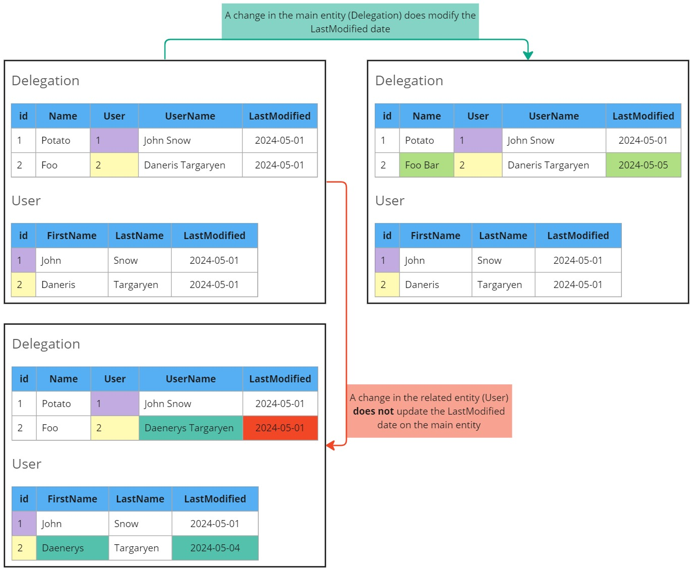
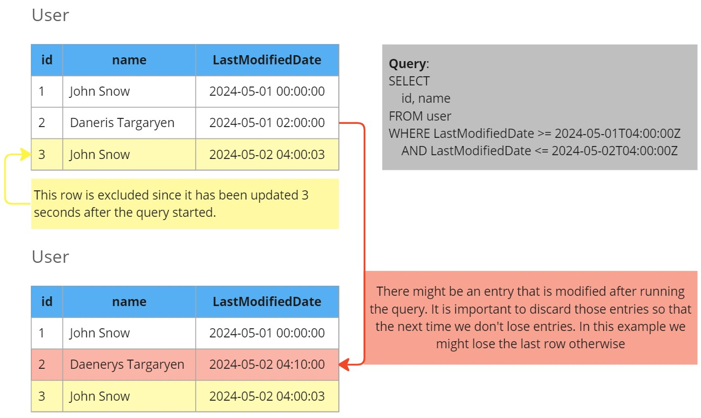

<script type="module" src="/js/posts/0046-salesforce.js"></script>

## Table of Contents

[TOC]

## 0. Motivation

## 1. Simple Salesforce

There are multiple ways of querying Salesforce data with python.
I like using <FancyLink linkText="Simple Salesforce" url="https://github.com/simple-salesforce/simple-salesforce" dark="true"/> because as it's name suggest it makes it quite simple to extract data.

We aware that in the <FancyLink linkText="Official documentation | Simple Salesforce" url="https://simple-salesforce.readthedocs.io/en/latest/"/> there are a lot of missing functions.
So I suggest you also take a look at the github readme.

To start with it, you need to instanciate `Salesforce` as follows

```python
from simple_salesforce import Salesforce

sf = Salesforce(
    username="your_username",
    password="your_password",
    consumer_key="your_consumer_key",
    consumer_secret="your_consumer_secret",
)
```
<Notice type="warning">
  Make sure to change all strings with proper values
</Notice>

### 1.1. Querying and `__getattr__`

This is the most simple query you can do:

```python
sf.Account.get('003e0000003GuNXAA0')
```

Notice that we are querying the entity `Account` and that to do so you need to access the `Account` attribute from the `sf` object.
That makes pipelines a little bit more complex than needed, but you can use `__getattr__("name")` to get the attribute in a programatic way from the entity name.
As an example, both statements do the same:

```python
sf.Account.get('003e0000003GuNXAA0')

sf.__getattr__("Account").get('003e0000003GuNXAA0')
```

<Notice type="success" className="mt-6">
  That can be applied almost everywhere in this post
</Notice>

## 2. Querying options

There are multiple ways of getting data from Salesforce using <FancyLink linkText="Simple Salesforce" url="https://github.com/simple-salesforce/simple-salesforce" dark="true"/> library.
Here is a detailed overview of all of them:

|                             | get | query | query_all | query_all_iter | bulk.query_all | bulk2.query |
|-----------------------------|-----|-------|-----------|----------------|----------------|-------------|
| Batch Querying              | ❌ | ✔️    | ✔️       | ✔️             | ✔️            | ✔️          |
| No need of pagination       | -   | ❌   | ✔️        | ✔️            | ✔️             | ✔️         |
| Iterable (no memory errors) | -   | ❌   | ❌        | ✔️            | ⚠️            | ✔️          |
| Result as python object     | ✔️ | ✔️    | ✔️       | ✔️             | ✔️            | ❌          |
| Includes deleted            | ❌ | ✔️    | ✔️       | ✔️             | ✔️            | ❌          |
| Can query compound data (*) | -   | ✔️   | ✔️       | ✔️             | ❌            | ❌          |

<Notice type="warning">
  (\*) More info about compound data in section 4.
</Notice>

And here you can see the query time of each method using the same query:

<canvas id="sf_querying_times" style="width:100%;height:300px;"></canvas>

<Notice type="success" className="mt-6">
  I would recommend using either `query_all_iter`.
</Notice>

### 2.1. Entity get

You can use the `get` method to retrive a single entity:

```python
sf.Account.get('003e0000003GuNXAA0')
```

<Notice type="warning">
  While useful for getting a value it's not suited for exporing large number of rows.
</Notice>

### 2.2. query

You can use `sf.query` to retrive multiple rows at the same time.
The number of records you can get is limited and if your query exceeds them you will need to call `sf.query_more`.

You can do that with the following code:

```python
sf.query("SELECT Id, Name FROM Account")

# The previous call will have: "nextRecordsUrl" : "/services/data/v26.0/query/01gD0000002HU6KIAW-2000
sf.query_more("01gD0000002HU6KIAW-2000")
```

You can read more about it in <FancyLink linkText="Queries | Simple Salesforce" url="https://simple-salesforce.readthedocs.io/en/latest/user_guide/queries.html"/>.

<Notice type="warning">
  I don't suggest using this option since there are others that are easier to use without needing to deal with the `sf.query_more` option.
</Notice>

### 2.3. query_all

This method is the same as before but it returns all results as a python object:

```python
sf.query_all("SELECT Id, Name FROM Account")
```

<Notice type="warning">
  The problem with that is that you can easily get `Out of Memory (OOM)` errors when trying to bring a lot of data into memory.
</Notice>

### 2.4. query_all_iter

This works similarly to the previous methods but the result is an iterator.
This way you can process each row at a time and avoid `Out of Memory (OOM)` errors.

It would work like:

```python
query = "SELECT Id, Name FROM Account"
data = sf.query_all_iter(, include_deleted=True)

for row in data:
    process(row)
```

Under the hood it manages to get the records in bulk.
You can notice this because when you try to query a lot of data the first row will take longer than the rest.

<Notice type="warning">
  This is the method I recommend using
</Notice>

### 2.5. Bulk

There is two ways of querying with `bulk`, the regular one and the lazy operation.
The first one works similarly to `query_all_iter` where you can iterate over the results (no OOM errors).
The lazy one is like `query_all` which brings evertying as one batch. 

Here is the regular call:

```python
query = "SELECT Id, Name FROM Account"

# generator on the results page
data = sf.bulk.Account.query_all(query)

# the generator provides the list of results for every call to next()
for row in data:
    process(row)
```

And this is how to call it lazilly:
```python
query = "SELECT Id, Name FROM Account"

# generator on the results page
data = sf.bulk.Account.query_all(query, lazy_operation=True)

# the generator provides the list of results for every call to next()
for chunk in data:
    process(chunk)
```
<Notice type="info">
  Notice that `chunk` contains all rows
</Notice>

<Notice type="warning">
  This function is consistently **2 to 3 times faster** than `query_all_iter`.
  However since it cannot extract compound fields it would make extraction more complex, since you would need to recreate all that logic in the datalake.
</Notice>

### 2.6. Bulk2

Finally there is also the `bulk2` option.

```python
query = "SELECT Id, Name FROM Account"

results = sf.bulk2.Account.query(
    query, max_records=50000, column_delimiter="COMM", line_ending="LF"
)

for i, data in enumerate(results):
    with open(f"results/part-{1}.csv", "w") as bos:
        bos.write(data)
```

With this one the iterator returns batches of the asked size (`max_records`).
One important caveat is that the result is a python string similar to a `csv`.

<Notice type="warning">
  That means extra work for parsing that result, such as handling problems with separators, encodings issues, extra I/O operations etc.
</Notice>

When testing, I saw around a 20% performance improvement compared to `bulk`.
Given that it's not high I think it's not worth the effort.

## 3. Avoiding timeouts and Out of Memory errors

After some months of extracting data from salesforce I've noticed that there are a couple of tricks that can make the pipeline more resilient.
Those are:

1. Exporting data in chunks
2. Splitting the query (batches)

Also I think it helps to always query only data that has been updated, more info at <FancyLink linkText="Self-Healing Pipelines" url="https://villoro.com/blog/self-healing-pipelines/" dark="True"/>.

### 3.1. Chunks

This one is quite straightforward. For tables that can potentially have a lot of data I like exporting records in chunks.
The chunk size can be adjusted after doing some queries to get a sense of the querying speed.
Afterwards I like setting the chunk size so that each chunk takes a similar amount of time (5 min in my case).

That is done with a `for/else` statement inside a function that can be called iteratibly:

```python
from time import time
from loguru import logger

DATA = sf.query_all_iter(query, include_deleted=True)
CHUNK_NUM = 0
ALL_DONE = False

def fetch_one_chunk(max_rows_per_chunk=100_000):
    t0 = time()
    out = []
    for i, row in enumerate(DATA):
        if (CHUNK_NUM == 0) and (i == 0):
            logger.info(
                f"First row extracted in {round(time() - t0, 2)} seconds"
            )

        out.append(row)

        if max_rows_per_chunk and (i + 1 == max_rows_per_chunk):
            break
    else:
        logger.info(f"There are no more records")
        ALL_DONE = True

    CHUNK_NUM += 1

    return out
```

Then you can do something like:

```python
MAX_ITERATIONS = 200

for chunk_num in range(MAX_ITERATIONS):
    data = fetch_one_chunk()
    export_data(data)
```

This is helpful since:

* It avoids Out of Memory (OOM) errors
* Helps getting progress on long queries that can fail

### 3.2. Batches

In some cases trying to do a query whose result will be a lot of data can lead to a timeout.
Based on experience I've seen that if the first row cannot be extracted in 2 minuts an exception will be raised by `simple_salesforce`.
In order to avoid those timeouts we can split the query into multiple queries.
To do so we define the `max_days_per_batch` parameter.
Then we can do multiple queries where each batch has that defined length.

This is the function that gets the batches:

```python
from datetime import timedelta
from math import ceil

from loguru import logger

def get_dates_batches(min_date, max_date, max_days_per_batch=None):

    if (min_date is None) or (max_date is None):
        logger.info(f"No need of batches since one date is None")
        return [(min_date, max_date)]

    logger.debug(
        f"Removing timezone info so that both 'min_date' and 'max_date' are compatible"
    )
    min_date = min_date.replace(tzinfo=None)
    max_date = max_date.replace(tzinfo=None)
    logger.info(f"After cleaning values: {min_date=}, {max_date=}")

    # Check if batches are needed
    if not max_days_per_batch:
        logger.info(f"No need of batches for this entity (max_days_per_batch=None)")
        return [(min_date, max_date)]

    # Finally calculate the batches
    total_days = (max_date - min_date) / timedelta(days=1)
    n_batches = ceil(total_days / max_days_per_batch)

    chunks = []
    start_date = min_date
    for x in range(n_batches):
        end_date = min(start_date + timedelta(days=max_days_per_batch), max_date)
        chunks.append([start_date, end_date])
        start_date += timedelta(days=max_days_per_batch)

    return chunks
```

## 4. Types of fields

Fields (or Columns) in Salesforce are flexible and they can contain different types of data.
I like to classify fields in three types:

1. **Primitive fields**: those show information about the entity itself.
2. **Reference fields**: those are links to other tables, similar to a join.
3. **Compound fields**: those are formulas based on other fields. Those fields can be from referenced tables.

### 4.1. Primitive fields

Those are the basic type of fields. They show information about the entity itself.
For example, if we are working with the `User` table, it will have some primitive fields like:

* `firstname`: the name of the user (string)
* `age`: how old the user is (int)

### 4.2. Reference fields

Those fields are references to other tables.
Under the hood they behave similarly to a `join` in SQL.

The 2 important parts of reference fields are:

* `referenceTo`: this shows to which entity the field refers to
* `relationshipName`: the name that entity will have. Think of it as the alias after a join

Here you have a sample of reference fields:

| name             | type      | referenceTo     | relationshipName |
|------------------|-----------|-----------------|------------------|
| CreatedById      | reference | [User]          | CreatedBy        |
| LastModifiedById | reference | [User]          | LastModifiedBy   |
| Delegation__c    | reference | [Delegation__c] | Delegation__r    |
| User__c          | reference | [User]          | User__r          |

### 4.3. Compound fields (Calculated fields)

Those fields are populated at query time based on a formula.
For example, in the `User` table we could have `firstName` and `lastName` as primitive fields and then `fullName` defined as `FirstName & ’ ’ & LastName`. More info at <FancyLink linkText="Compound fields" url="https://developer.salesforce.com/docs/atlas.en-us.object_reference.meta/object_reference/compound_fields.htm"/>.

<Notice type="warning">
  Compound fields can use information from `referenced` entities!
</Notice>

Let's imagine the we have the `Order` table which has those fields (among others):

| name             | type      | referenceTo | relationshipName                                      |
|------------------|-----------|-------------|-------------------------------------------------------|
| CreatedById      | reference | [User]      | CreatedBy                                             |
| LastModifiedById | reference | [User]      | LastModifiedBy                                        |
| User__c          | reference | [User]      | <span style="background-color:yellow;">User__r</span> |

We could have here a **calculated** field called `fullName` with the following formula: `User__r.FirstName & ’ ’ & User__r.LastName`.

In that case, `fullName` will have information based on the table `Users` and not the `Orders`.

<Notice type="error">
  When extracting data those fields are very dangerous since **changes in the referenced table does not modify the `LastModifiedDate` from the main table**.
  In the example above, we would see a different `fullName` if `User.FirstName` is modified but the `Order` table will have the same `LastModifiedDate` as before, since the `Order` table hasn't been modified. This is dangerous for data extractions.
</Notice>

### 4.4. Getting fields info

With `sf.Entity.describe()` you can get the fields definition as a `dict`.
You can then transform that into a `pandas` dataframe so that it is easier to view with:

```python
import pandas as pd

data = sf.__getattr__("entity_name").describe()
df = pd.DataFrame(data["fields"]).set_index("name")
```

Alternativelly you can also use <FancyLink linkText="Pydantic" url="https://docs.pydantic.dev/"/>.
You can get the attributes you want with:

```python
from pydantic import BaseModel
from typing import List, Optional

class Column(BaseModel):
    name: str
    type: str
    calculated: bool
    calculatedFormula: Optional[str]
    referenceTo: Optional[List[str]]
    relationshipName: Optional[str]

data = sf.__getattr__(self.entity).describe()
columns = [Column(**x) for x in data["fields"]]
```

That is useful since you can access properties with `column.property`, like `column.calculatedFormula`.

## 5. Query including external changes

### 5.1. The problem

The compound fields can be calculated based on external entities.
Since an update on that related entity does not change the `LastModifiedDate` of the principal entity.

Let's see this in with an example where we want to query `Delegation` which depends on the `User` entity:



### 5.2. The solution

In order to avoid problems with that scenario we need to filter the `LastModifiedDate` of both entities.

To automate that, we need to retrive all fields that are of `type="reference"`.
Then we can check if the `relationshipName` is used in any `calculatedFormula` since if that happens it means we need to include that entity in the query.

As an example:

| name             | calculated | calculatedFormula | type      | referenceTo     | relationshipName                                                |
|------------------|------------|-------------------|-----------|-----------------|-----------------------------------------------------------------|
| Id               | False      |                   | id        |                 |                                                                 |
| CreatedById      | False      |                   | reference | [User]          | <span style="background-color:PaleGreen;">CreatedBy</span>      |
| LastModifiedById | False      |                   | reference | [User]          | <span style="background-color:PaleGreen;">LastModifiedBy</span> |
| Delegation__c    | False      |                   | reference | [Delegation__c] | <span style="background-color:PaleGreen;">Delegation__r</span>  |
| User__c          | False      |                   | reference | [User]          | <span style="background-color:Salmon;">User__r</span>           |
| UserName__c      | True       | <span style="background-color:Salmon;">User__r</span>.FirstName &amp; ' ' &amp; <span style="background-color:Salmon;">User__r</span>.LastName | string | | |
| IsDeleted        | False      |                   | boolean   |                 |                                                                 |
| Name             | False      |                   | string    |                 |                                                                 |
| CreatedDate      | False      |                   | datetime  |                 |                                                                 |
| LastModifiedDate | False      |                   | datetime  |                 |                                                                 |
| SystemModstamp   | False      |                   | datetime  |                 |                                                                 |

Here we see that `CreatedBy`, `LastModifiedBy` and `Delegation__r` are not used in any `calculatedFormula`.
Then `User__r` is used in `UserName__c` formula, so we need to also query any User that might have been modified.

So in that case we would do a query like:

```sql
SELECT
    Id,
    CreatedById,
    LastModifiedById,
    Delegation__c,
    User__c,
    UserName__c,
    IsDeleted,
    Name,
    CreatedDate,
    LastModifiedDate,
    SystemModstamp
FROM Delegation
WHERE (LastModifiedDate >= {min_date} AND LastModifiedDate < {max_date})
    OR (User__r.LastModifiedDate >= {min_date})
```
<Notice type="warning">
  You should replace `{min_date}` and `{max_date}` with datetimes with the format `%Y-%m-%dT%H:%M:%SZ` (do not include any `"` or `'`).
</Notice>

#### 5.2.1. Deciding date ranges

In regular runs I always query between the last extraction (`max(LastUpdateDate)` from the table where the export will be stored) up until `datetime.now()`.
More info about that at <FancyLink linkText="Self-Healing Pipelines" url="https://villoro.com/blog/self-healing-pipelines/" dark="True"/>.

<Notice type="warning">
  Between the query creation and the actual execution some time might happend.
  In order to not lose records we need to set `max_date` as a filter and discard records that are modified afterwards. 
</Notice>

See the example below for better clarification



So when dealing with external entities, we will only include set the `min_date` since that date won't be used for the next execution to decide the next `min_date`.

### 5.3. Automatically detecting related entities

The idea here is that for all `relationshipName` entires in an entity to look and see if we find that in the `calculatedFormula` of any other field.
We can do that with using regexs:

```python
import re

REGEX_RELATION = r"\b{relationship}\.\b"

def get_referenced_entities(entity):

    fields = sf.__getattr__(entity).describe()["fields"]
    cols = [Column(**x) for x in fields] # More info in section 4.4

    formulas = [
        col.calculatedFormula
        for col in cols
        if col.calculated and (col.calculatedFormula is not None)
    ]

    out = {}
    for col in cols:
        if col.type != TYPE_REFRENCE:
            continue

        regex = re.compile(REGEX_RELATION.format(relationship=col.relationshipName))
        for formula in formulas:
            if regex.search(formula):
                # In 'Lead' there is 'OwnerId' which is throwing errors
                if len(col.referenceTo) > 1:
                    logger.warning(
                        f"Excluding {col=} since it has multiple 'referenceTo'"
                    )
                    continue

                out[col.relationshipName] = self._get_filter_col(col.referenceTo)

    if out:
        logger.info(f"{entity=} has references with '{out}'")

    return out
```

