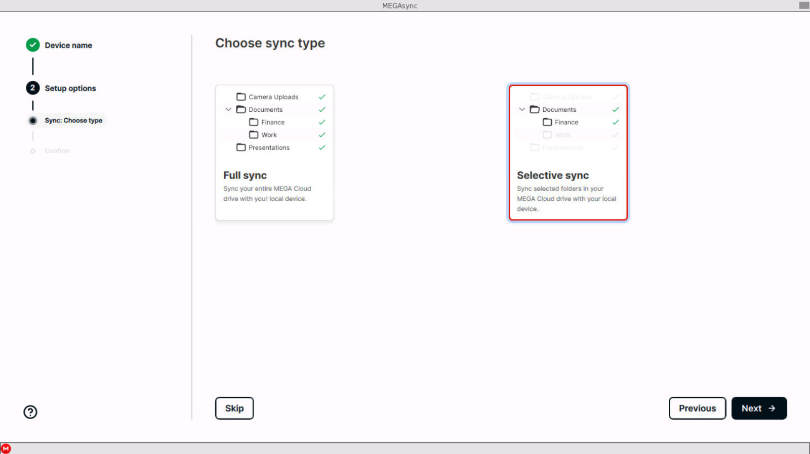
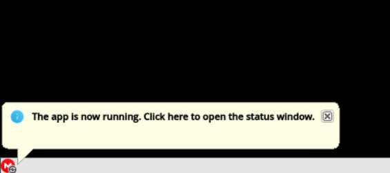

## 0. Motivation

In this guide, I'll walk you through installing and configuring MEGASync on a TerraMaster NAS using Docker. This setup is particularly useful because **TOS CloudSync doesn't support MEGA**, leaving users with limited options for seamless synchronization with MEGA cloud storage. Using Docker, you can overcome this limitation and enjoy a fully functional sync setup.

If you're just starting with your TerraMaster NAS, I recommend checking out my previous post <FancyLink linkText="Setting Up and Optimizing a Terramaster NAS" url="https://villoro.com/blog/setting-up-terramaster-nas/" dark="true"/>, where I cover the basics to get your device up and running. Once your NAS is set up, this guide will help you extend its functionality with MEGASync.

## 1. About TOS Paths

TerraMaster's TOS handles user directories in a specific way that can sometimes cause confusion or issues with Docker containers. While user folders are displayed in TOS under `/home/<username>`, these directories are actually mapped internally to `/Volume1/User/<username>`. This discrepancy can lead to problems with Docker containers, particularly when they require consistent and predictable file paths.

### 1.1. Shared Folders for Sync

In my setup, `Volume1` is the SSD where the OS is installed, and `Volume2` is the RAID volume for the HDDs.

To store personal data on the HDDs, you need to create a shared folder on `Volume2` and assign access to the user who will use it. For example, you can create a shared folder named `<username>_data` to store all personal data for that user.

### 1.2. Proposed Directory Structure for MEGASync

I recommend the following paths for MEGASync:

- **Configuration Files**: `/home/<admin_username>/docker/mega/<username>`  
  This path keeps MEGASync configuration files organized under a dedicated `docker` folder, maintaining a clean and consistent structure across applications.

- **Synced Data**: `/Volume2/<username>_data`  
  Storing data in the shared folder ensures easy access and reduces the chance of conflicts with other applications.

## 2. Run the MEGASync Docker Container

You can set up MEGASync either via the terminal or by using Portainer. Choose the option that works best for you.

The Docker image we are using for this setup is <FancyLink linkText="ich777/docker-megasync" url="https://github.com/ich777/docker-megasync" dark="true"/>, which provides a lightweight and reliable containerized version of MEGASync. Ensure you review the repository for the latest updates and additional configuration options.

<Notice type="warning">
  **Default Path Issues:** The default configuration path for MEGASync includes spaces (`/megasync/.local/share/data/Mega Limited/MEGAsync`), which can cause parsing and permission problems. To avoid this, we set the `DATA_DIR` environment variable to `/megasync/config`.
</Notice>

<Notice type="warning" classname="mt-6">
  **Ports:** It is recommended to use a custom port for security reasons. This guide uses 8081 as an example, but I suggest choosing a unique port for your setup.
</Notice>

You can use the following command to see which ports are free to use:

```bash
netstat -tuln | grep LISTEN
```

### 2.1. Option 1: Using the Terminal

Run the following command:

```bash
docker run -d \
  --name=megasync-<username> \
  -p 8081:8080 \
  --env 'DATA_DIR=/megasync/config' \
  --env 'CUSTOM_RES_W=1280' \
  --env 'CUSTOM_RES_H=720' \
  --volume "/home/<admin_username>/docker/Mmega/<username>:/megasync/config" \
  --volume "/Volume2/<username>_data:/sync-data" \
  --restart=always \
  ich777/megasync
```

<Notice type="warning">
  Replace `<admin_username>` and `<username>` with your actual values.
</Notice>

### 2.2. Option 2: Using Portainer

Use the following configuration:

```yaml
Name: megasync-<username>
Image: ich777/megasync:latest
Network ports configuration:
  Manual network port publishing:
    host: 8081 # Change it
    container: 8080
Advanced container settings:
  Volumes:
    - container: /megasync/config
      type: bind
      host: /home/<admin_username>/docker/mega/<username>
    - container: /sync-data
      type: bind
      host: /Volume2/<username>_data
  Env:
    - name: CUSTOM_RES_W
      value: 1280
    - name: CUSTOM_RES_H
      value: 720
    - name: DATA_DIR
      value: /megasync/config
Restart Policy: Always
```

After entering all the configuration in Portainer, click `Deploy the container`.

## 3. Access the MEGASync Web Interface

Once the container is running, access the MEGASync interface by opening your browser and navigating to:

```plaintext
http://<NAS_IP>:8081
```

<Notice type="warning">
  Replace `<NAS_IP>` with your NAS’s IP address and use the port you chose.
</Notice>

You will see a user interface similar to what you would see on a desktop computer with MEGA installed:



Log in to your MEGA account and set up synchronization.

<Notice type="warning">
  **Local Folder Setup**: Always choose `/sync-data` (or a subdirectory) for the **local folder** during synchronization setup to ensure proper syncing with the host.
</Notice>

Once configured, you can access the settings anytime via the `Mega` icon on the "task bar":



## 4. Verify the Setup

- Monitor the container logs to ensure there are no errors:
  ```bash
  docker logs megasync
  ```

- Test synchronization by adding files to `/Volume2/<username>_data` and confirming they appear in your MEGA account (and vice versa).

## 5. Adding Multiple Users

This setup is designed to work for multiple users. To sync another user, repeat the steps to run the Docker container. Use the new username in all relevant paths and container names. For example:

- Configuration Path: `/home/<admin_username>/docker/mega/<new_username>`
- Sync Data Path: `/home/<new_username>`
- Container Name: `megasync-<new_username>`
- Port: Use a different host port (e.g., `8082:8080`) to avoid conflicts.

By doing so, each user will have their own isolated MEGAsync instance.

## 6. Troubleshooting

### 6.1. Permission Denied Errors

If you encounter permission errors, verify the volume paths are set correctly and accessible to the Docker container.

<Notice type="info">
  You can also test whether the issue is related to permissions by temporarily setting the data path to `777`.
</Notice>

### 6.2. Logs Indicate Missing Commands

Errors like `xrdb: command not found` are harmless and can be ignored.

### 6.3. Access Issues

Ensure the container is running:

```bash
docker ps
```

Verify the port mapping matches your setup.

---

By following this guide, you’ve successfully set up MEGASync on your TerraMaster NAS. This setup enables seamless synchronization between your local NAS storage and MEGA cloud storage. If you encounter issues or have questions, feel free to leave a comment or reach out.

Happy syncing! 😊
