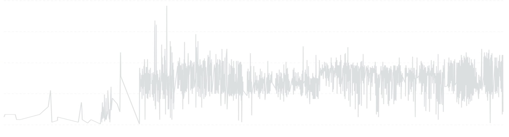

## Why Smoothing Matters (and Why It’s Not That Simple)

I’ve spent hours—maybe days—trying to find the "perfect" way to smooth a time series. I didn’t just want a trend line, I wanted a smoothed *series*—the kind you often see in polished dashboards, where the noise fades and the pattern becomes obvious. I remembered seeing some tools that seemed to use something close to a Gaussian smoother, and that became my benchmark.

So I tried everything: simple moving averages, exponential weighted moving averages (EWMA), Kalman filters, even rolling medians. Some were too noisy, others too laggy. I wanted something that respected the data's structure while highlighting the trend.

This post walks through that journey—from the most basic methods to more advanced, expressive smoothers. We’ll also explore what can and can’t be done in SQL, and why not every smoother belongs in a database.

Along the way, I’ll show visual comparisons using the same time series, so you can see exactly what each technique does—and where it shines or fails.

<canvas id="plot_source" style="width:100%;height:300px;"></canvas>

## Smoothing with Python: From Simple to Smart

### 🔁 Moving Average
A moving average is the most common starting point for smoothing. It replaces each point with the average of its neighbors over a fixed-size window.

**Pros:**
- Simple to understand and implement
- Reduces high-frequency noise

**Cons:**
- **Not very smooth:** Especially with small windows, the result is spiky and lacks continuity.
- **Sensitive to new data:** Trailing averages can react too fast or too slow, depending on window size.
- **Centering tradeoff:** Centered windows yield a more accurate reflection of the trend, but introduce delay and make the method unusable in real-time contexts.
- **Edge handling:** The start and end of the series are harder to estimate cleanly.

We'll apply both trailing and centered versions and compare their impact on the series.

### 🎯 Gaussian Smoother (`tsmoothie`)
Gaussian smoothing uses a weighted moving average where weights follow a Gaussian (normal) distribution. Points closer to the center of the window get higher weight.

**Pros:**
- Produces a very smooth, continuous curve
- Reduces noise while preserving general structure
- Tunable via the `sigma` parameter for controlling smoothness

**Cons:**
- **Window size matters:** Too large and you may lose important fluctuations; too small and it behaves like a basic moving average
- **Still linear:** Doesn’t adapt to non-linear trends or local curvature
- **Requires parameter tuning:** Choosing a good `sigma` isn’t always obvious

We'll use `tsmoothie.GaussianSmoother` to show its smoothing effects and how `sigma` influences the result.

<canvas id="plot_gaussian" style="width:100%;height:300px;"></canvas>

### 📈 Lowess Smoother (`tsmoothie`)
Lowess (Locally Weighted Scatterplot Smoothing) fits a local linear regression at each point using weighted neighboring data.

**Pros:**
- Adapts to local patterns, great for non-linear trends
- Handles seasonal variation and local curvature very well
- Smoother than moving average or Gaussian, especially with complex signals

**Cons:**
- **Computationally expensive:** Especially on large datasets (O(n^2) in naive implementations)
- **Not interpretable in real-time:** Being a centered smoother, it relies on future values
- **No clear parameters:** Tuning the fraction of data used (`frac`) requires experimentation

We'll visually explore how Lowess smooths differently and when it's a better choice.

<canvas id="plot_lowess" style="width:100%;height:300px;"></canvas>

---

## Smoothing with SQL: What’s Possible, What’s Not

### ❌ Why no Gaussian or Lowess in SQL?
Techniques like Gaussian smoothing and Lowess require iterative, weighted, and often non-linear computations—something SQL just isn't designed for. You can’t easily apply convolution or perform local regressions inside a SQL query.

SQL engines don’t support weighted kernels, nor do they support local least-squares fitting. While it's possible to simulate some behaviors using window functions and recursive queries, the complexity and performance penalty make it impractical.

### 📊 Median Smoothing
SQL *can* do robust smoothing with medians:

**Pros:**
- Robust to outliers, making it better for noisy series
- Available in many modern SQL engines via window functions

**Cons:**
- **Hard edges:** Like the moving average, it produces sharp transitions, especially when values shift abruptly
- **Still lags:** As with other rolling functions, it introduces temporal lag
- **Computational cost:** Rolling medians are heavier than means in most engines

We'll show how to apply a median using `MEDIAN() OVER (...)` to smooth the series.

### ⌐ Quantile Bands
Quantile smoothing provides additional context:

**Pros:**
- Gives a sense of spread and volatility
- Easy to implement using `PERCENTILE_CONT`
- Useful for detecting changes in distribution or trends

**Cons:**
- **Not a smoother per se:** Quantiles don't create a smoothed line, but rather bands
- **Limited interpretability:** Requires visual support to be useful

We'll demonstrate how to use quantiles as upper/lower bounds around a central trend.

<canvas id="plot_sql" style="width:100%;height:300px;"></canvas>

### 📆 Timeframe Reduction
Reducing granularity is another form of smoothing:

**Pros:**
- Naturally removes noise by aggregation
- Simple and performant in SQL
- Useful when precision isn't critical

**Cons:**
- **Loss of resolution:** You trade detail for clarity
- **Harder comparisons:** Aggregated results may hide important local variation

---

## Side-by-Side Comparison

To wrap up, we’ll place all techniques side by side:

<canvas id="plot_all" style="width:100%;height:300px;"></canvas>

- Raw time series
- Moving average
- Gaussian smoother
- Lowess smoother
- SQL median + quantiles + downsampling

This comparison will help you decide which approach works best depending on your tech stack and the level of fidelity you need.

Stay tuned for code samples, math notes, and visualizations.

