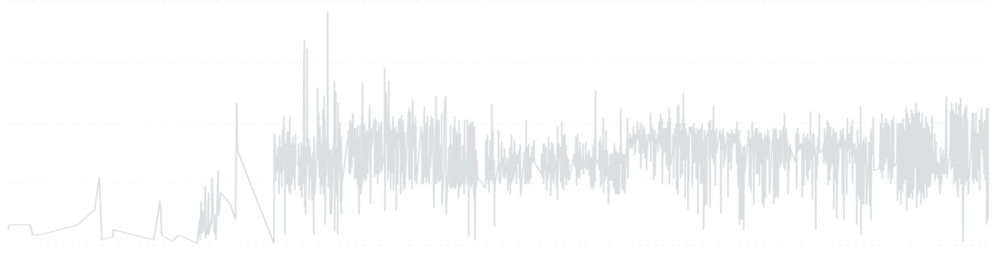

<script type="module" src="/js/posts/0057-smoothing.js"></script>

## Why Smoothing Matters (and Why It’s Not That Simple)

I’ve spent hours, maybe days, trying to find the "perfect" way to smooth a time series. I didn’t just want a trend line, I wanted a smoothed *series*, the kind you often see in polished dashboards, where the noise fades and the pattern becomes obvious. I remembered seeing some tools that seemed to use something close to a Gaussian smoother, and that became my benchmark.

So I tried everything: simple moving averages, exponentially weighted moving averages (EWMA), Kalman filters, even rolling medians. Some were too noisy, others too laggy. I wanted something that respected the data's structure while highlighting the trend.

This post walks through that journey, from the most basic methods to more advanced, expressive smoothers. We’ll also explore what can and can’t be done in SQL, which, as I learned after first publishing this post, is more than I initially thought.

Along the way, I’ll show visual comparisons using the same time series, so you can see exactly what each technique does, and where it shines or fails.

To do so, I'll use the following time series with daily data:



## Timeframe Reduction
The simplest way to smooth a time series is by reducing its granularity.

**Pros:**
- Naturally removes noise through aggregation
- Simple and performant in SQL
- Useful when precision isn't critical

**Cons:**
- **Loss of resolution:** You trade detail for clarity
- **Harder comparisons:** Aggregated results may hide important local variation

<canvas id="plot_source" style="width:100%;height:300px;"></canvas>

## Smoothing with Python: From Simple to Smart

### 🔁 Moving Average
A moving average is the most common starting point for smoothing. It replaces each point with the average of its neighbors over a fixed-size window.

**Pros:**
- Simple to understand and implement
- Reduces high-frequency noise

**Cons:**
- **Not very smooth:** Especially with small windows, the result is spiky and lacks continuity
- **Sensitive to new data:** Trailing averages can react too fast or too slow, depending on window size
- **Centering trade-off:** Centered windows yield a more accurate reflection of the trend but introduce delay, making the method unsuitable for real-time contexts
- **Edge handling:** The start and end of the series are harder to estimate cleanly

We'll apply both trailing and centered versions and compare their impact on the series.

<canvas id="plot_ma" style="width:100%;height:300px;"></canvas>

### 🎯 Gaussian Smoother (`tsmoothie`)
Gaussian smoothing uses a weighted moving average where weights follow a Gaussian (normal) distribution. Points closer to the center of the window receive higher weight.

**Pros:**
- Produces a very smooth, continuous curve
- Reduces noise while preserving general structure
- Tunable via the `sigma` parameter for controlling smoothness

**Cons:**
- **Window size matters:** Too large and you may lose important fluctuations; too small and it behaves like a basic moving average
- **Still linear:** Doesn’t adapt to non-linear trends or local curvature
- **Requires parameter tuning:** Choosing a good `sigma` isn’t always obvious

We can apply Gaussian smoothing using <FancyLink linkText="tsmoothie" url="https://github.com/cerlymarco/tsmoothie/tree/master" dark="true"/>:

```python
from tsmoothie.smoother import GaussianSmoother

smoother = GaussianSmoother(n_knots=6, sigma=0.1)
smoother.smooth(df["numeric_column"])
df["gaussian"] = smoother.smooth_data[0]
```

<canvas id="plot_gaussian" style="width:100%;height:300px;"></canvas>

### 📈 Lowess Smoother (`tsmoothie`)
Lowess (Locally Weighted Scatterplot Smoothing) fits a local linear regression at each point using weighted neighboring data.

**Pros:**
- Adapts to local patterns, great for non-linear trends
- Handles seasonal variation and local curvature very well
- Smoother than a moving average or Gaussian, especially with complex signals

**Cons:**
- **Computationally expensive:** Especially on large datasets (O(n^2) in naïve implementations)
- **Not interpretable in real-time:** Being a centered smoother, it relies on future values
- **No clear parameters:** Tuning the fraction of data used (`frac`) requires experimentation

We can also apply Lowess smoothing using <FancyLink linkText="tsmoothie" url="https://github.com/cerlymarco/tsmoothie/tree/master" dark="true"/>:

```python
from tsmoothie.smoother import LowessSmoother

smoother = LowessSmoother(smooth_fraction=0.2, iterations=1)
smoother.smooth(df["numeric_column"])
df["lowess"] = smoother.smooth_data[0]
```

<canvas id="plot_lowess" style="width:100%;height:300px;"></canvas>

## Smoothing with SQL: What's Possible, What's Not

> [!NOTE] Update, August 2026
> When I first wrote this section I claimed Gaussian and Lowess smoothing "just aren't something SQL is designed for." That was too strong. Since then I've built all of this in pure SQL (DuckDB, via dbt macros) as part of my `vtasks` pipeline, to smooth monthly income/expense trends without a Python step. The rest of this section reflects what I learned building it.

### 🎯 Gaussian and Savitzky-Golay both fit in SQL

Gaussian smoothing is just a weighted moving average: a self-join bounded to a window, with the weight computed inline as `exp(-0.5 * pow((neighbour.m - base.m) / sigma, 2))`. Dividing by the sum of the weights renormalises the kernel wherever it's truncated, which also gives edge handling for free: clamping the join index to the first/last row reproduces scipy's `mode="nearest"`.

Savitzky-Golay is the piece I'd missed. It fits a polynomial over a sliding window and keeps the value at the centre, but since least squares is linear in the data, that fitted value is a **fixed linear combination of the inputs**. The weights depend only on `(window_size, degree)`, never on the data, so they can be precomputed once (via `np.linalg.pinv` on the polynomial design matrix, no scipy needed) and the filter becomes a plain weighted sum against a lookup table:

```sql
sum(tap_weight * neighbour.value)  -- tap_weight from a precomputed (window_size, degree) table
```

I checked this against real data: reproducing `savgol_filter(35, 5, mode="nearest")` plus a 3-point convolution this way gave **0.00 deviation across every interior point** of three real monthly series (incomes, expenses, result; 158 months each). Only the first and last point differed, because `tsmoothie` pads the trailing convolution differently.

Lowess is expressible too, mostly: a local linear (or quadratic) fit has a closed form, so weighted least squares reduces to sums a database already computes (`slope = (Sw*Sxy - Sx*Sy) / (Sw*Sxx - Sx*Sx)`), no iteration needed. What genuinely doesn't belong in SQL is Lowess's *robustness iterations*, which repeatedly re-weight residuals. Calling that part impractical is still fair; it's just not the whole algorithm.

I'd also overstated the cost: a self-join bounded to a window is **O(n · w), not O(n²)**. At 158 monthly points with a 35-month window that's roughly **11k intermediate rows**, single-digit milliseconds in DuckDB. Only an unbounded window is quadratic.

### 🎚️ Degree, not algorithm family, buys responsiveness

Comparing local-polynomial fits against the savgol reference (MAE in euros, over 158 months, on series averaging about 2500/month):

| Method                    | Incomes MAE | Expenses MAE |
| ------------------------- | ----------- | ------------ |
| Local linear, sigma=4     | 103.5       | 80.8         |
| Local linear, sigma=6     | 123.3       | 84.4         |
| Local quadratic, sigma=6  | 83.4        | 70.3         |

Plain Gaussian and local-linear both lag at turning points, since a straight line fitted through a window can't bend to a peak. It's the polynomial degree that lets Savitzky-Golay track changes faster, not something inherent to "SQL vs Python."

### ⚠️ The caveat I'd missed: negative ringing

Savitzky-Golay taps include **negative lobes**, so an isolated spike in a sparse series rings *below zero* on both sides. On a real expense category with a single non-zero month out of 158, the savgol trend reached **-9.38** where the Gaussian smoother stayed at **0**. An earlier ad-hoc measurement on a different sparse category bottomed out around **-113 EUR**. Lowering the degree doesn't fix it (tested at `(21, 3)` and `(15, 2)`); it's inherent to the kernel. Gaussian weights are all positive, so a weighted average of non-negative values can never go negative:

- **Dense aggregate series** (monthly totals) → Savitzky-Golay, for responsiveness
- **Sparse detail series** (a breakdown by category) → Gaussian, for non-negativity

### 🕳️ Complete the series before you smooth it

Both filters match neighbours **by period index**, not by date, so a missing month doesn't create a gap: it makes the months on either side of the hole behave as if they were consecutive, and the trend comes out quietly wrong with no error and no null. Build a complete date grid (period × dimensions) and fill it first, and the fill rule depends on the measure:

- **Flow** measures (spend, hours logged, pages read) → missing means `0`
- **Stock** measures (account balances, net worth) → missing means carry the last value forward; zero would be badly wrong

### 📊 Median Smoothing
SQL *can* do robust smoothing with medians:

**Pros:**
- Robust to outliers, making it better for noisy series
- Available in many modern SQL engines via window functions

**Cons:**
- **Hard edges:** Like the moving average, it produces sharp transitions, especially when values shift abruptly
- **Still lags:** As with other rolling functions, it introduces temporal lag
- **Computational cost:** Rolling medians are heavier than means in most engines

You can compute the median over a window with:

```sql
SELECT
    start_day,
    MEDIAN(value) OVER (ORDER BY start_day ROWS BETWEEN 15 PRECEDING AND 15 FOLLOWING) AS mov_median
FROM data
ORDER BY 1 DESC
```

<canvas id="plot_median" style="width:100%;height:300px;"></canvas>

### 🎹 Quantile Bands
Quantile smoothing provides additional context:

**Pros:**
- Gives a sense of spread and volatility
- Easy to implement using `PERCENTILE_CONT`
- Useful for detecting changes in distribution or trends

**Cons:**
- **Not a smoother per se:** Quantiles don't create a smoothed line, but rather bands
- **Limited interpretability:** Requires visual support to be useful

There is no standard for calculating quantiles in SQL. As an example, here’s how it can be done with <FancyLink linkText="DuckDB" url="https://duckdb.org/" dark="true"/>:

```sql
SELECT
    start_day,
    MEDIAN(value) OVER win AS mavg,
    quantile_cont(value, 0.10) OVER win AS p10,
    quantile_cont(value, 0.90) OVER win AS p90
FROM data
WINDOW win AS (ORDER BY start_day ROWS BETWEEN 15 PRECEDING AND 15 FOLLOWING)
ORDER BY 1 DESC
```

You can also partition by one or more categories with:

```sql
SELECT
    start_day,
    category,
    MEDIAN(value) OVER win AS mavg,
    quantile_cont(value, 0.10) OVER win AS p10,
    quantile_cont(value, 0.90) OVER win AS p90
FROM data
WINDOW 
    win AS (
        PARTITION BY category
        ORDER BY start_day
        ROWS BETWEEN 15 PRECEDING AND 15 FOLLOWING  
    )
ORDER BY 1 DESC
```

<canvas id="plot_sql" style="width:100%;height:300px;"></canvas>

---

## Side-by-Side Comparison

To wrap up, we’ll place all techniques side by side:

<canvas id="plot_all" style="width:100%;height:300px;"></canvas>

- Raw time series
- Moving average
- Gaussian smoother
- Lowess smoother
- SQL median + quantiles + downsampling

This comparison will help you decide which approach works best, depending on your tech stack and the level of fidelity you need.

Stay tuned for code samples, math notes, and visualizations.
