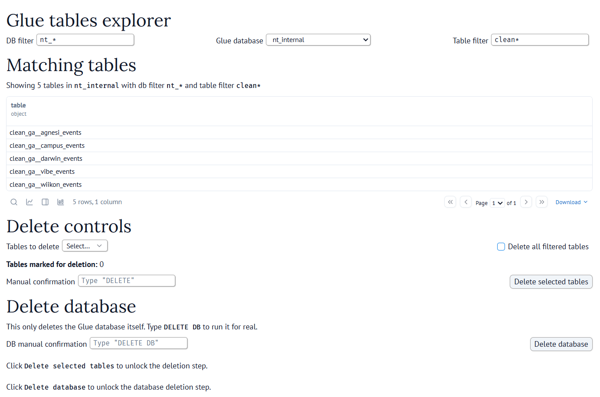

## 0. Intro

I have used Jupyter notebooks for years, and recently I started trying <FancyLink linkText="marimo" url="https://marimo.io/"/>.

In this post I want to explain why I think it is a very interesting alternative for Python projects, and then show one small example at the end.

## 1. Marimo as a Jupyter alternative

I still think Jupyter notebooks are very useful.
For quick exploration, ad-hoc analysis, or testing an idea, they are hard to beat.

The problem starts when the notebook stops being temporary.

That is usually the moment where Jupyter begins to show its weak points:

* execution order gets messy
* the in-memory state becomes harder to reason about
* git diffs are annoying
* moving notebook code into a proper project takes extra work

That is why I think **marimo** is so interesting.

It keeps the interactive part of notebooks, but it feels much closer to normal Python development.
The notebook becomes easier to understand, easier to keep in git, and easier to revisit later.

Part of that comes from the fact that a marimo notebook is really just a small Python app.

<Notice type="success">
  A marimo notebook is just a Python app.
</Notice>

It is not a special document format with some Python inside it.
It is Python code that happens to render as a notebook.

So I do not really see marimo as "Jupyter but nicer".
I see it more as a notebook tool for the cases where the notebook is slowly becoming part of the project itself.

## 2. Execution order, reloading, and variable redefinition

This is the part I liked the most.

With Jupyter, it is very easy to get into a weird state without noticing.
You run some cells, change something above, rerun only part of the notebook, and now the kernel is no longer a clean reflection of the code you have on screen.

That is not always a problem, but it is a very common source of confusion.

In marimo, cells return values.
That is what allows marimo to understand the dependencies between cells and build a DAG from them.

So if one cell returns a variable and another cell uses it, marimo knows there is a dependency there.
If the first cell changes, the second one can be updated automatically.

That is why reloading feels much cleaner.
It is not just rerunning cells randomly.
It is updating the parts of the notebook that depend on values that changed.

The key part is that variables should have a single definition.
You should not keep redefining the same variable in different cells.

So this kind of pattern:

```python
df = load_data()
```

and later:

```python
df = transform_data(df)
```

is better written as:

```python
raw_df = load_data()
transformed_df = transform_data(raw_df)
```

But the important part is that these would normally live in **different cells**.

One cell returns:

```python
raw_df = load_data()
```

And another cell returns:

```python
transformed_df = transform_data(raw_df)
```

This way marimo knows that the second cell depends on the first one.
So if the first cell changes, the second one updates automatically.

At first I thought this would feel a bit annoying, but I actually think it is one of the best things about marimo.
It forces a cleaner structure, and that makes the notebook easier to understand later.

<Notice type="info">
  The nice part is not only that the notebook updates automatically.
  It is that the update follows the dependencies between cells, so the notebook behaves more like a DAG than like a mutable scratchpad.
</Notice>

## 3. Why being a plain Python file matters

This is another big reason I like it.

A marimo notebook is just a Python file.
That means you can open it, read it, diff it, and review it like any other Python file in the project.

That is a much better fit for git than a traditional notebook file.

It also makes the notebook feel less "special".
It can live inside a normal project, import your code, and evolve like the rest of the codebase.

Here is a very small example:

```python
import marimo

app = marimo.App()

@app.cell
def __():
    x = 1
    return (x,)

@app.cell
def __(x):
    y = x + 1
    return (y,)

@app.cell
def __(y):
    print(y)
    return

if __name__ == "__main__":
    app.run()
```

The nice part is that there is no special format involved here, just regular Python code.

<Notice type="info">
  This is also why marimo notebooks are much easier to version and review.
</Notice>

And I think that matters a lot.
If a notebook is useful enough to keep, then it is useful enough to deserve clean diffs and normal code review.

## 4. SQL integration and plotting

TODO

## 5. UI elements

This is another part I like a lot.

Marimo has quite a few useful UI elements:

* `alert`
* `spinner`
* `multiselect`
* `text`
* `hstack`
* `vstack`
* `slider`
* `dropdown`
* `checkbox`
* `button`
* `table`
* `tabs`

I also like that marimo has a clear distinction between the **edit** view and the **app** view.
When editing, you work on the notebook like normal.
When switching to the app view, the notebook feels much closer to a small internal tool.



Here is a very small example:

```python
import marimo as mo

tables = mo.ui.multiselect(
    options=["users", "sessions", "events"],
    label="Tables",
)
pattern = mo.ui.text(label="Filter")

controls = mo.vstack([
    mo.md("## Cleanup controls"),
    mo.hstack([tables, pattern]),
    mo.md(
        mo.callout(
            "This notebook can delete old Glue table versions.",
            kind="warn",
        )
    ),
])

with mo.status.spinner(title="Loading tables"):
    available_tables = get_tables()

controls
```

I think `hstack` and `vstack` are especially handy because they let you organize the notebook a bit better.
Without them, the widgets can end up feeling scattered.

<Notice type="info">
  This is enough to turn a notebook into a small internal tool without leaving Python.
</Notice>

## 6. The Glue cleanup notebook

TODO

## 7. Closing thoughts

TODO
