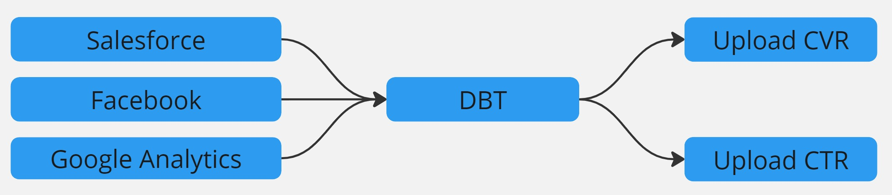
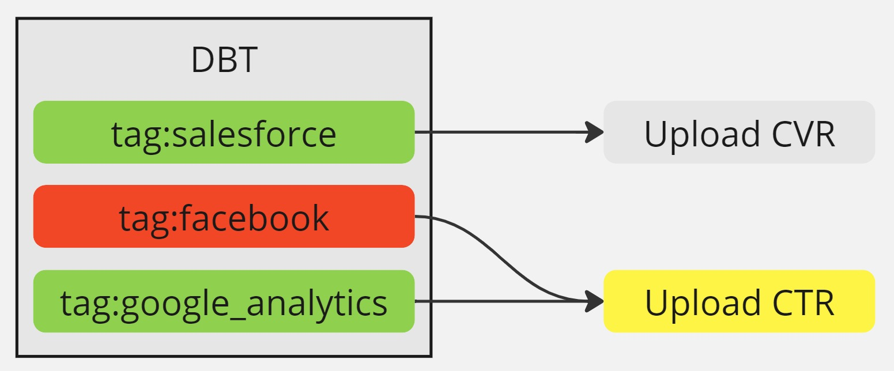
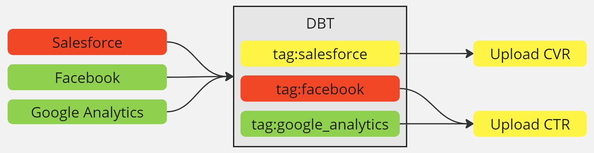

## 0. Motivation

xx

## 1. Types of failures

There are 2 types of problems we can handle in DBT

1. Failures before DBT
2. Failures in DBT



## 2. Failures before DBT


`dbt build --exclude tag:salesforce`

## 3. Failures in DBT



How failures work in DBT

<FancyLink linkText="Running DBT with AWS ECS (Fargate) | 8.2. DBT run results" url="https://villoro.com/blog/running-dbt-with-aws-ecs-fargate/#82-dbt-run-results" dark="true"/>

## 4. Running jobs post DBT

<TerminalOutput color="stone">
  QUERY_FAILURES
</TerminalOutput>
```sql
WITH executions AS (
    SELECT invocation_id
    FROM nt_bronze__metadata.dbt_execution
    WHERE p_extraction_date >= DATE '{yesterday:%Y-%m-%d}'
        AND flow_run_id = '{flow_run_id}'
), run_res AS (
    SELECT *
    FROM nt_bronze__metadata.dbt_run_results
    WHERE p_extraction_date >= DATE '{yesterday:%Y-%m-%d}'
        AND status NOT IN ('success', 'pass', 'skipped')
)
SELECT DISTINCT relation_name
FROM executions
LEFT JOIN run_res
    ON executions.invocation_id = run_res.invocation_id
WHERE relation_name IS NOT NULL
```

And the python part:

```python
from datetime import date, timedelta

import awswrangler as wr
from prefect import task, get_run_logger

@task(name="prefect.dbt.run.get_failures")
def get_dbt_failures(env, flow_run_id):
    logger = get_run_logger()
    logger.info(f"Checking if there were DBT failures for {flow_run_id=}")

    yesterday = date.today() - timedelta(days=1)
    query = QUERY_FAILURES.format(yesterday=yesterday, flow_run_id=flow_run_id)
    df = wr.athena.read_sql_query(sql=query, database="default")

    errors = [
        x.split(".")[1].replace('"', "").split("__")[-1] for x in df["relation_name"]
    ]
    errors = list(set(errors))  # Remove duplicates
    errors = [f"tag:{x}" for x in errors]

    if errors:
        logger.warning(f"There were some failed models in DBT {errors=}")
        return errors

    logger.info("There were no failed models in DBT")
    return False
```




## 5. Putting it all together

```python
def combine_failures(*failures):
    """Combines lists of failures"""
    out = []

    for x in failures:
        # Returning 'None' in prefect is dangerous so we return 'False' instead
        if x:
            out += x

    # In DBT we cannot pass 'False', since this is not a prefect task we can return 'None'
    if not out:
        return None

    # Remove duplicates
    return list(set(out))
```
