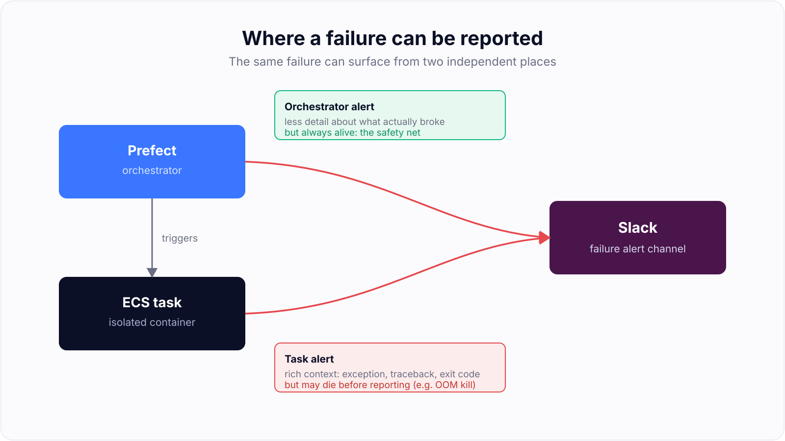
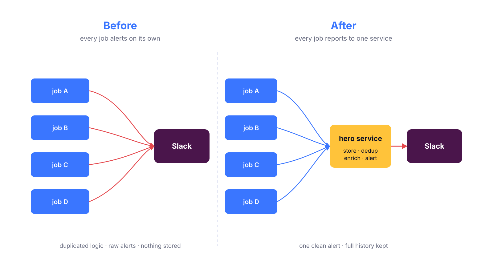
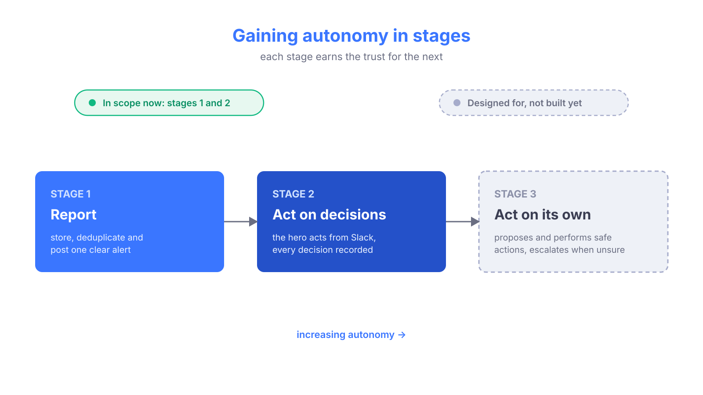

## Motivation

Most data teams have a **hero**: the person on rotation who deals with production failures. When a job breaks, the hero reads the stack trace, tries to figure out what went wrong, decides what to do, and very often ends up rerunning the job by hand.

This works, but it has problems. It's slow, it's repetitive, and the quality of the response depends on who happens to be on call that week. The same out-of-memory error gets diagnosed from scratch every single time. And a lot of useful context, like who owns a job or whether it's safe to rerun, lives only in people's heads.

I've been building a project to change this. The idea is a **failure handling service**, which I call the `DE hero agent`, that takes over the manual work the hero does today and, over time, learns to do more of it on its own.

This is the first post in a series. Here I want to explain the vision and the decisions behind it. Later posts will cover the actual implementation as each part ships.

> [!note]
> This is a vision post, so there is very little code here. If you want the hands-on details, those come in the following posts.

## Where alerts happen today

To understand the problem, it helps to look at where failure alerts come from in my setup. There are usually **two different places** where a failure can be detected and reported.

The first is the **orchestrator**. In my case that's <FancyLink linkText="Prefect" url="https://www.prefect.io/" dark="true"/>. The orchestrator is the code that decides what runs and when, and it triggers the actual tasks. When a task fails, the orchestrator notices and can send an alert.

The second is the **task itself**. Most of my heavy jobs don't run inside the orchestrator process. They run in a separate container on ECS (AWS Fargate), completely isolated from Prefect. That task can also detect its own failure and send its own alert.

These two places are not equivalent:

* The **task** has the richest context. It's the one that actually blew up, so it knows the exception, the traceback, and the exit code.
* The **orchestrator** has less detail, but it's more reliable. It's still alive even when the task dies in a way that leaves no time to report anything, like an out-of-memory kill.

So I want alerts from both. The task gives me the good context most of the time, and the orchestrator acts as a safety net for when the task can't say anything before dying.

The problem is that today each of these places sends its own Slack alert directly from its own code. That leads to a few issues:

* **The alert logic is duplicated** everywhere, both in the orchestrator and in every task.
* **The same failure can be reported twice**, once by the task and once by the orchestrator, so the hero gets two messages for one problem.
* **The alerts are raw**. Usually just a stack trace dumped into a channel, with no summary and no suggested next step.
* **Nothing is stored**. Once the failure is fixed, all the context about what broke and what the hero did is gone.

That last point matters more than it looks. If I ever want to automate any of this, I need a record of what failures look like and how people respond to them. A pile of Slack messages doesn't give me that.

## The core idea: one central service

Instead of every job shouting into Slack on its own, I want jobs to send a **structured failure event** to a single service. That service is then responsible for everything that happens next:

| Responsibility    | What it does                                                    |
| ----------------- | --------------------------------------------------------------- |
| **Store**         | Save every failure (and later every human action) as a record.  |
| **Deduplicate**   | Decide which side sends the alert when both report the same failure. |
| **Enrich**        | Turn a raw error into a short summary and a likely cause.       |
| **Alert**         | Post one clean Slack message that pings the right owner.        |
| **Interact**      | Let the hero act from the Slack thread and record what they did.|

The jobs get simpler, because all they do is report. The logic that used to be copy-pasted everywhere now lives in one place. And every failure and every decision ends up written down.

## The direction: autonomy in stages

The whole project is built around one idea: the service should gain autonomy **gradually**, and only where I can prove it's safe. I think about it in three stages.

### Stage 1 - Report

The first stage doesn't touch anything in production. It only changes how a failure is reported, and its whole job is to make a failure easier to understand.

When a job fails, it sends a structured event to the service instead of posting to Slack itself. The event carries the useful context: which job failed, who owns it, the exception type, the traceback, the exit code, and whatever metadata the job wants to attach. The service then does a few things with it:

* **Stores** the event, so there's a permanent record of the failure.
* **Deduplicates** it, so a failure reported from two places (the task and the orchestrator) only produces one alert.
* **Enriches** it. This is where the LLM comes in. Instead of dumping a raw traceback into a channel, the model reads it and writes a short summary of what went wrong and a likely cause.
* **Posts** one clean Slack message that pings the right owner and puts the important details up front.

The difference in practice is going from "here is a 60-line stack trace, good luck" to "the Salesforce extraction failed because the API returned a 429, this is probably rate limiting". Same failure, but the hero starts from a much better place.

This is the stage that's actually being built. It has no ability to change anything, which makes it safe to roll out and a good place to learn what a useful alert looks like.

### Stage 2 - Act on human decisions

Once the alerts are good, the next step is to let the hero act on them without leaving Slack.

The idea is to add buttons to the alert. The hero can rerun the job, mark it as something they already fixed by hand, ask the owner to look at it, or close it as solved. The service performs the action, updates the status of the failure, and posts the result back into the thread so everyone can see what happened.

The important rule is that the service only acts when a human tells it to. It's not deciding anything on its own yet. What it *is* doing is **recording every one of those decisions**: which failure, what the hero chose, and whether it worked. Over time this builds a history of "this kind of failure, this action, this outcome".

That history is the whole point of the stage. It's not just convenience for the hero, it's the dataset that makes the next stage possible.

### Stage 3 - Act on its own

The last stage is where the service starts to take work off the hero's plate, but only for the cases where the history says it's safe.

If the record shows that a certain kind of failure has been fixed by a rerun twenty times in a row, with no bad side effects, that's a strong signal that a rerun is the right move. The service can start by **proposing** it ("this looks like the usual transient timeout, I'd rerun, do you agree?") and, once there's enough evidence, **doing it automatically** and just reporting what it did.

Anything that doesn't match a known-safe pattern still goes to a human, exactly like today. The goal isn't to remove the hero, it's to stop waking them up for the failures that always have the same boring answer.

> [!info]
> Only stages 1 and 2 are in scope for now. But I'm making every decision with stage 3 in mind. That's the reason I store the failures and the human actions from the very beginning: that history is what will let me safely automate things later.

## The decisions behind it

There are a few choices that keep this from turning into a scary "AI reruns my production pipelines" project.

### The model earns the right to act

I do want the service to act on its own eventually. That's the whole point of stage 3. But it shouldn't start there, and when it does act, it shouldn't be the model deciding on a whim.

So the rule is about *how* actions get promoted, not about banning them forever. At the beginning the LLM only advises. I use it for what it's actually good at: reading a messy error and writing a short summary and a likely cause. That output is a suggestion shown to the hero, and a human decides what to do.

An action only becomes automatic once the history shows it's consistently safe, and even then it runs through plain code that I own, not through the model choosing freely. The model can suggest "this looks like the usual timeout, I'd rerun", but whether a rerun is *allowed* to happen without a human is a decision made by explicit rules, based on what the recorded history says.

> [!warning]
> Letting a model rerun production jobs on day one, just because it sounds confident, is exactly the kind of thing that destroys trust fast. The point isn't that it never acts. It's that it has to earn each action with evidence, and every action stays behind rules I control.

This is also what keeps the whole thing auditable. Because the rules are code and the history is stored, I can always explain why an action was or wasn't taken, and I can promote a new action deliberately instead of hoping the model gets it right.

### It has to fail safe

The service sits right in the path of production alerts. If it's down, or the database is unreachable, or the AI call times out, failures still have to reach a human.

So the rule is to **degrade, never swallow**. If the AI enrichment fails, send a plain alert instead. If storing the event fails, still send the alert. A failure should never disappear just because some part of the service had a bad day.

### Store everything now, automate later

I store two things: the **failure events** (what broke) and, later, the **actions** (what the hero decided). This is more than stage 1 strictly needs, but it's the raw material for stage 3. It's also why I keep this in a proper relational database instead of leaving it as messages in Slack.

## Alternatives I considered

A few other approaches I looked at and set aside:

* **Keep the alerts inside each job.** No history, no shared logic, and no path to automation.
* **Use only fixed rules to classify failures.** Too rigid, and it misses the part LLMs are genuinely useful for, which is summarizing an ugly trace.
* **Let an AI agent framework run the whole thing.** That hands the model control over production actions, which is the exact line I don't want to cross yet.
* **Read the Slack messages after the fact.** That makes Slack the source of truth, which it should never be.

The common thread is that I keep the orchestration and the rules in my own code, use AI only where it clearly helps, and never give up being able to audit what happened.

## What's next

That's the vision. In the next post I'll get into the actual implementation of **Stage 1**: the service that receives the structured failure events, decides which side should send the alert (the deduplication between the task and the orchestrator is trickier than it sounds), and posts to Slack, all while failing safe.

> [!tip]
> The interesting part of this project isn't the AI. It's everything around the AI that makes it safe to trust: the boundaries, the fallbacks, and the history.
