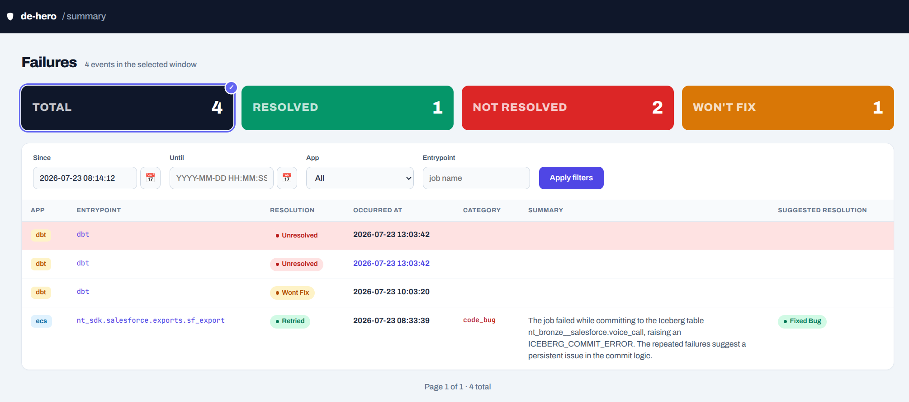
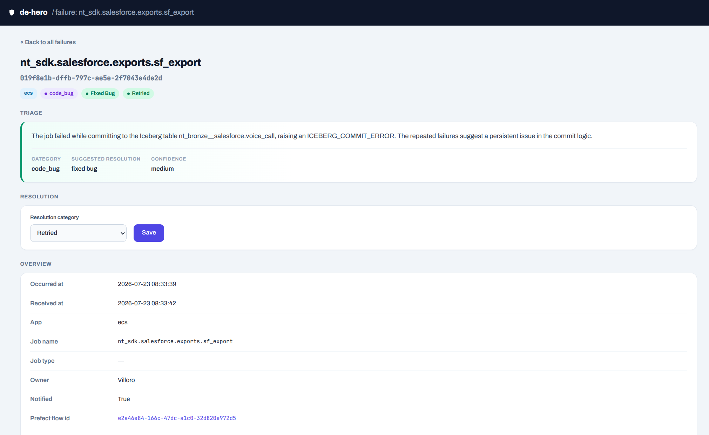

## Motivation

Two posts in, the hero agent can report a failure and, since the <FancyLink linkText="Bedrock summarization" url="https://villoro.com/blog/data-engineering-hero-agent-bedrock-summarization/" dark="true"/> post, summarize it and suggest how it will likely be resolved. What it can't do yet is remember how a failure *actually* ended: when the hero fixes something, that knowledge lives in their head or a Slack thread and then disappears. (The whole plan is in the <FancyLink linkText="vision post" url="https://villoro.com/blog/data-engineering-hero-agent-vision/" dark="true"/>, and the service itself was built in the <FancyLink linkText="Stage 1 post" url="https://villoro.com/blog/data-engineering-hero-agent-ingestion-service/" dark="true"/>.)

This post closes the loop. Every failure now gets a resolution: a record of how it was dealt with, set by the hero from a web page, or, for a whole class of failures, closed automatically. That auto-close is the first bit of autonomy in the project, and it is deliberately *not* the model acting. It is a plain rule: if a later run of the same job succeeds, the earlier failure is fixed.

> [!note]
> There are still no Slack buttons here. Setting a resolution happens on a web page, not from the alert thread. Acting from Slack is Stage 2; this post is about capturing the resolution and auto-closing what it safely can.

## How a failure gets resolved

A resolution is a single category from a fixed set:

<FileName>
  de_hero/schemas.py
</FileName>
```python
class ResolutionCategory(str, Enum):
    fixed_bug = "fixed_bug"            # a code fix shipped
    retried = "retried"                # transient, resolved by rerunning
    upstream_fixed = "upstream_fixed"  # the failing dependency recovered
    config_change = "config_change"    # fixed by a config/permission/secret change
    wont_fix = "wont_fix"              # known issue, deliberately not fixed
    not_an_issue = "not_an_issue"      # false alarm / expected
    auto_resolved = "auto_resolved"    # set by the service, not a hero
```

These map to what the hero *does* about a failure, not to why it happened (that is the Bedrock category from the last post). The hero picks one of the first six by hand. `auto_resolved` is the odd one out: it is the only value the service sets on its own, which is also how I can tell later which resolutions were human decisions and which the system closed itself.

There is no separate "resolved" boolean. Resolution is one nullable column on the failure row, where null means unresolved and any value means resolved. A resolved failure with no category would be meaningless, so I don't store the two things apart.

Setting it is a small write, exposed as `PATCH /api/failures/{id}` and handled by `update_resolution`.

### Resolving siblings together

One real-world run can produce two failure rows. As the <FancyLink linkText="Stage 1 post" url="https://villoro.com/blog/data-engineering-hero-agent-ingestion-service/" dark="true"/> covered, a Prefect flow and the ECS task it triggers can each report the same underlying failure. If the hero resolves one, the other has to resolve too, or the list keeps showing a phantom half of a failure that is already handled.

So `update_resolution` cascades to siblings: any other row sharing this one's `prefect_flow_id` or `parent_flow_run_id` gets the same category.

<FileName>
  de_hero/queries.py
</FileName>
```python
def update_resolution(session_factory, failure_id, *, resolution_category):
    value = resolution_category.value if resolution_category else None
    with session_factory() as session:
        record = session.get(FailureEventRecord, failure_id)
        if record is None:
            return None  # let the endpoint 404 instead of silently no-op'ing
        record.resolution_category = value

        sibling_filters = []
        if record.prefect_flow_id:
            sibling_filters.append(FailureEventRecord.prefect_flow_id == record.prefect_flow_id)
        if record.parent_flow_run_id:
            sibling_filters.append(FailureEventRecord.parent_flow_run_id == record.parent_flow_run_id)

        siblings = []
        if sibling_filters:
            siblings = session.scalars(
                select(FailureEventRecord)
                .where(FailureEventRecord.id != record.id)
                .where(or_(*sibling_filters))
            ).all()
            for sibling in siblings:
                sibling.resolution_category = value

        session.commit()
        return record, len(siblings)
```

The match is deliberately narrow: exact equality on either id, and no cross-matching one row's `prefect_flow_id` against another's `parent_flow_run_id`. It returns the updated record plus how many siblings it touched, and `None` when the id doesn't exist so the endpoint can return a `404`.

This cascade matters beyond the manual case. Auto-resolve, further down, reuses this exact function, so a self-healed failure closes its sibling the same way.

## Looking at failures

The hero needs somewhere to see failures and set resolutions. There are two surfaces for that, and it is worth saying why both exist:

- **Server-rendered HTML pages**, built with <FancyLink linkText="Jinja" url="https://jinja.palletsprojects.com/" dark="true" company="default"/> templates. This is what the hero actually opens in a browser.
- **A JSON API** under `/api/failures`, for anything that wants the data as data.

The pages don't call the API. They query the database directly and render server-side. The JSON API exists alongside them so the same data is available for ad-hoc queries or a future integration without scraping HTML, and without committing to a frontend framework now.

### The summary page

Served at `/` (and `/summary`), this is the landing page: a filterable, paginated list of failures, newest first.



A form above the list holds most of the filters: a time window (default: the last 24 hours), source app, and job name. The resolution-state filter works differently, and it doubles as the summary at the top.

Those four stat cards, total / resolved / not resolved / won't-fix, are also the resolution filter. Each one is a link: clicking it filters the list below to that state and marks the card active. By default nothing is filtered, so the *total* card is the selected one. There is one deliberate choice in how they count.

> [!tip]
> The cards always count the whole window, even the one you have clicked. If they shrank to match the current filter, selecting "resolved" would show "resolved: N of N", which tells you nothing. Keeping them fixed lets the hero read "12 total, 9 resolved, 3 left" while the list below shows just those 3.

Won't-fix is counted apart from resolved, because a deliberate non-fix is not a fix: `unresolved = total − resolved − won't-fix`. The list itself is backed by `GET /api/failures`, which takes the same filters as query params and returns one page of results plus the total count for pagination.

### The failure detail page

Each row links to `/failures/{id}`, the full context for a single failure: everything the alert carried (job, owner, exception, traceback) plus the stored Bedrock triage.



This is where the suggested resolution from the last post earns its place. The triage box shows the model's summary, category, and suggested resolution, and that suggestion also appears as a pill among the failure's tags, styled the same as the actual resolution pill so the two read as a matched pair. Just below, the resolution form is where the hero commits the real one, taking the model's suggestion or overriding it.

Setting the resolution here is what fires the `PATCH` from the previous section, cascade and all. Reading the page is a `GET /api/failures/{id}`.

## Auto-resolving on success

Some failures fix themselves. A transient timeout kills one run, the next run succeeds and reprocesses the data the failed one should have produced. The failure is genuinely resolved, but nobody told the service, so it lingers in the list forever.

The fix is to have jobs report their successes too, not just their failures. A job `POST`s to `/success` when a run finishes cleanly:

<FileName>
  de_hero/main.py
</FileName>
```python
@app.post("/success", status_code=202, dependencies=[Depends(require_ingest_token)])
def submit_success(event: SuccessEvent) -> SuccessResult:
    resolved_count = auto_resolve_failures(
        session_factory,
        job_name=event.job_name,
        app=event.app.value,
        params=event.params,
        occurred_before=event.occurred_at,
    )
    return SuccessResult(resolved_count=resolved_count)
```

`auto_resolve_failures` looks for unresolved failures of the same job (`job_name` + `app`) that happened *before* this success, keeps the ones this run covers, and marks them `auto_resolved`. It calls `update_resolution` per match, so the sibling cascade from earlier applies here too.

### Matching a success to a failure

"Same job" is not enough. A success that only reprocessed table A should not resolve a failure that was about table B. So each event carries the job's invocation params, and a success only resolves a failure whose params it covers.

Two subtleties matter here.

First, the params themselves, and this one was an actual bug. ECS reports them JSON-encoded under `metadata["params"]`, next to run and environment noise like `duration_minutes` and `ecs_version`. Matching on the raw metadata dict never worked, because `duration_minutes` alone guarantees two runs never match exactly. The fix was to decode `metadata["params"]` and match on that, ignoring the noise:

<FileName>
  de_hero/queries.py
</FileName>
```python
def _job_params(metadata):
    raw = metadata.get("params")
    if not raw:
        return {}
    try:
        parsed = json.loads(raw)
    except (TypeError, ValueError):
        return {}
    return parsed if isinstance(parsed, dict) else {}
```

Second, coverage is not exact equality. Everything must match exactly *except* `select`/`exclude`, the dbt-style table scoping, which get coverage logic instead:

<FileName>
  de_hero/queries.py
</FileName>
```python
def _params_cover(failure_params, success_params):
    # Everything except select/exclude must match exactly.
    failure_rest = {k: v for k, v in failure_params.items() if k not in _SCOPE_KEYS}
    success_rest = {k: v for k, v in success_params.items() if k not in _SCOPE_KEYS}
    if failure_rest != success_rest:
        return False

    failure_select = _table_set(failure_params.get("select"))
    success_select = _table_set(success_params.get("select"))
    if failure_select is not None or success_select is not None:
        if success_select is None:   # success ran unscoped → it covers everything
            return True
        if failure_select is None:
            return False
        return failure_select <= success_select  # success covers if it's a superset
    # (exclude handling is the mirror image, omitted here)
```

- Both sides use `select` (explicit include lists): the success covers the failure if its tables are a superset, or if it ran unscoped and processed everything.
- Neither uses `select`: both are in "everything except `exclude`" mode, and the success covers if it excluded no more than the failure did.
- Mixed, one side scoped and the other not: this can't be reasoned about without knowing the job's full table universe, so it counts as not covered.

> [!warning]
> Auto-resolve only ever *closes* failures, and only when a later run demonstrably covered the same work. It is conservative on purpose. A false "not covered" just leaves a failure for the hero to close, but a false "covered" would hide a real, still-broken failure. When in doubt, don't resolve.

## Where this leaves us

The loop is closed. A failure is reported (Stage 1), summarized and classified (the Bedrock post), and now carries how it was resolved, whether a hero set that by hand or a later success closed it automatically.

That also completes the dataset I have been building toward. Every failure now pairs the model's *suggested* resolution with the *actual* one. Over time that is what lets me measure how good the suggestions are and, further out, feed a more specialized agent that learns which failures tend to resolve which way. It is the evidence base the vision post described.

Auto-resolve is the project's first taste of acting on its own, and it is intentionally the most cautious version possible: no model in the decision, just a deterministic rule that a covered rerun success fixes a failure. That is the shape of Stage 3 in miniature, where the service earns each autonomous action by being provably safe first.

Next in the series: **acting from Slack**, where the hero can rerun, reassign, or resolve a failure straight from the alert thread, and every one of those actions becomes part of the same audit trail.
