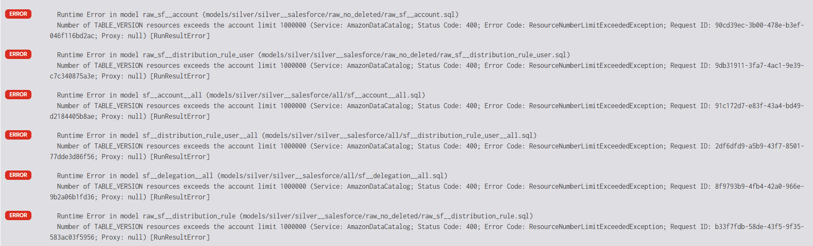
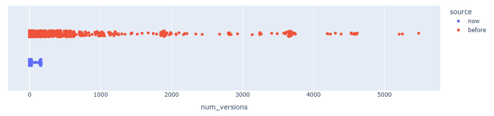

<script type="module" src="/js/posts/9999-glue-versions.js"></script>

## 0. What happened?

We hit a strange issue with dbt Athena were no queries were running:



After digging we discovered the culprit: **Glue table version limits**.

Until then, I was totally unaware that:
1. There is a hard limit of **1 000 000 schema versions across the entire Glue catalog**.
2. Exceeding this limit doesn't just block updates — it **breaks Athena queries** in ways that aren't obvious.

<Notice type="error">
  Glue has a **hard limit** of **1 000 000 schema versions** across the **entire Glue catalog**.
</Notice>

## 1. Glue versions

Almost all the tables we write are **Iceberg**, which manages schema evolution more effectively under the hood.
From an Iceberg perspective, we **don’t need Glue versioning at all** — it’s a side effect of using Glue as a catalog.

For context, we use **Glue only as a metadata catalog**.
We don't use Glue ETL jobs at all — in our opinion, there are far better alternatives for orchestration and transformation.

Every time you run a DDL that alters a table — even implicitly through dbt or Iceberg — AWS Glue creates a new schema version.

In our case:
- We had **4,429 tables** before cleanup.
- Some of these tables had **thousands** of versions.
- We weren’t explicitly managing schema evolution — just running dbt models repeatedly.

The version bloat was entirely invisible... until it wasn’t.

## 2. How to clean old versions

We wrote a script that:
* Iterates over all databases
* Iterates over all Glue tables
* Lists all versions
* Keeps only the latest few
* Deletes the rest using `boto3`

This brought the catalog size down **massively**:



We can also visualize it with a distribution plot:

<canvas id="plot-table-versions" style="width:100%;height:300px;"></canvas>

<Notice type="info" className="mt-6">
  The canvas above is a **smoothed** version of the raw version count data for readability.
</Notice>

| metric         | before | now   |
|----------------|--------|-------|
| total tables   | 4429   | 4760  |
| total versions | 657129 | 54745 |

<Notice type="success" className="mt-6">
  This is a **92% reduction** in Glue versions.
</Notice>

Here's the full code we used, broken down in sections:

### Getting database and tables info
```python
from datetime import datetime, timedelta, timezone
import awswrangler as wr
import boto3
import botocore
from loguru import logger

DB_DEFAULT = "default"
MIN_VERSIONS = 5
RETENTION_DAYS = 14

def get_databases(limit=1000):
    logger.info(f"Getting all databases ({limit=})")
    df = wr.catalog.databases(limit=limit)
    logger.info(f"There are {df.shape[0]} databases")
    return df["Database"].to_list()

def get_tables(database, limit=1000):
    logger.info(f"Getting all tables in {database=} ({limit=})")
    df = wr.catalog.tables(database=database, limit=limit)
    logger.info(f"There are {df.shape[0]} tables in {database=}")
    return df["table"].to_list()

def get_versions(database, table, client=None):
    client = client or boto3.client("glue")
    paginator = client.get_paginator("get_table_versions")
    out = []
    for data in paginator.paginate(DatabaseName=database, TableName=table):
        out += data["TableVersions"]
    return out
```

### Cleaning versions of a table with batches

```python
def _chunked(iterable, size):
    """Yield successive chunks from iterable of given size."""
    for i in range(0, len(iterable), size):
        yield iterable[i : i + size]


def clean_old_glue_table_versions(
        database,
        table,
        min_versions=MIN_VERSIONS,
        retention_days=RETENTION_DAYS,
    ):
    cutoff_date = datetime.now(timezone.utc) - timedelta(days=retention_days)
    prefix = f"Table '{database}.{table}'"
    client = boto3.client("glue")
    versions = get_versions(database, table, client=client)
    versions = sorted(versions, key=lambda v: v["Table"]["UpdateTime"])

    if len(versions) <= min_versions:
        logger.debug(f"{prefix} has {len(versions)} versions < {min_versions=}, nothing to do")
        return 0

    logger.debug(f"{prefix} has {len(versions)} versions")

    old_versions = []
    for v in versions:
        created = v.get("Table", {}).get("UpdateTime")
        if created and created < cutoff_date:
            old_versions.append(v)

    if len(old_versions) <= min_versions:
        logger.debug(
            f"{prefix} has {len(old_versions)} versions older "
            f"than {retention_days=} < {min_versions=}, nothing to do"
        )
        return 0

    delete_versions = old_versions[:-min_versions]

    logger.info(
        f"{prefix} has {len(old_versions)} versions older "
        f"than {retention_days=}, deleting {len(delete_versions)}"
    )

    version_ids = [x["VersionId"] for x in delete_versions]

    for chunk in _chunked(version_ids, 100):
        client.batch_delete_table_version(
            DatabaseName=database, TableName=table, VersionIds=chunk
        )
    return len(version_ids)
```

### Cleaning the whole catalog

```python
def clean_one_database(database):
    tables = get_tables(database)
    logger.info(f"Processing {database=} with {len(tables)=}")
    n_deletes = 0
    for table in tables:
        try:
            n_deletes += clean_old_glue_table_versions(database, table)
        except botocore.exceptions.ClientError as e:
            if e.response["Error"]["Code"] == "EntityNotFoundException":
                logger.warning(f"Table '{database}.{table}' not found, skipping it")
            else:
                raise # Re-raise unknown errors
    logger.info(f"{database=} done with {n_deletes=}")
    return n_deletes

def process():  # main entry point
    databases = get_databases()
    total_deletes = 0
    for i, database in enumerate(databases):
        logger.info(f"[Database {i + 1}/{len(databases)}] Processing {database=}")
        total_deletes = clean_one_database(database)
    logger.info(f"{len(databases)} databases proccessed with {total_deletes=}")
```

## 3. Performance gains

What surprised us the most was that dbt athena **query performance improved dramatically** after cleanup.

<canvas id="plot-dbt-execution-time" style="width:100%;height:300px;"></canvas>

<Notice type="success" className="mt-6">
  * Daily: **2× faster** (from 2h to 1h)
  * Hourly: **4× faster** (from 64min to 16min)
</Notice>

## 4. Takeaways

* Be aware of **Glue’s 1 000 000-version catalog limit** — it's not just theoretical.
* If you're running dbt (or Iceberg) frequently, **version bloat is guaranteed**.
* The Glue UI doesn’t warn you. Athena doesn’t either. You need to check manually.
* Cleaning up old versions not only avoids query failures — it **improves performance**.

We’ve now automated this cleanup as a regular maintenance task.
