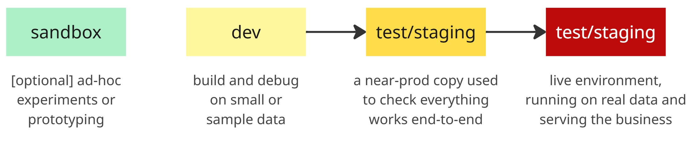
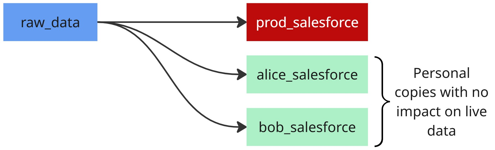

## 1. Why multiple environments exist

### 1.1 The traditional setup: dev, test, sandbox, prod

In software and data engineering, it’s common to separate work into multiple environments. Code is built in **dev**, validated in **test/staging**, sometimes explored in a **sandbox**, and only then deployed to **prod**. The idea is simple: keep experiments and errors away from the systems that matter.



This layering reduces risk by catching problems earlier and isolating them from production.

### 1.2 What problems they try to solve

Multiple environments exist to:

* **Test safely** – experiment without risking real data.
* **Prevent data loss** – mistakes in dev/test don’t wipe out prod tables.
* **Contain breaking changes** – issues surface in lower envs first.
* **Enable collaboration** – teams can work in parallel without stepping on prod.
* **Support CI/CD** – changes move gradually from dev → test → prod, with checks at each step.

<Notice type="info">
  More environments mean more guardrails before code reaches production.
</Notice>

## 2. The DBT perspective

### 2.1 How DBT handles environments

In dbt, environments live in the `profiles.yml`. Each profile contains one or more **targets** that describe how dbt should connect: warehouse, database, schema, and credentials. This design means your project code doesn’t change — dbt simply decides *where* to build models based on the target.

The important piece is how dbt uses **database/schema naming conventions**. Instead of separate databases for dev and prod, dbt encourages using the same warehouse but isolating work with naming patterns. For example:

* **Prod target** → writes to a protected schema with a prefix like `prod_salesforce`.
* **Dev targets** → write to personal schemas using the developer’s name as prefix, e.g. `villoro_salesforce`.

This allows everyone to work against the same production data and warehouse while keeping outputs separated. Developers can safely test changes in their own prefixed schemas without touching production tables.

### 2.2 Switching targets with profiles

Profiles make it easy to switch between these targets. By default, a developer might run dbt with a personal target, which builds into `villoro_salesforce`. When deploying, the pipeline switches to the `prod` target, which builds into `prod_salesforce`. You can read more about it at <FancyLink linkText="DBT | Understanding custom schemas" url="https://docs.getdbt.com/docs/build/custom-schemas#understanding-custom-schemas"/>.

<Notice type="warning">
  The **protected prefix** (like `prod_`) is reserved for automated runs only. Developers shouldn't have permissions to write there.
</Notice>

Both environments use the same underlying warehouse and data, so development runs closely mimic production. The only difference is the schema prefix — `prod_` for production, `<user>_` for development. This convention ensures realistic testing, strict protection of production outputs, and seamless promotion from personal work to production.

## 3. One environment to rule them all

The same idea can be applied outside of dbt. In Python projects, you can also run everything on production infrastructure while keeping outputs isolated.

### 3.1 How to make it safe

* **Schema prefixes** – follow the same pattern as dbt: `prod_salesforce` for production, `villoro_salesforce` for a dev run. Everyone shares the same data and compute, but results go into different schemas.
* **Environment variables** – control the prefix with an `ENV` or `SCHEMA_PREFIX` variable. Pipelines stay identical; only the destination changes.
* **Permissions** – block developers from writing to `prod_` schemas. Even if someone misconfigures, they can’t damage production tables.

### 3.2 Dealing with side effects

Code often does more than write tables: send emails, call APIs, trigger dashboards. These actions can be dangerous in a prod-only setup.

<Notice type="info">
  Use feature toggles to **simulate side effects**. In dev runs, log actions instead of executing them.
</Notice>

Example:

```python
if env == "prod":
    send_email(user)
else:
    logger.info(f"[DEV] Would send email to {user}")
```

The same trick applies to API calls, data deletions, or notifications.

### 3.3 Patterns in practice

Many teams use this approach:

* Developers get personal schemas (`alice_salesforce`, `bob_salesforce`).
* Production jobs write only to `prod_salesforce`.
* CI/CD pipelines create temporary schemas for validation, then clean them up.



## 4. Pros and cons

### 4.1 Advantages: simplicity, less drift, fewer surprises

* **Less infra** – only one environment to manage.
* **No drift** – everyone works in the same place, no mismatched configs.
* **Realistic dev** – you test against real data and prod-like conditions.
* **Faster cycle** – no need to promote across multiple stages.

### 4.2 Risks: less safe experimentation, higher blast radius

* **Unsafe tests** – mistakes can impact prod data if not isolated.
* **Bigger blast radius** – a bad query or heavy job can hurt live workloads.
* **Hard to stage big changes** – limited space for dry runs.
* **Onboarding stress** – new devs must be careful from day one.

<Notice type="error">
  The main risk of prod-only is a **higher blast radius** — one mistake can affect critical data or workloads.
</Notice>

### 4.3 Mitigation strategies

* **Schema prefixes** – `prod_salesforce` for prod, `villoro_salesforce` for dev.
* **Permissions** – devs can’t write to `prod_` schemas.
* **Feature toggles** – in dev, replace side effects (e.g. email sending) with safe logs.
* **CI in temp schemas** – build and test in throwaway schemas before merging.

<Notice type="success">
  Combining schema isolation, strict permissions, and feature toggles gives most of the safety of multi-env setups, without the overhead.
</Notice>

## 5. Closing thoughts

### 5.1 When it makes sense to go prod-only

* Small teams that can coordinate easily.
* Mature pipelines with solid tests and monitoring.
* When cost and simplicity matter more than strict safety.

### 5.2 When you probably still want multiple environments

* Large or complex systems with many users.
* Workflows tied to external services.
* Heavy experimentation and schema changes.
* Regulated or sensitive data where staging is mandatory.
