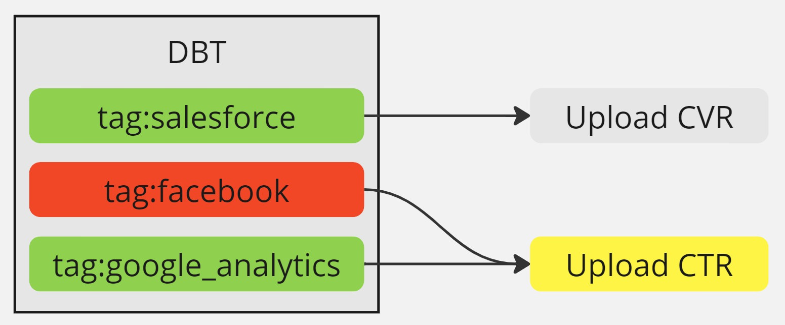
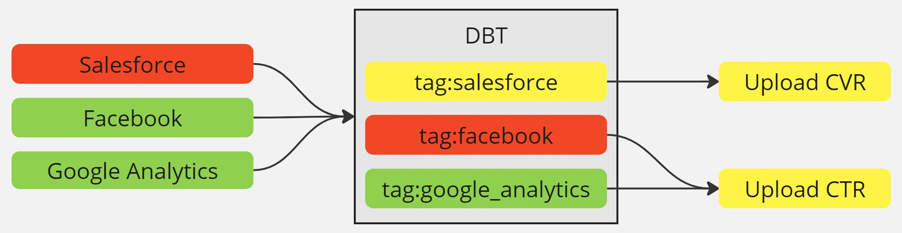

## 0. Motivation

xx


## 1. Pipeline Stages - ETU paradigm

Before we can talk about handling failures effectively, it's important to first describe the structure of our pipeline.

<Notice type="info">
  Our pipeline resembles a modern ELT process but with an important addition: we include a final step that pushes transformed data back into external systems — a practice often called Reverse ETL.
  To capture this full lifecycle, we describe our approach as **ETU**: Extract, Transform, Upload.
</Notice>

### 1.1. ⬇️ Extract & Load (E)

In this first phase, we move data from various external sources into our data lake. These sources include APIs, SQL databases (e.g., Postgres, MySQL), and other systems. The data is ingested and registered in our Glue Data Catalog, enabling downstream discoverability and schema management.

### 1.2. ⚙️ Transform (T)

Once the raw data lands in the lake, we use DBT to transform it into clean, structured, and enriched datasets. These transformations include filtering, joining, and applying business logic to create models that are ready for analysis or operational use.

### 1.3. ⬆️ Upload (U)

In the final step, we push processed data back into third-party systems. This might include CRM platforms, advertising tools, or other business systems that require fresh data to function effectively. This step ensures the data lifecycle comes full circle, making insights actionable.

### 1.4. ETU Stage Summary

| Stage                 | Goal                                  | Tools / Mechanism   | Output / Target                               |
| --------------------- | ------------------------------------- | ------------------- | --------------------------------------------- |
| ⬇️ Extract & Load (E)  | Centralize raw data                   | Python jobs         | Iceberg tables on S3 + Glue Catalog           |
| ⚙️ Transform (T)      | Create trustworthy, reusable datasets | DBT on Athena       | Cleaned, versioned Iceberg tables             |
| ⬆️ Upload (U)          | Activate data in external tools       | Python jobs         | Synced data in external systems (like CRM/ad) |

Here is a really simple example of how our pipeline looks like:


## 2. Failures in Extract & Load (E) ⬇️

Since we follow an ETU paradigm, data needs to be successfully extracted and landed in the lake before DBT transformations can begin. These upstream extract jobs — often orchestrated outside DBT — are susceptible to failures, and how we handle those failures directly impacts downstream processing.

In this scenario, two main options arise:

1. Exclude failed topics with an `exclude` (like `dbt build --exclude tag:salesforce`)
2. Run DBT as usual without exclusions

While skipping failed upstream tasks with option 1 might seem like a resource optimization, it introduces significant risks. DBT transformations are usually cheap to run — especially with incremental models — and skipping them can create inconsistencies.

For example, I have a job that transcribes audios (see <FancyLink linkText="Process Calls with Open AI" url="https://villoro.com/blog/transcribe-audios-whisper-extract-structured-data-chatgpt/" dark="true"/>).
This job can partially succeed — transcribing some files but failing others due to server timeouts. To avoid redundant processing, I use a LEFT ANTI JOIN with the DBT-generated transcriptions table.

However, when the transcription job partially failed and I excluded its tag in the DBT run, the corresponding models weren’t updated. This led to reprocessing already-transcribed files, inflating compute costs and duplicating results. 

<Notice type="warning">
  Avoid relying on `--exclude` unless you're fully confident about the implications.
</Notice>

## 3. Failures in Transform (T)

Usually jobs done after DBT load data into external services.
If there are failures in DBT it can be problematic if we load that data.
For example we might be loading `users` and `sessions` data somewhere and if one fails, we might not want to load only one entity.

In DBT we have 6 possible status that represents:
* **error**: a `model` failure
* **fail**: a `test` failure (with `fail` severity)
* **warn**: a `test` problem with `warn` severity
* **skipped**: a node that was not executed because of problems in predecessors
* **success**: a `model` that run without problems
* **pass**: a `test` that complied with it's requirements

Let's imagine we have:



<FancyLink linkText="Running DBT with AWS ECS (Fargate) | 8.2. DBT run results" url="https://villoro.com/blog/running-dbt-with-aws-ecs-fargate/#82-dbt-run-results" dark="true"/>

## 3.1. Running jobs post DBT

<TerminalOutput color="stone">
  QUERY_FAILURES
</TerminalOutput>
```sql
WITH executions AS (
    SELECT invocation_id
    FROM nt_bronze__metadata.dbt_execution
    WHERE p_extraction_date >= DATE '{yesterday:%Y-%m-%d}'
        AND flow_run_id = '{flow_run_id}'
), run_res AS (
    SELECT *
    FROM nt_bronze__metadata.dbt_run_results
    WHERE p_extraction_date >= DATE '{yesterday:%Y-%m-%d}'
        AND status NOT IN ('success', 'pass', 'skipped')
)
SELECT DISTINCT relation_name
FROM executions
LEFT JOIN run_res
    ON executions.invocation_id = run_res.invocation_id
WHERE relation_name IS NOT NULL
```

And the python part:

```python
from datetime import date, timedelta

import awswrangler as wr
from prefect import task, get_run_logger

@task(name="prefect.dbt.run.get_failures")
def get_dbt_failures(env, flow_run_id):
    logger = get_run_logger()
    logger.info(f"Checking if there were DBT failures for {flow_run_id=}")

    yesterday = date.today() - timedelta(days=1)
    query = QUERY_FAILURES.format(yesterday=yesterday, flow_run_id=flow_run_id)
    df = wr.athena.read_sql_query(sql=query, database="default")

    errors = [
        x.split(".")[1].replace('"', "").split("__")[-1] for x in df["relation_name"]
    ]
    errors = list(set(errors))  # Remove duplicates
    errors = [f"tag:{x}" for x in errors]

    if errors:
        logger.warning(f"There were some failed models in DBT {errors=}")
        return errors

    logger.info("There were no failed models in DBT")
    return False
```




## 3.2 Putting it all together

```python
def combine_failures(*failures):
    """Combines lists of failures"""
    out = []

    for x in failures:
        # Returning 'None' in prefect is dangerous so we return 'False' instead
        if x:
            out += x

    # In DBT we cannot pass 'False', since this is not a prefect task we can return 'None'
    if not out:
        return None

    # Remove duplicates
    return list(set(out))
```

## 4. Failures in Upload (U)

xxxx
