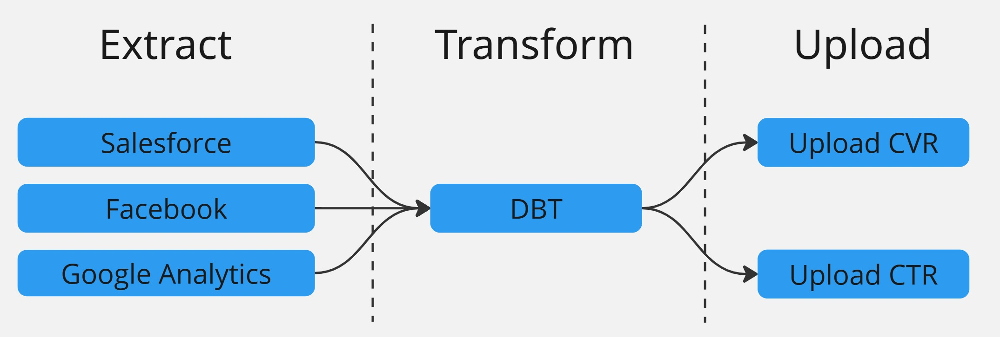
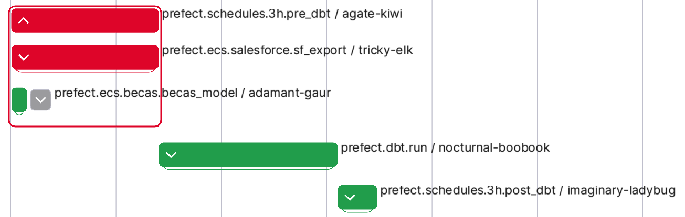

## 0. Motivation

Failures are inevitable in any data pipeline — whether due to API timeouts, schema changes, network issues, or bugs in transformation logic. Over time, we’ve learned that simply reacting to failures as they occur leads to inconsistent data, broken downstream systems, and painful debugging sessions.

This post outlines a more structured, proactive approach. By treating failure handling as a first-class citizen of the pipeline design — not just an afterthought — we can recover faster, minimize business impact, and maintain trust in our data products.The ETU framework and failure handling strategies described here are the result of real-world lessons and aim to create pipelines that are resilient by design.

## 1. Pipeline Stages - ETU paradigm

Before we can talk about handling failures effectively, it's important to first describe the structure of our pipeline.

<Notice type="info">
  Our pipeline resembles a modern ELT process but with an important addition: we include a final step that pushes transformed data back into external systems — a practice often called Reverse ETL.
  To capture this full lifecycle, we describe our approach as **ETU**: Extract, Transform, Upload.
</Notice>

### 1.1. ⬇️ Extract & Load (E)

In this first phase, we move data from various external sources into our data lake. These sources include APIs, SQL databases (e.g., Postgres, MySQL), and other systems. The data is ingested and registered in our Glue Data Catalog, enabling downstream discoverability and schema management.

### 1.2. ⚙️ Transform (T)

Once the raw data lands in the lake, we use DBT to transform it into clean, structured, and enriched datasets. These transformations include filtering, joining, and applying business logic to create models that are ready for analysis or operational use.

### 1.3. ⬆️ Upload (U)

In the final step, we push processed data back into third-party systems. This might include CRM platforms, advertising tools, or other business systems that require fresh data to function effectively. This step ensures the data lifecycle comes full circle, making insights actionable.

### 1.4. ETU Stage Summary

| Stage                 | Goal                                  | Tools / Mechanism | Output / Target                               |
| --------------------- | ------------------------------------- | ----------------- | --------------------------------------------- |
| ⬇️ Extract & Load (E)  | Centralize raw data                   | Python jobs       | Iceberg tables on S3 + Glue Catalog           |
| ⚙️ Transform (T)      | Create trustworthy, reusable datasets | DBT on Athena     | Cleaned, versioned Iceberg tables             |
| ⬆️ Upload (U)          | Activate data in external tools       | Python jobs       | Synced data in external systems (like CRM/ad) |

Here is a really simple example of how our pipeline looks like:



## 2. Handling failures in different stages

### 2.1. Failures in Extract & Load (E) ⬇️

Since we follow an ETU paradigm, data needs to be successfully extracted and landed in the lake before DBT transformations can begin. These upstream extract jobs — often orchestrated outside DBT — are susceptible to failures, and how we handle those failures directly impacts downstream processing.

In this scenario, two main options arise:

1. Exclude failed topics with an `exclude` (like `dbt build --exclude tag:salesforce`)
2. Run DBT as usual without exclusions

While skipping failed upstream tasks with option 1 might seem like a resource optimization, it introduces significant risks. DBT transformations are usually cheap to run — especially with incremental models — and skipping them can create inconsistencies.

For example, I have a job that transcribes audios (see <FancyLink linkText="Process Calls with Open AI" url="https://villoro.com/blog/transcribe-audios-whisper-extract-structured-data-chatgpt/" dark="true"/>).
This job can partially succeed — transcribing some files but failing others due to server timeouts. To avoid redundant processing, I use a LEFT ANTI JOIN with the DBT-generated transcriptions table.

However, when the transcription job partially failed and I excluded its tag in the DBT run, the corresponding models weren’t updated. This led to reprocessing already-transcribed files, inflating compute costs and duplicating results.

<Notice type="warning">
  Avoid relying on `--exclude` unless you're fully confident about the implications.
</Notice>

### 2.2. Failures in Transform (T) ⚙️

The Transform step (T) is where DBT takes raw data from the lake and builds structured models. If something goes wrong here, pushing bad or incomplete data into external systems can create inconsistencies or break business processes.

For example, if you're syncing both `users` and `sessions` but the transformation for `sessions` fails, you likely don’t want to upload only `users` — doing so could result in mismatched reporting or corrupted metrics.

DBT assigns one of six statuses to each node during execution:

* **error**: a `model` failure
* **fail**: a `test` failure (with `fail` severity)
* **warn**: a `test` problem with `warn` severity
* **skipped**: a node that was not executed because of problems in predecessors
* **success**: a `model` that ran without problems
* **pass**: a `test` that complied with its requirements

#### 2.2.1. Strategies to Handle Failures

Before triggering the Upload (U) step, it’s important to inspect DBT results and decide which entities can safely be synced. We've used two main approaches:

1. **Tag-based filtering**. Only upload data associated with models that belong to a specific tag and completed successfully. This relies on defining clear ownership via tags in your DBT project.

2. **Model-based filtering**. Build an allowlist of model names that finished with `success`, and restrict uploads to just those. This can be done by parsing the DBT `run_results.json`.

Both strategies aim to prevent syncing stale or partial datasets while allowing the rest of the pipeline to proceed without a full rollback.

#### 2.2.2. Handling Failures

The idea is to be able to know which models succeeded and which failed.

This can be done by:

1. Getting a unique ID for the execution
2. Exporting DBT run results
3. Reading run results

##### 2.2.2.1. Getting a Unique Execution ID

It is really important to pass some ID to DBT so that we can match the run results with the actual run.

With Prefect, it can be done like this:

```python
from prefect.context import get_run_context

def get_flow_run_id():
    context = get_run_context()
    if hasattr(context, "flow_run"):
        return str(context.flow_run.id)
    elif hasattr(context, "task_run"):
        return str(context.task_run.flow_run_id)
    else:
        msg = "get_flow_run_id must be called within a Prefect flow or task context."
        raise RuntimeError(msg)
```

##### 2.2.2.2. Exporting DBT Run Results

I already described this in a previous post. You can read it at <FancyLink linkText="Running DBT with AWS ECS (Fargate) | 8.2. DBT run results" url="https://villoro.com/blog/running-dbt-with-aws-ecs-fargate/#82-dbt-run-results" dark="true"/>.

The important part is to pass the `flow_run_id` to DBT so that it can be added as a column. This will allow us to filter later the run results we want.

##### 2.2.2.3. Reading the results

Here is how we can query the results of a DBT run:

<TerminalOutput color="stone">
  QUERY_FAILURES
</TerminalOutput>
```sql
WITH executions AS (
    SELECT invocation_id
    FROM nt_bronze__metadata.dbt_execution
    WHERE p_extraction_date >= DATE '{yesterday:%Y-%m-%d}'
        AND flow_run_id = '{flow_run_id}'
), run_res AS (
    SELECT *
    FROM nt_bronze__metadata.dbt_run_results
    WHERE p_extraction_date >= DATE '{yesterday:%Y-%m-%d}'
)
SELECT
    run_res.status,
    run_res.unique_id
FROM executions
LEFT JOIN run_res
    ON executions.invocation_id = run_res.invocation_id
WHERE relation_name IS NOT NULL
```

And the python part:

<TerminalOutput color="stone">
  get_dbt_results
</TerminalOutput>
```python
import asyncio
from prefect import get_run_logger
from common.glue import query_athena # Out of scope

STATUS_MAPPING = {
    "error": -1,
    "fail": -1,
    "warn": 0,
    "skipped": 0,
    "success": 1,
    "pass": 1,
}

@task(name="prefect.dbt.run.get_failures")
def get_dbt_results(env, flow_run_id):
    logger = get_run_logger()
    logger.info(f"Checking if there were DBT failures for {flow_run_id=}")

    yesterday = date.today() - timedelta(days=1)
    query = QUERY_FAILURES.format(yesterday=yesterday, flow_run_id=flow_run_id)
    df = query_athena(query)

    df["level"] = df["status"].map(STATUS_MAPPING)

    if errors := df.loc[df["level"] < 0, "unique_id"].to_list():
        logger.warning(f"There were {len(errors)} failures in DBT: {errors=}")
    else:
        logger.info("There were no failures in DBT")

    return df
```

Then we can check the results of the models we want using this function:

<TerminalOutput color="stone">
  are_results_good
</TerminalOutput>
```python
from typing import List
from typing import Optional

from prefect import get_run_logger
from pydantic import BaseModel
from pydantic import computed_field

class DbtNode(BaseModel):
    dbt_type: str
    name: str
    level: int = LEVEL_SUCCESS

    @computed_field
    @property
    def full_name(self) -> str:
        return f"{self.dbt_type}.dbt_northius.{self.name}"

    def __repr__(self):
        return f"{self.dbt_type.title()}(name='{self.name}', level={self.level})"


class Model(DbtNode):
    dbt_type: str = "model"


class Test(DbtNode):
    dbt_type: str = "test"


class DbtExpectations(BaseModel):
    models: Optional[List[Model]] = None
    tests: Optional[List[Test]] = None

    def get_all_unique_ids(self):
        models = {x.full_name: x.level for x in self.models}
        tests = {x.full_name: x.level for x in self.tests}
        return {**models, **tests}

def are_results_good(df, models=None, tests=None):
    logger = get_run_logger()

    if df is None:
        logger.error("Results are missing (df is None)")
        return True

    models = [{"name": x} for x in models] if models else []
    tests = [{"name": x} for x in tests] if tests else []
    dbt_expectations = DbtExpectations(models=models, tests=tests)

    logger.info(f"Expected results: {dbt_expectations}")
    desired_results = dbt_expectations.get_all_unique_ids()
    actual_results = df.groupby("unique_id").agg({"level": "min"}).to_dict()["level"]

    missing_nodes = []
    unwanted_outcomes = []

    for model, desired_level in desired_results.items():
        actual_level = actual_results.get(model)

        if actual_level is None:
            missing_nodes.append(model)
        elif actual_level < desired_level:
            unwanted_outcomes.append(f"{model} {actual_level=} {desired_level=}")

    if missing_nodes:
        logger.warning(f"{len(missing_nodes)} missing nodes: {missing_nodes=}")
    if unwanted_outcomes:
        logger.warning(
            f"{len(unwanted_outcomes)} unwanted outcomes: {unwanted_outcomes=}"
        )

    failure = missing_nodes or unwanted_outcomes
    return not failure
```

This would be called with something like:

<TerminalOutput color="stone">
  run_uploads
</TerminalOutput>
```python
UPLOAD_JOBS = {
    ds.ds_export: {"models": ["leads_ds_id"]},
    salesforce.sf_upload_beca_scoring: {"models": ["sf__beca_model_score"]},
    salesforce.sf_upload_conversion_rate: {"models": ["conversion_rate"]},
}

async def run_uploads(flow_run_id, env: Literal["snd", "pro"] = "pro"):
    """Runs post-DBT jobs based on DBT validation results."""
    logger = get_run_logger()

    dbt_results = dbt.get_dbt_results(env, flow_run_id)

    jobs = []
    for func, expectations in UPLOAD_JOBS.items():
        if are_results_good(dbt_results, **expectations):
            jobs.append(func)
        else:
            logger.warning(f"Skipping {func=} because of DBT failures")

    await prefect_utils.run_flows_async(
        flows=jobs, flow_name="3h.post_dbt", env=env
    )
```

### 2.3. Failures in Upload (U) ⬆️

Failures in upload jobs need no special treatment since there are no jobs that depend on them.

## 3. Letting Tasks Fail Gracefully

Sometimes you don’t want the failure of a single task to stop an entire pipeline. For example, you may be downloading multiple tables from a CRM inside an ECS or EMR job. Each table is processed in series using a synchronous flow. If one fails, you'd still want the rest to run — and only after finishing, handle and report any failures. In parallel, multiple of these jobs (e.g., for different sources) may be triggered as independent async flows.

In this section, we’ll first show how to implement this behavior using synchronous flows — a simpler and more intuitive starting point — and then how to handle it in asynchronous flows running in parallel.

The key to enabling this pattern is the argument `return_state=True`. When passed to a Prefect flow, it causes the flow to return its **state object** instead of raising exceptions on failure. This allows you to inspect each result and decide what to do next — all without stopping execution.

Here you can see one example of how a failue in one extraction didn't block the other one and didn't stop the rest of the pipeline stages:



### 3.1. Handling Sync Flows

This is how we can continue executing tasks whenever one fails:

```python
from prefect import flow, task, get_run_logger

@task
def process_item(item: int) -> float:
    return 10 / item  # Replace with your actual logic

@flow
def main():
    logger = get_run_logger()
    items = [5, 2, 0, 1]  # Replace with your own data

    futures = {i: process_item.submit(i, return_state=True) for i in items}
    failures = []

    for item, state in futures.items():
        if state.is_completed():
            logger.info(f"Task succeeded for item={item}: result = {state.result()}")
        else:
            try:
                _ = state.result()
            except Exception as exc:
                logger.error(f"Task failed for item={item}: {type(exc).__name__}: {exc}")
                failures.append(f"{item} → {type(exc).__name__}: {exc}")

    if failures:
        summary = "\n".join(failures)
        raise RuntimeError(f"One or more tasks failed:\n{summary}")
```

This pattern gives your pipeline flexibility and resilience, helping you avoid total failure just because one piece breaks.

### 3.2. Handling Async Flows

Here’s how to run async flows concurrently while collecting and reporting failures:

```python
import asyncio
from prefect import get_run_logger, states

def notify_and_raise(...): ...  # Omitted for brevity

async def is_failure(state):
    """Checks if it's a failed state."""
    return isinstance(state, states.State) and state.is_failed()

async def run_flows_async(flows, flow_name, env, version="latest", **kwargs):
    logger = get_run_logger()
    logger.info(f"Starting {flow_name=} with {len(flows)} flows.")

    tasks = [func(env=env, return_state=True, **kwargs) for func in flows]
    results = await asyncio.gather(*tasks, return_exceptions=True)

    failures = [
        (flow.__name__, state)
        for flow, state in zip(flows, results)
        if isinstance(state, Exception) or await is_failure(state)
    ]

    if failures:
        failure_msgs = [f"{name}: {state}" for name, state in failures]
        msg = f"{flow_name} failed ({len(failures)} failures):\n" + "\n".join(failure_msgs)
        notify_and_raise(env=env, version=version, entrypoint=flow_name, msg=msg)
        return states.Failed(message=msg)

    logger.info(f"{flow_name=} (with {len(flows)} flows) completed successfully!")
    return states.Completed()
```
