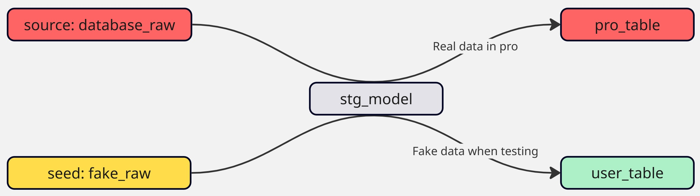
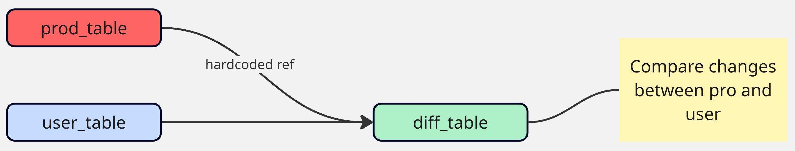
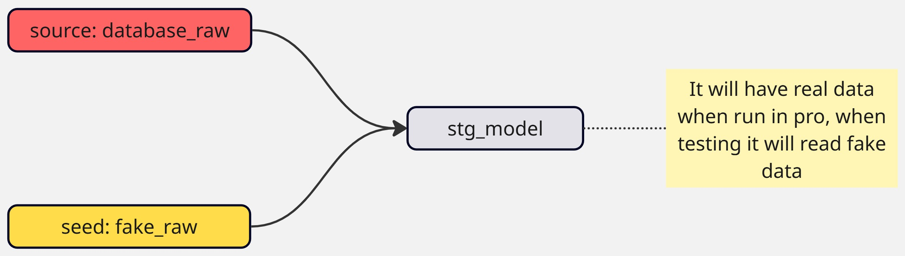

## 1. Ways of Protecting Production Tables

Production tables are the backbone of any data platform. They feed dashboards, power APIs, and sometimes even trigger external actions (like sending emails or pushing updates to third-party systems).

Because of this, mistakes in production tables can quickly escalate into costly problems. At my company, we use three complementary strategies to reduce risk:

1. Protecting against bad data.
2. Protecting against unexpected changes.
3. Protecting sensitive data.

## 2. Protecting Against Bad Data

The idea is simple:

* Build an **internal model** (not exposed to end users) with the necessary tests.
* Then, create a **final model** that depends on the internal one.
* The final model is only updated if the tests pass.



This approach prioritizes **quality over freshness**. It’s most useful when errors in the downstream system could have serious consequences.

For example, if a table is used to trigger customer emails, it’s safer to delay updates than to send the wrong notifications.

<Notice type="warning">
  This pattern is not for every model. Use it sparingly — only when data quality is more important than timeliness.
</Notice>


## 3. Protecting Against Unexpected Changes

Sometimes the main risk isn’t bad data, but unintentional modifications. A small schema tweak or row-level difference can trigger expensive or disruptive actions downstream (like syncing thousands of rows into Salesforce).

The solution is to **compare changes between the developer’s version and the production one** before merging.



We use a custom `data_diff` macro for this. It highlights row-level differences across key columns, so the developer can review them during the pull request process.

<TerminalOutput color="stone">
  macros/data_diff.sql
</TerminalOutput>
```sql

    
    
        
            
        
    
    

    WITH a_except_b AS (
        SELECT {{ cols_str }} FROM {{ baseline }}
        {{ except() }}
        SELECT {{ cols_str }} FROM {{ compare_with }}
    ),
    b_except_a AS (
        SELECT {{ cols_str }} FROM {{ compare_with }}
        {{ except() }}
        SELECT {{ cols_str }} FROM {{ baseline }}

    ),
    different_pks AS (
        SELECT {{ pk }} FROM a_except_b
        UNION
        SELECT {{ pk }} FROM b_except_a
    ),
    different_a AS (
        SELECT '{{ baseline }}' AS relation, {{ cols_str }}
        FROM {{ baseline }}
        INNER JOIN different_pks USING ({{ pk }})
    ),
    different_b AS (
        SELECT '{{ compare_with }}' AS relation, {{ cols_str }}
        FROM {{ compare_with }}
        INNER JOIN different_pks USING ({{ pk }})
    ),
    unioned_differences AS (
        SELECT * FROM different_a
        UNION ALL
        SELECT * FROM different_b
    )

    SELECT * FROM unioned_differences
    ORDER BY {{ pk }}, relation

```

And the documentation:

<TerminalOutput color="stone">
  macros/data_diff.yml
</TerminalOutput>
```yaml
macros:
  - name: data_diff
    description: |
      Returns the rows that are different between two models, comparing only specified columns.
      The output table contains a `relation` column identifying the source model (`baseline` or `compare_with`),
      along with all compared columns from the models. Results are ordered by pk and relation.

    arguments:
      - name: baseline
        type: relation
        description: The baseline model to compare against

      - name: compare_with
        type: relation
        description: The model to compare with the baseline

      - name: pk
        type: string
        description: The primary key column used to identify rows

      - name: select
        type: list
        description: Optional list of columns to compare.

      - name: exclude
        type: list
        description: Optional list of columns to exclude from comparison.
```

This lets us create diff models like:

<TerminalOutput color="stone">
  models/salesforce/data_diff__salesforce__users.sql
</TerminalOutput>
```sql
{# Enable it only on testing runs, you might need to change it #}
{{ config(
    enabled=target.name != 'pro' and target.type != 'duckdb'
) }}



{# Here we hardcore the production table #}


WITH data_diff AS (
    {{ data_diff(
        baseline,
        compare_with,
        pk='user_id',
        select=[
            'name',
            'created_at',
            'last_updated_at',
            'p_extracted_at',
        ]
    ) }}
)

SELECT * FROM data_diff

```

<Notice type="info" className="mt-6">
  This adds a small PR overhead, but it prevents costly mistakes in production syncs and batch jobs.
</Notice>

## 4. Protecting Sensitive Data

Finally, some tables are too sensitive to expose — like payroll data. Access should be restricted to a small subset of users.

The challenge is that dbt needs to compile and run models even for developers without permission to query the real tables.

The solution: use **seeds with fake data** that mimic the real tables’ schema. Then dynamically switch between the real source (in production runs) and the seed (in dev/test runs).



Example logic:

```sql
WITH source AS (
    /*
        This allows us to use fake data when testing and real data in pro
        It's meant for sensitive data protection
    */
    SELECT *
    
        FROM {{ source('nt_raw__a3', 'absenteeisms') }}
    
        FROM {{ ref('fake_absenteeisms') }}
    
)
-- downstream logic...
SELECT * FROM source;
```

Supporting macros (environment detection, scheduled vs manual run, etc.) make this flexible.

<Accordion client:load title="Environment detection macros">
  ```sql
  
      
          {{ return("ci") }}
      
          
              {{ return("pro") }}
          
              {{ return("snd") }}
          
              {# Defaulting to 'PRE' #}
              {{ return("pre") }}
          
      
  

  
      {{ return(target.name.split("_")[0]) }}
  

  
      {{ return(get_user() != var('user_pro'))}}
  

  
      {{ return(not is_manual_run() and (get_environment() == "pro"))}}
  
  ```
</Accordion>

It’s important that the **seed schema matches the real source schema**. One way is to explicitly enforce column types in the `seed_schema.yml` for seeds.

<Accordion client:load title="seed_schema.yml example">
  ```yaml
  version: 2

  seeds:
    - name: fake_absenteeisms
      description: Contains fake data for A3 absenteeisms
      meta:
        owner: Villoro

      columns:
        - name: absenteeism_id
          description: Absenteeisms pk.
        - name: type_of_absenteeism
          description: Category/type of IT absenteeism.
        - name: employee_id
          description: Reference to the employee related to the absenteeism.


      config:
        column_types:
          absenteeism_id: string
          type_of_absenteeism: string
          employee_id: string
  ```
</Accordion>

<Notice type="success">
  With this pattern, developers can test pipelines safely while production runs always use real data.
</Notice>

## 5. Summary and Best Practices

* **Bad data protection**: prioritize data quality over freshness. Use for critical tables powering user-facing actions.
* **Unexpected changes**: catch unintended diffs before merging. Ideal for tables that trigger expensive syncs or updates.
* **Sensitive data**: use fake seeds to allow safe dev/testing while protecting real information.

Together, these strategies create layered protection for production tables without blocking developer workflows.
