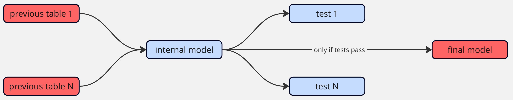
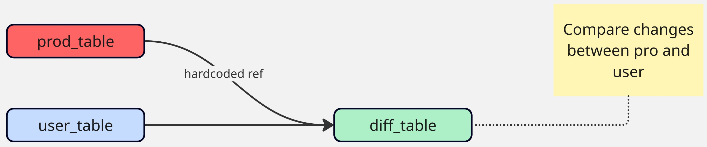

## Ways of protecting production tables

1. Protecting against bad data
2. Protecting against unexpected changes
3. Portecting sensitvie data

## Protecting against bad data

The idea is simple, create an internal model (not exposed to end users) with the tests you need. And then a second model that depends on the first. This model will only be updated if the data is good (meaning that the tests on the internal model passed).



This should only be used when it's more important to have high quality data than fresh data. Generally I recommend this approach only when there is something that uses this table and that if it goes wrong could be really problematic. Like imagine if we are sending emails to users based on a table, we want to make sure we only notify them when it's needed to avoid sending unwanted emails.

## Protecting against unexpected changes

What we want is to make sure we don't change the content of a table by mistake. This is useful when changes in a table trigger subsequent actions. For example, imagine we upload that data to some system and a lot of changes could mean a lot of expensive API calls. In that case, we want to protect that table.

The idea is to have a model that compares the differences between the developer version of a table and the production one.
This way the developer can check if those changes are inteded or not and go forward with the pull request based on that.



This is achieved using the `data_diff` macro:

<TerminalOutput color="stone">
  macros/data_diff.sql
</TerminalOutput>
```sql

    
    
        
            
        
    
    

    WITH a_except_b AS (
        SELECT {{ cols_str }} FROM {{ baseline }}
        {{ except() }}
        SELECT {{ cols_str }} FROM {{ compare_with }}
    ),
    b_except_a AS (
        SELECT {{ cols_str }} FROM {{ compare_with }}
        {{ except() }}
        SELECT {{ cols_str }} FROM {{ baseline }}

    ),
    different_pks AS (
        SELECT {{ pk }} FROM a_except_b
        UNION
        SELECT {{ pk }} FROM b_except_a
    ),
    different_a AS (
        SELECT '{{ baseline }}' AS relation, {{ cols_str }}
        FROM {{ baseline }}
        INNER JOIN different_pks USING ({{ pk }})
    ),
    different_b AS (
        SELECT '{{ compare_with }}' AS relation, {{ cols_str }}
        FROM {{ compare_with }}
        INNER JOIN different_pks USING ({{ pk }})
    ),
    unioned_differences AS (
        SELECT * FROM different_a
        UNION ALL
        SELECT * FROM different_b
    )

    SELECT * FROM unioned_differences
    ORDER BY {{ pk }}, relation

```

That has this documentation:

<TerminalOutput color="stone">
  macros/data_diff.yml
</TerminalOutput>
```yaml
macros:
  - name: data_diff
    description: |
      Returns the rows that are different between two models, comparing only specified columns.
      The output table contains a `relation` column identifying the source model (`baseline` or `compare_with`),
      along with all compared columns from the models. Results are ordered by pk and relation.

    arguments:
      - name: baseline
        type: relation
        description: The baseline model to compare against

      - name: compare_with
        type: relation
        description: The model to compare with the baseline

      - name: pk
        type: string
        description: The primary key column used to identify rows

      - name: select
        type: list
        description: Optional list of columns to compare.

      - name: exclude
        type: list
        description: Optional list of columns to exclude from comparison.
```

Then we would create the comparison model. For example it could be:

```sql
{# Enable it only on testing runs, you might need to change it #}
{{ config(
    enabled=target.name != 'pro' and target.type != 'duckdb'
) }}



{# Here we hardcore the production table #}


WITH data_diff AS (
    {{ data_diff(
        baseline,
        compare_with,
        pk='user_id',
        select=[
            'name',
            'created_at',
            'last_updated_at',
            'p_extracted_at',
        ]
    ) }}
)

SELECT * FROM data_diff

```

## Protecting sentitive data


