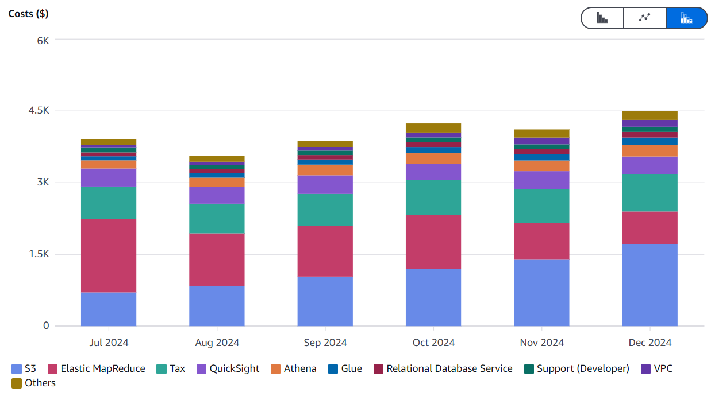
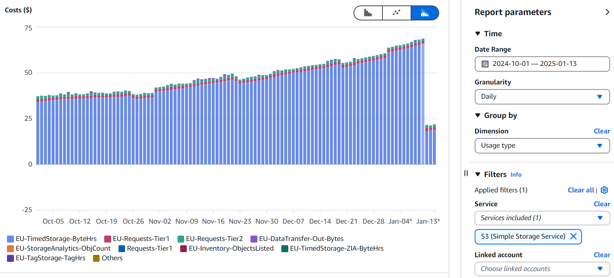

<script type="module" src="/js/posts/9999-plots-s3-costs.js"></script>

## 0. Motivation

Amazon S3 is a powerful, scalable storage solution that is integral to many workflows. However, storage costs can quickly accumulate, especially when managing large datasets. After migrating some of our jobs from EMR to ECS, we noticed that S3 storage became our largest expense.

By analyzing our storage usage and implementing targeted strategies, we managed to reduce our S3 costs to a third, as shown in the plot below. 

<canvas id="plot-s3-costs" style="width:100%;height:300px;"></canvas>

<Notice type="success" className="mt-6">
  This guide outlines how to export an S3 Inventory and implement Lifecycle Policies to track and optimize your storage expenses effectively.
</Notice>

## 1. Categoryzing S3 costs

### 1.1. Discover S3 costs with Cost Explorer

The first thing you need to do is to check your AWS costs by Service. This way you can see where you should focus your efforts in order to reduce costs.
In our case, after reducing EMR costs, S3 became the next clear objective:

<div class="border-2 rounded-md">
  
</div>

<Notice type="warning" className="mt-6">
  You should focus first on the AWS service with the biggest cost. Focus only on S3 if you have already addressed other services with bigger costs.
</Notice>

Once you are sure you want to reduce S3 costs, you should check what you are paying for:

<div class="border-2 rounded-md">
  
</div>

In our case it's for data we are storing but in other companies I've seen an abnormally high cost allocated to requests.
That usually happen when you have very small files in the datalake that you need to compact.

<Notice type="info">
  If you are paying a lot for S3 requests you should see how to compact data files at <FancyLink linkText="Solving the probem with small files in the Data Lake" url="https://villoro.com/blog/solving-problem-small-files-data-lake/" dark="true"/>.
</Notice>

### 1.2. Create an S3 Inventory Configuration

**S3 Inventory** is a feature in Amazon S3 that generates a scheduled report containing a comprehensive list of objects in a bucket, along with their metadata, enabling you to analyze and manage storage efficiently.

The steps to set it up are:

1. **Access the S3 Console:**
   Log in to the AWS Management Console and navigate to the S3 service.

2. **Select Your Bucket:**
   Choose the bucket for which you want to create an inventory report.

3. **Go to Management:**
   In the bucket’s dashboard, select the **Management** tab and scroll down to the **Inventory** section.

4. **Create Inventory Configuration:**
   * Click **Create Inventory Configuration**.
   * Provide a unique name for your inventory.
   * Specify the **destination bucket** where the inventory report will be delivered.

5. **Select Report Content:**
   * Choose the **frequency** of the report: Daily or Weekly.
   * Select the **file format**: Since you will be exporting a lot of data, I suggest you export it as `parquet`.
   * Specify the **fields** to include. I suggest you at least include object `size`, `storage class` and `last modified` date.

6. **Review and Save:**
   * Review your configuration.
   * Save it by clicking **Create**.

Regarding the destination path, notice that some folder will be added automatically to it. For example if we have a bucket named `villoro` and we set `destination_path=s3://villoro/s3_inventory` the data will end up at `s3://villoro/s3_inventory/villoro/villoro_inventory/` (the bucket name and the inventory name are appended).

<Notice type="info">
  The first report will be done within 48h and the next ones will be done each day or monday (depending on the frequency you chose).
</Notice>

### 1.3. Accessing the S3 inventory

The S3 inventory follows a non conventional structure. As mentioned, it will be exported to `destination_path/bucket_name/inventory_name/`.
There you will have:
* A folder with the timestamp of each export containing a `manifest.json` listing the `parquets` files of that extraction.
* The `data` folder with the data from all exports
* The `hive` data with symlinks to the dated folder

As an example here is what I got:

```plaintext
- s3://villoro/s3_inventory/villoro/villoro_inventory/
  ├── 2025-01-09T01-00Z/
  │   ├── manifest.json
  │   └── manifest.checksum
  ├── 2025-01-12T01-00Z/
  │   ├── manifest.json
  │   └── manifest.checksum
  ├── data/
  │   ├── 469e11b1-730b-487b-9110-e0fac5cb4237.parquet
  │   ├── ...
  │   └── 91ee5bf8-c053-4993-b698-ba07009b9060.parquet
  └── hive/
      ├── dt=2025-01-09-01-00/
      │   └──symlink.txt
      └── dt=2025-01-12-01-00/
          └──symlink.txt
```

And here you have an example of the first `manifest.json`:

```json
{
  "sourceBucket" : "villoro",
  "destinationBucket" : "arn:aws:s3:::villoro",
  "version" : "2016-11-30",
  "creationTimestamp" : "1736384401000",
  "fileFormat" : "Parquet",
  "fileSchema" : "message s3.inventory {  required binary bucket (STRING);  required binary key (STRING);}",
  "files" : [ {
    "key" : "s3_inventory/villoro/villoro_inventory/data/469e11b1-730b-487b-9110-e0fac5cb4237.parquet",
    "size" : 120112,
    "MD5checksum" : "f0731733165f367e93fa4a51ecc28edb"
  } ]
}
```

## 2. Extracting data from the inventory

We want to create a standard iceberg table given the non conventional folder structure of the inventory.

### 2.1. Creating a S3 Inventory table

The main idea is to read each manifest to know which parquet files correspond to each extraction. Then read those files and export it in a table. Then reapeat it for each inventory. Since we will be exporting all data, I think it's also a good idea to remove the source data.

This can be done with:

```python
import json
from datetime import datetime

import awswrangler as wr
import pandas as pd
from prefect import flow
from prefect import task
from prefect import get_run_logger

from ecs_northius.common import glue
from ecs_northius.common import parameters


BUCKET_DE = "nt-data-engineering-eu-west-1-742407267173-pro"

PREFIX_INVENOTRY = "s3_inventory/{bucket}/{inventory}"
PATH_INVENTORY = f"s3://{BUCKET_DE}/{PREFIX_INVENOTRY}"

INVENTORIES = {
    "de_inventory": BUCKET_DE,
    "bronze_inventory": "ct-bronze-eu-west-1-742407267173-pro",
    "silver_inventory": "ct-silver-eu-west-1-742407267173-pro",
}

DATABASE = "nt_bronze__metadata"
TABLE = "s3_inventory"

S3 = boto3.client("s3")


def get_all_files(inventory, bucket):
    logger = get_run_logger()
    uri = PATH_INVENTORY.format(inventory=inventory, bucket=bucket)
    logger.info(f"Reading files in {uri=}")

    return wr.s3.list_objects(uri)


def get_ts_from_manifest_path(manifest_file):
    date_str = manifest_file.split("/")[-2]
    return datetime.strptime(date_str, "%Y-%m-%dT%H-%MZ")


def get_data_files_from_manifest(manifest_file):
    logger = get_run_logger()

    logger.info(f"Reading manifest {manifest_file=}")
    bucket, filename = manifest_file.replace("s3://", "").split("/", 1)
    manifest = S3.get_object(Bucket=bucket, Key=filename)["Body"].read()

    logger.debug("Parsing manifest")
    return json.loads(manifest)["files"]


def read_and_export_data(inventory, bucket, data_files, reported_at):
    logger = get_run_logger()

    dfs = []
    logger.info(f"Reading {len(data_files)} files for {inventory=}")
    for file in data_files:
        # The replace is to fix an error in config
        key = file["key"].replace(f"{bucket}/{bucket}", bucket)

        uri = f"s3://{BUCKET_DE}/{key}"
        logger.debug(f"Reading parquet {uri=}")
        dfs.append(wr.s3.read_parquet(uri))

    df = pd.concat(dfs)
    df["bucket"] = bucket
    df["reported_at"] = reported_at

    glue.write_iceberg(df, DATABASE, TABLE) # This uses `wr.athena.to_iceberg`

def get_bucket_and_prefix(s3_path):
    if not s3_path.startswith("s3://"):
        raise ValueError("Invalid S3 path. Path must start with 's3://'.")

    # Remove 's3://' and split the remaining path
    path_parts = s3_path[5:].split("/", 1)

    # Bucket is the first part, prefix is the remaining
    bucket = path_parts[0]
    prefix = path_parts[1] if len(path_parts) > 1 else ""

    return bucket, prefix

def delete_all_files(all_files):
    logger = get_run_logger()

    for file in all_files:
        bucket, prefix = get_bucket_and_prefix(file)
        logger.debug(f"Removing {file=}")
        S3.delete_object(Bucket=bucket, Key=prefix)


def export_one_inventory(inventory, bucket, delete_files):
    logger = get_run_logger()

    all_files = get_all_files(inventory, bucket)

    manifest_files = sorted([x for x in all_files if x.endswith("manifest.json")])
    if len(manifest_files) == 0:
        logger.warning(f"There are no manifests files for {inventory=}")
        return False

    for manifest_file in manifest_files:
        reported_at = get_ts_from_manifest_path(manifest_file)
        data_files = get_data_files_from_manifest(manifest_file)
        read_and_export_data(inventory, bucket, data_files, reported_at)

    if delete_files:
        logger.info(f"Deleting {len(all_files)} files")
        delete_all_files(all_files)

    return True


@flow(name="export_inventory")
def export_all_inventories(flow_name="export_inventory", delete_files=False):
    logger = get_run_logger()

    for i, (inventory, bucket) in enumerate(INVENTORIES.items()):
        percent = f"{i + 1}/{len(INVENTORIES)}"
        logger.info(f"[Inventory {percent}] Processing {inventory=}'")
        name = f"export_inventory.{inventory}__{percent}"
        task(name=name)(export_one_inventory)(inventory, bucket, delete_files)


if __name__ == "__main__":
    export_all_inventories()

```

### 2.2. Cleaning the data with DBT


<Accordion client:load title="base_metadata__s3_inventory.sql">
  <TerminalOutput color="stone">
    /models/staging/metadata/base/base_metadata__s3_inventory.sql
  </TerminalOutput>
  ```sql
  WITH source AS (
      SELECT *
      FROM {{ source('nt_bronze__metadata', 's3_inventory') }}
  ),

  casted AS (
      SELECT
          ---------- pks
          's3://' || bucket || '/' || key AS s3_id,

          ---------- partitions
          {{ from_iso_timestamp('p_extracted_at') }} AS p_extracted_at,

          ---------- info
          bucket AS s3_bucket,
          key AS s3_key,
          lower(storage_class) AS storage_class,

          ---------- metrics
          size / 1024.0 / 1024.0 AS size_mb,

          ---------- time related
          last_modified_date AS last_modified_at,
          reported_at
      FROM source
  )

  SELECT *
  FROM casted
  ```
</Accordion>

<Accordion client:load title="clean_metadata__s3_inventory.sql">
  <TerminalOutput color="stone">
    /models/staging/metadata/clean/clean_metadata__s3_inventory.sql
  </TerminalOutput>
  ```sql
  WITH source AS (
      SELECT *
      FROM {{ ref('base_metadata__s3_inventory') }}
  ),

  latest_report AS (
      SELECT
          *,
          {{ row_number('s3_id') }} AS _rn
      FROM source
      WHERE reported_at = (
          SELECT MAX(t2.reported_at)
          FROM source AS t2
          WHERE t2.s3_bucket = source.s3_bucket
      )
  ),

  latest_data_from_latest_report AS (
      SELECT *
      FROM latest_report
      WHERE _rn = 1
  )

  SELECT *
  FROM latest_data_from_latest_report
  ```
</Accordion>

<Accordion client:load title="int_metadata__s3_inventory.sql">
  <TerminalOutput color="stone">
    /models/staging/metadata/internal/int_metadata__s3_inventory.sql
  </TerminalOutput>
  ```sql
  {% set patterns = {
      's3://ct-bronze-eu-west-1-742407267173-pro/%': 'tables/bronze',
      's3://ct-silver-eu-west-1-742407267173-pro/%': 'tables/silver',
      's3://nt-data-engineering-eu-west-1-742407267173-pro/dbt/code/%': 'code/dbt',
      's3://nt-data-engineering-eu-west-1-742407267173-pro/dbt/database/%': 'tables/de',
      's3://nt-data-engineering-eu-west-1-742407267173-pro/dbt/staging_dir/%': 'temp/dbt_staging_dir',
      's3://nt-data-engineering-eu-west-1-742407267173-pro/dbt/users/%': 'dbt_personal_schemas',
      's3://nt-data-engineering-eu-west-1-742407267173-pro/ecs/%': 'code/ecs',
      's3://nt-data-engineering-eu-west-1-742407267173-pro/emr/%': 'code/emr',
      's3://nt-data-engineering-eu-west-1-742407267173-pro/lambda/%': 'code/lambda',
      's3://nt-data-engineering-eu-west-1-742407267173-pro/s3_inventory/%': 's3_inventory',
      's3://nt-data-engineering-eu-west-1-742407267173-pro/superset/query-results/%': 'query_results/superset',
      's3://nt-data-engineering-eu-west-1-742407267173-pro/temp/%': 'temp/de_root'
  } %}

  WITH source AS (
      SELECT *
      FROM {{ ref('clean_metadata__s3_inventory') }}
  ),

  assigned_categories AS (
      SELECT
          *,
          CASE
              
                  WHEN s3_id LIKE '{{ path_pattern }}' THEN '{{ category }}'
              
          END AS _category,
          CASE
              
                  WHEN s3_id LIKE '{{ path_pattern }}' THEN '{{ path_pattern }}'
              
          END AS _path_pattern
      FROM source
  ),

  extracted_folder AS (
      SELECT
          *,
          COALESCE(_category, 'other') AS category,
          CASE
              WHEN _path_pattern IS NOT NULL THEN
                  SPLIT_PART(SUBSTRING(s3_id, LENGTH(_path_pattern)), '/', 1)
          END AS folder_1,
          CASE
              WHEN _path_pattern IS NOT NULL THEN
                  SPLIT_PART(SUBSTRING(s3_id, LENGTH(_path_pattern)), '/', 2)
          END AS folder_2
      FROM assigned_categories
  )

  SELECT *
  FROM extracted_folder
  ```
</Accordion>

<Accordion client:load title="stg_metadata__s3_inventory.sql">
  <TerminalOutput color="stone">
    /models/staging/metadata/stg/stg_metadata__s3_inventory.sql
  </TerminalOutput>
  ```sql
  WITH source AS (
      SELECT *
      FROM {{ ref('int_metadata__s3_inventory') }}
  ),

  selected_columns AS (
      SELECT
          ---------- pks
          s3_id,

          ---------- partitions
          p_extracted_at,

          ---------- info
          s3_bucket,
          s3_key,
          storage_class,

          ---------- metrics
          size_mb,

          ---------- categories
          category,
          folder_1,
          folder_2,

          ---------- time related
          last_modified_at,
          reported_at
      FROM source
  )

  SELECT *
  FROM selected_columns
  ```
</Accordion>

<Accordion client:load title="stg_metadata__s3_inventory.sql">
  <TerminalOutput color="stone">
    /models/staging/metadata/stg/stg_metadata__s3_inventory.yml
  </TerminalOutput>
  ```yaml
  version: 2

  models:
    - name: stg_metadata__s3_inventory
      description: >
        Processes raw S3 inventory data, transforming it into a clean dataset
        with partitioning, calculated metrics, and standardized fields for analysis.
      columns:
        # ---------- pks
        - name: s3_id
          description: Unique identifier for the S3 object in the format `s3://<bucket>/<key>`.
          tests: [not_null, unique]

        # ---------- partitions
        - name: p_extracted_at
          description: Partition column indicating when the metadata was extracted.

        # ---------- info
        - name: s3_bucket
          description: The name of the S3 bucket containing the object.
        - name: s3_key
          description: The key (path) of the object within the bucket.
        - name: storage_class
          description: The storage class of the object, such as `standard`, `glacier`, etc., converted to lowercase.
        
        # ---------- metrics
        - name: size_mb
          description: Size of the S3 object in megabytes, calculated as `size / 1024 / 1024`.

        # ---------- categories
        - name: category
          description: >
            High-level categorization of the S3 object based on its prefix,
            such as `tables`, `code/dbt`, or `temp/de_root`.
        - name: folder_1
          description: The first folder level extracted from the S3 key after the matched path pattern.
        - name: folder_2
          description: The second folder level extracted from the S3 key after the matched path pattern.

        # ---------- time related
        - name: last_modified_at
          description: Timestamp indicating when the object was last modified.
        - name: reported_at
          description: Timestamp indicating when the S3 inventory report was generated.
  ```
</Accordion>

## 3. Implement S3 Lifecycle Policies

S3 Lifecycle Policies can automatically manage your objects to reduce costs. For example, you can configure policies to transition objects to cheaper storage classes or delete non-current versions of objects. Here’s how to set them up:

1. **Navigate to Lifecycle Rules:**
   * In the S3 console, go to the **Management** tab of your bucket.
   * Scroll to the **Lifecycle Rules** section and click **Create Lifecycle Rule**.

2. **Define the Rule Scope:**
   * Provide a name for the rule.
   * Specify whether the rule applies to the entire bucket or to a subset of objects (e.g., objects with a specific prefix or tag).

3. **Configure Actions:**
   * **Transition Actions:** Move objects to cheaper storage classes like S3 Standard-IA, S3 Glacier Instant Retrieval, or S3 Deep Archive after a specified number of days.
   * **Expiration Actions:** Set rules to delete objects after a certain number of days.
   * **Non-Current Version Expiration:** Automatically delete older versions of objects to save storage space.

4. **Review and Save:**
   * Review your configuration.
   * Save the rule by clicking **Create Rule**.

<Notice type="info">
  Non-current version expiration is especially useful for buckets with versioning enabled to minimize storage costs.
</Notice>

---

By combining S3 Inventory with Lifecycle Policies, you can effectively analyze and manage your storage, ensuring optimal cost efficiency. This approach not only provides visibility into your data but also automates actions to keep your storage expenses under control.
